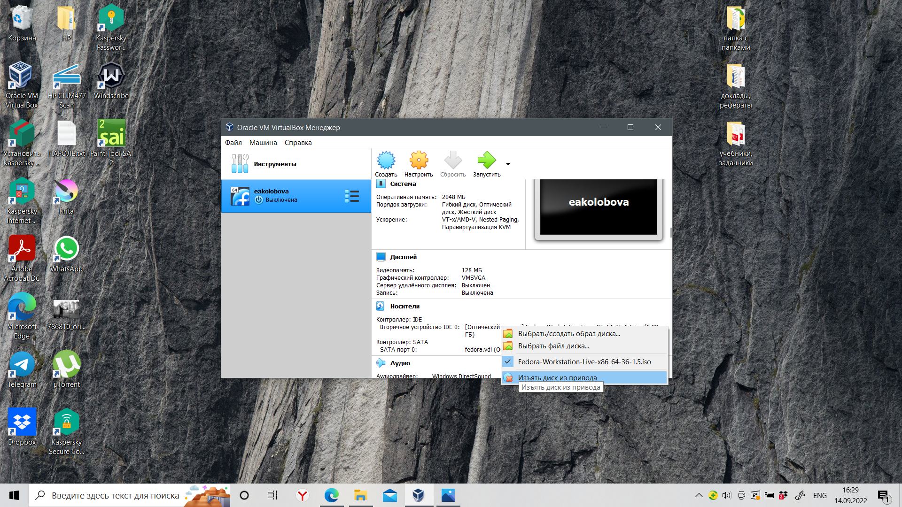

---
## Front matter
title: "**Отчет по лабораторной работе №1**"
subtitle: "дисциплина: Операционные системы"
author: "Колобова Елизавета Андреевна НММбд-01"

## Generic otions
lang: ru-RU
toc-title: "Содержание"

## Bibliography
bibliography: bib/cite.bib
csl: pandoc/csl/gost-r-7-0-5-2008-numeric.csl

## Pdf output format
toc: true # Table of contents
toc-depth: 2
lof: true # List of figures
lot: true # List of tables
fontsize: 12pt
linestretch: 1.5
papersize: a4
documentclass: scrreprt
## I18n polyglossia
polyglossia-lang:
  name: russian
  options:
	- spelling=modern
	- babelshorthands=true
polyglossia-otherlangs:
  name: english
## I18n babel
babel-lang: russian
babel-otherlangs: english
## Fonts
mainfont: PT Serif
romanfont: PT Serif
sansfont: PT Sans
monofont: PT Mono
mainfontoptions: Ligatures=TeX
romanfontoptions: Ligatures=TeX
sansfontoptions: Ligatures=TeX,Scale=MatchLowercase
monofontoptions: Scale=MatchLowercase,Scale=0.9
## Biblatex
biblatex: true
biblio-style: "gost-numeric"
biblatexoptions:
  - parentracker=true
  - backend=biber
  - hyperref=auto
  - language=auto
  - autolang=other*
  - citestyle=gost-numeric
## Pandoc-crossref LaTeX customization
figureTitle: "Рис."
tableTitle: "Таблица"
listingTitle: "Листинг"
lofTitle: "Список иллюстраций"
lotTitle: "Список таблиц"
lolTitle: "Листинги"
## Misc options
indent: true
header-includes:
  - \usepackage{indentfirst}
  - \usepackage{float} # keep figures where there are in the text
  - \floatplacement{figure}{H} # keep figures where there are in the text
---

# **Цель работы**

Целью работы является приобретение практических навыков установки операционной системы на виртуальную машину и настройки необходимых для дальнейшей работы сервисов.

# **Выполнение лабораторной работы**
**Настройка VirtualBox**
1. На компьютере-хосте устанавливается VitualBox. Запускается виртуальная машина (рис. [-@fig:001]). Проверяется в свойствах VirtualBox месторасположение каталога для виртуальных машин. Для этого в VirtualBox выберется «Файл» -> «Настройки» -> вкладка «Общие». В поле «Папка для машин» выставляется /var/tmp/имя_пользователя (рис. [-@fig:002])
Хост-клавишей оставлен Right Ctrl, т.к. клавиша не используется.

{ #fig:001 width=70% }

{ #fig:002 width=70% }

2. Создается новая виртуальная машину. Для этого в VirtualBox выбирается «Машина» -> «Создать». Указывается имя виртуальной машины (логин в дисплейном классе), тип операционной системы – Linux, Fedora (рис. [-@fig:003]).

{ #fig:003 width=70% }

3. Указывается размер основной памяти виртуальной машины – 2048 МБ (рис. 1.4). Задается конфигурация жёсткого диска – загрузочный, VDI (VirtualBox Disk Image), динамический виртуальный диск (рис. [-@fig:004], [-@fig:005], [-@fig:006], [-@fig:007], [-@fig:008])
Размер диска – 80 ГБ, 
расположение –/var/tmp/имя_пользователя/fedora.vdi

{ #fig:004 width=70% }

{ #fig:005 width=70% }

{ #fig:006 width=70% }

{ #fig:007 width=70% }

{ #fig:008 width=70% }

4. В настройках виртуальной машины во вкладке «Дисплей» -> «Экран» доступный объем видеопамяти увеличивается до 128 МБ. В настройках виртуальной машины во вкладке «Носители» добавляется новый привод оптических дисков и выбирается образ (рис. [-@fig:009], [-@fig:0010]):

{ #fig:009 width=70% }

{ #fig:0010 width=70% }

**Запуск виртуальной машины и установка системы**

5. Запускается виртуальная машина («Машина» -> «Запустить»). После загрузки с виртуального оптического диска выбирается «Install to hard drive» (рис. [-@fig:0011], [-@fig:0012])

{ #fig:0011 width=70% }

{ #fig:0012 width=70% }

6. Последовательно проверяются настройки даты и времени, клавиатуры, настройки сети и места установки (рис. [-@fig:0013], [-@fig:0014], [-@fig:0015], [-@fig:0016], [-@fig:0017])

{ #fig:0013 width=70% }

{ #fig:0014 width=70% }

{ #fig:0015 width=70% }

{ #fig:0016 width=70% }

{ #fig:0017 width=70% }

7. Задается имя пользователя и пароль (рис. [-@fig:0018])

{ #fig:0018 width=70% }

8. После завершения настроек осуществляется выключение виртуальной машины (рис. [-@fig:0019])

{ #fig:0019 width=70% }

9. После того, как виртуальная машина отключилась, образ диска изымается из дисковода (рис. [-@fig:0020])

{ #fig:0020 width=70% }

10. Запускаем виртуальную машину и входим в ОС под заданной при установке учётной записью.
    Переключаемся на роль супер-пользователя (рис. [-@fig:0021], [-@fig:0022]):

    sudo -i

    Обновляем все пакеты

    dnf -y update

{ #fig:0021 width=70% }

{ #fig:0022 width=70% }

11. Поэтому отключим систему безопасности SELinux
   В файле /etc/selinux/config заменим значение SELINUX=enforcing
   на значение SELINUX=permissive (рис. [-@fig:0023])
   
   Перезагрузим виртуальную машину:
   
   reboot
   
   { #fig:0023 width=70% }
   
12. Установим программное обеспечения для создания документации

    Переключаемся на роль супер-пользователя:

    sudo -i

    Установим pandoc:

    dnf -y install pandoc

    Установим необходимые расширения:

    pip install pandoc-fignos pandoc-eqnos pandoc-tablenos pandoc-secnos --user

    Установим дистрибутив TeXlive:
```
    dnf -y install texlive texlive-\*
```
    
    (рис. [-@fig:0025], [-@fig:0026])

   { #fig:0025 width=70% }
   
   { #fig:0026 width=70% }

## **Задание для самостоятельной работы**
1. В окне терминала проанализируем последовательность загрузки системы, выполнив команду dmesg. Просмотрим вывод этой команды:

    dmesg | less

    Используя поиск с помощью grep,

    dmesg | grep -i "то, что ищем"

    Получим следующую информацию:
        
        Версия ядра Linux (Linux version). - 6.1.10-100.fc36.x86_64
        Частота процессора (Detected Mhz processor). - 2807.996MHz
        Модель процессора (CPU0). - Intel Core i7-7700MQ CPU
        Объём доступной оперативной памяти (Memory available).
        Тип обнаруженного гипервизора (Hypervisor detected). - KVM
        Тип файловой системы корневого раздела. - ext4, btrfs
        Последовательность монтирования файловых систем. sda1 - ext4, sda2 - btrfs
        
    (рис. [-@fig:0027], [-@fig:0028])
        
    { #fig:0027 width=70% }
    { #fig:0028 width=70% }
        
## **Контрольные вопросы**

1.    Какую информацию содержит учётная запись пользователя?
     - Учётная запись, как правило, содержит сведения, необходимые для опознания пользователя при подключении к системе, сведения для авторизации и учёта. Это идентификатор пользователя (login) и его пароль.

2.    Укажите команды терминала и приведите примеры (рис. [-@fig:0029],  [-@fig:0030]):
        для получения справки по команде;
    - команда man
        для перемещения по файловой системе;
    - команда cd
        для просмотра содержимого каталога;
    - команда ls
        для определения объёма каталога;
    - команда df
        для создания / удаления каталогов / файлов;
    - команда touch / mkdir для создания
    - команда rm / rmdir - для удаления
        для задания определённых прав на файл / каталог;
    - команда сhmod
        для просмотра истории команд.
    - команда history

 { #fig:0029 width=70% }
 { #fig:0030 width=70% }
 
3.    Что такое файловая система? Приведите примеры с краткой характеристикой.
    - файловая система - это порядок, определяющий способ организации, хранения и именования данных на носителях информации в компьютерах и другом оборудовании
    Пример: FAT32 - вышла в 1995 году, может работать с томами размером до 32 ГБ и файлами размером до 4 ГБ, работает с накопителями объемом не более 8 ТБ. Структура накопителя с FAT32 имеет три области: служебный сектор, зарезернвированный системой, таблица указателей для поиска файлов и область записи данных. Структура иерархическая с многоуровневым доступом к файлам. Шифрование отсутствует.
4.    Как посмотреть, какие файловые системы подмонтированы в ОС?
     ввести в терминале команду mount, df или lsblk -f
5.    Как удалить зависший процесс?
    - командой kill с PID процесса в кач-ве параметра или командой killall с именем процесса в кач-ве параметра


# **Выводы**

Результатом проведенной работы является приобретение практических навыков установки операционной системы на виртуальную машину и настройки необходимых для дальнейшей работы сервисов

