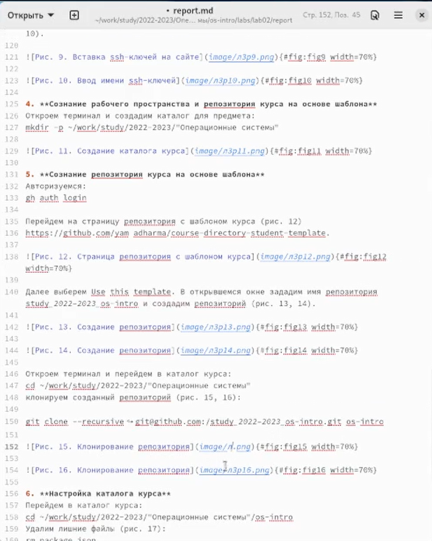

---
## Front matter
lang: ru-RU
title: Презентация по лабораторной работе №3
subtitle: дисциплина Операционные системы
author:
  - Колобова Елизавета гр. НММ-01
institute:
  - Российский университет дружбы народов, Москва, Россия
date: 23 февраля 2023

## i18n babel
babel-lang: russian
babel-otherlangs: english

## Formatting pdf
toc: false
toc-title: Содержание
slide_level: 2
aspectratio: 169
section-titles: true
theme: metropolis
header-includes:
 - \metroset{progressbar=frametitle,sectionpage=progressbar,numbering=fraction}
 - '\makeatletter'
 - '\beamer@ignorenonframefalse'
 - '\makeatother'
---

# Информация

## Докладчик

:::::::::::::: {.columns align=center}
::: {.column width="70%"}

  * Колобова Елизавета Андреевна
  * студент
  * Российский университет дружбы народов
:::
::::::::::::::

# Вводная часть

## Объект и предмет исследования

- Легковесный язык разметки Markdown.

## Цели и задачи

- Создать отчет по лабораторной работе №2 в Markdown

## Материалы и методы

- Процессор `pandoc` для входного формата Markdown
- Результирующие форматы
	- `pdf`
	- `docx`
- Автоматизация процесса создания: `Makefile`

# Создание презентации

## Создание отчета

- Оформляем отчет по лабораторной работе №2 в формате Markdown.
Заполняем информацию об авторе по образцу, описываем цели, задачи и ход выполнения работы, дополняя текст ссылками на иллюстрации.

## Процесс оформления отчета

{width=70%}

## Процесс оформления отчета

{width=70%}

## Процесс оформления отчета

{width=70%}

## Итоги и результаты

- Результатом проделанной работы является освоение языка разметки Markdown.

