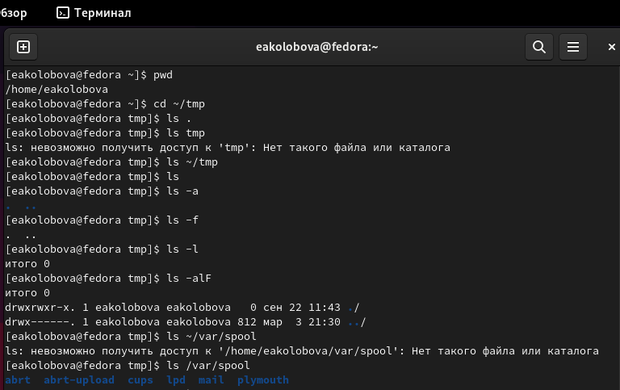
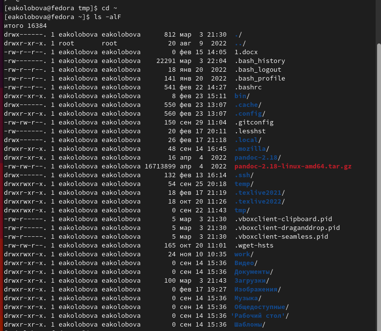
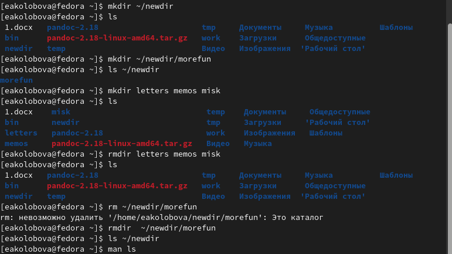
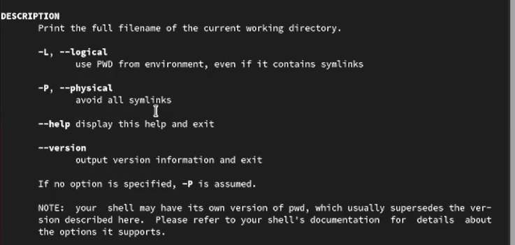
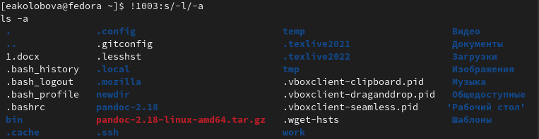

---
## Front matter
lang: ru-RU
title: Отчет по лабораторной работе №4
subtitle: дисциплина Операционные системы
author:
  - Колобова Елизавета, гр. НММ-01-22
institute:
  - Российский университет дружбы народов, Москва, Россия
date: 04 марта 2023

## i18n babel
babel-lang: russian
babel-otherlangs: english

## Formatting pdf
toc: false
toc-title: Содержание
slide_level: 2
aspectratio: 169
section-titles: true
theme: metropolis
header-includes:
 - \metroset{progressbar=frametitle,sectionpage=progressbar,numbering=fraction}
 - '\makeatletter'
 - '\beamer@ignorenonframefalse'
 - '\makeatother'
---

# Информация

## Докладчик

:::::::::::::: {.columns align=center}
::: {.column width="70%"}

  * Колобова Елизавета Андреевна
  * студент
  * Российский университет дружбы народов

:::
::::::::::::::

# Вводная часть

## Объект и предмет исследования

- командная строка Unix

## Цели и задачи

- Приобретение практических навыков взаимодействия с системой посредством командной строки.

## Материалы и методы

- консоль Linux 

# Создание презентации

## Блок заданий 1

- Определим полное имя домашнего каталога. 
```
pwd
```
 {width=70%}
 
## Блок заданий 2

- Перейдем в каталог /tmp и выведем на экран его содержимое
- Определим, есть ли в каталоге /var/spool подкаталог с именем cron
- Перейдем в домашний каталог и выведем на экран его содержимое. Определим, кто является владельцем файлов и подкаталогов

 {width=70%}

## Блок заданий 3

 - В домашнем каталоге создадим новый каталог с именем newdir, в нем - новый каталог с именем morefun
 - В домашнем каталоге создадим одной командой три новых каталога с именами letters, memos, misk. Затем удалим эти каталоги одной командой
 - Удалим ранее созданный каталог ~/newdir командой rm. Проверим, был ли каталог удалён
 - Удалим каталог ~/newdir/morefun из домашнего каталога. Проверим, был лиhistory
каталог удалён

{width=70%}

## Блок заданий 4-6

- Используем команду man для просмотра описания следующих команд: ls, cd, pwd, mkdir, rmdir, rm.

{width=70%}

## Блок заданий 7

- Используя информацию, полученную при помощи команды history, выполним модификацию и исполнение нескольких команд из буфера команд.

{width=70%}

## Результаты

- Результатом проделанной работы является приобретение практических навыков взаимодействия с системой посредством командной строки.

