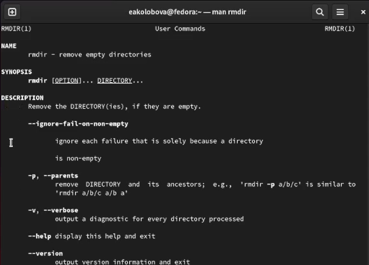

---
## Front matter
title: "Отчет по лабораторной работе №4"
subtitle: "дисциплина Операционные системы"
author: "Колобова Елизавета, гр. НММ-01-22"

## Generic otions
lang: ru-RU
toc-title: "Содержание"

## Bibliography
bibliography: bib/cite.bib
csl: pandoc/csl/gost-r-7-0-5-2008-numeric.csl

## Pdf output format
toc: true # Table of contents
toc-depth: 2
lof: true # List of figures
lot: true # List of tables
fontsize: 12pt
linestretch: 1.5
papersize: a4
documentclass: scrreprt
## I18n polyglossia
polyglossia-lang:
  name: russian
  options:
	- spelling=modern
	- babelshorthands=true
polyglossia-otherlangs:
  name: english
## I18n babel
babel-lang: russian
babel-otherlangs: english
## Fonts
mainfont: PT Serif
romanfont: PT Serif
sansfont: PT Sans
monofont: PT Mono
mainfontoptions: Ligatures=TeX
romanfontoptions: Ligatures=TeX
sansfontoptions: Ligatures=TeX,Scale=MatchLowercase
monofontoptions: Scale=MatchLowercase,Scale=0.9
## Biblatex
biblatex: true
biblio-style: "gost-numeric"
biblatexoptions:
  - parentracker=true
  - backend=biber
  - hyperref=auto
  - language=auto
  - autolang=other*
  - citestyle=gost-numeric
## Pandoc-crossref LaTeX customization
figureTitle: "Рис."
tableTitle: "Таблица"
listingTitle: "Листинг"
lofTitle: "Список иллюстраций"
lotTitle: "Список таблиц"
lolTitle: "Листинги"
## Misc options
indent: true
header-includes:
  - \usepackage{indentfirst}
  - \usepackage{float} # keep figures where there are in the text
  - \floatplacement{figure}{H} # keep figures where there are in the text
---

# Цель работы

Целью работы является приобретение практических навыков взаимодействия с системой посредством командной строки.

# Выполнение лабораторной работы

1. Определим полное имя домашнего каталога. 
```
pwd
```
Как видно на рисунке, имя домашнего каталога совпадает с именем учетной записи  (рис. [@fig:001]).
 {#fig:001 width=70%}

2. Выполним следующие действия:
 1. Перейдем в каталог /tmp.(рис. [@fig:002])
```
 cd ~/tmp
```
 
 2. Выведем на экран содержимое каталога /tmp (рис. [@fig:002])
```
 ls -a
 ls -l
 ls -alF
```
 Как видно по рисунку, в этом каталоге находятся два скрытых файла, которые показываются при использовании опций -а и -F. Опции -alF и -l выдают информацию об этих файлах.
 
 3. Определим, есть ли в каталоге /var/spool подкаталог с именем cron (рис. [@fig:002])
```
 ls /var/spool
```
 По рисунку видно, что такого каталога в /var/spool нет.
 
 4. Перейдем в домашний каталог и выведем на экран его содержимое. Определим, кто является владельцем файлов и подкаталогов (рис. [@fig:003])

```
 cd ~
 ls -alF
```
Как показано на рисунке, владельцем каталогов является пользователь, а владельцем каталога .. - суперпользователь

 {#fig:002 width=70%}
 
 {#fig:003 width=70%}
 
3. Выполним следующие действия:
 1. В домашнем каталоге создадим новый каталог с именем newdir (рис. [@fig:004])
```
mkdir ~/newdir
ls ~
```

 2. В каталоге ~/newdir создадим новый каталог с именем morefun (рис. [@fig:004])
```
mkdir ~/newdir/morefun
ls ~/newdir
```

 3. В домашнем каталоге создадим одной командой три новых каталога с именами letters, memos, misk. Затем удалим эти каталоги одной командой (рис. [@fig:004])
```
mkdir letters memos misk
ls ~
```

 4. Удалим ранее созданный каталог ~/newdir командой rm. Проверим, был ли каталог удалён (рис. [@fig:004])
```
rm -r ~/newdir
rmdir ~/newdir
ls ~
```

 5. Удалим каталог ~/newdir/morefun из домашнего каталога. Проверим, был лиhistory
каталог удалён (рис. [@fig:004])
```
rm -r ~/newdir/morefun
rmdir ~/newdir/morefun
ls ~
```
{#fig:004 width=70%}

4. С помощью команды man определим, какую опцию команды ls нужно использовать для просмотра содержимое не только указанного каталога, но и подкаталогов, входящих в него (рис. [@fig:006])
```
man ls
```
Как видно по рисунку, нужная опция - опция -R

5. С помощью команды man определим набор опций команды ls, позволяющий отсортировать по времени последнего изменения выводимый список содержимого каталога с развёрнутым описанием файлов (рис. [@fig:005], [@fig:006])
Опция, позволяющая отсортировать по времени последнего использования - -с, развернутое описание файлов дает опция -F,
т.е. нужная опция: -cF

{#fig:005 width=70%}

{#fig:006 width=70%}

6. Используем команду man для просмотра описания следующих команд: cd, pwd, mkdir, rmdir, rm. (рис. [@fig:009], [@fig:0010], [@fig:0011], [@fig:0012], [@fig:0013])

Основные опции команды cd (рис. [@fig:009]):
-P - позволяет следовать по символическим ссылкам перед тем, как будут обработаны все переходы "..";
-L - переходит по символическим ссылкам только после того, как были обработаны "..";
-e - если папку, в которую нужно перейти не удалось найти - выдает ошибку.
    
{#fig:009 width=70%}

Основные опции команды pwd (рис. [@fig:0010])
-L, --logical - брать директорию из переменной окружения, даже если она содержит символические ссылки;
-P - отбрасывать все символические ссылки;
--help - отобразить справку по утилите;
--version - отобразить версию утилиты.

{#fig:0010 width=70%}

Основные опции команды mkdir (рис. [@fig:0011])
-m=MODE или --mode=MODE
Устанавливает права доступа для создаваемой директории. Синтаксис MODE такой же как у команды chmod
-p или --parents
Создать все директории, которые указаны внутри пути. Если какая-либо директория существует, то предупреждение об этом не выводится.
-v или --verbose
Выводить сообщение о каждой создаваемой директории.
-Z
Установить контекст SELinux для создаваемой директории по умолчанию.
--context[=CTX]
Установить контекст SELinux для создаваемой директории в значение CTX
--help
Показать справку по команде mkdir
--version
Показать версию утилиты mkdir

{#fig:0011 width=70%}

Основные опции команды rmdir (рис. [@fig:0012])
-p	Позволяет удалить каталог и вышележащие каталоги, оказавшиеся пустыми. На стандартный вывод выдается сообщение об удалении всех указанных в маршруте каталогов или о сохранении части из них по каким-либо причинам.
-s	Подавление сообщения, выдаваемого при действии опции -p.

{#fig:0012 width=70%}

Основные опции команды rm (рис. [@fig:0013])
-r — обрабатывать все вложенные подкаталоги. Данный ключ необходим, если удаляемый файл является каталогом, пусть даже пустым. Если удаляемый файл не является каталогом, то ключ -r не влияет на команду rm.
-i — выводить запрос на подтверждение каждой операции удаления.
-f — не возвращать код ошибочного завершения, если ошибки были вызваны несуществующими файлами; не запрашивать подтверждения операций.

{#fig:0013 width=70%}

7. Используя информацию, полученную при помощи команды history, выполним модификацию и исполнение нескольких команд из буфера команд. (модифицируем команды 1003 ls -l и 1012 mkdir) (рис. [@fig:007], [@fig:008])
```
history
!1003:s/-l/-a
!1012:s/ / -m a+rwx 
```
{#fig:007 width=70%}

{#fig:008 width=70%}

# Контрольные вопросы
1. Что такое командная строка?
Это программа, которая позволяет управлять компьютером путем ввода текстовых команд с клавиатуры.

2. При помощи какой команды можно определить абсолютный путь текущего каталога?
Приведите пример.
С помощью команды pwd
Пример: 
```
$ pwd ~
/home/eakolobova
```
(см. рис. [@fig:001])

3. При помощи какой команды и каких опций можно определить только тип файлов
и их имена в текущем каталоге? Приведите примеры.
С помощью команды ls с опцией -l
```
$ ls somedir
1.docx
$ ls -l somedir
-rw-r--r--. 1 eakolobova eakolobova        0 фев 15 14:05  1.docx
```
(см. рис. [@fig:001])

4. Каким образом отобразить информацию о скрытых файлах? Приведите примеры.
С помощью команды ls с опцией -a
```
$ ls ~/tmp
(нет видимых файлов)
$ ls -a ~/tmp
. ..
```
(см. рис. [@fig:001])

5. При помощи каких команд можно удалить файл и каталог? Можно ли это сделать
одной и той же командой? Приведите примеры.
Файл можно удалить командой rm, а каталог - командой rmdir или командой rm с опцией -r
```
$ mkdir ~/newdir/somedir/1.docx
$ ls ~/newdir/somedir
1.docx
$ rm ~/newdir/somedir/1.docx
$ ls ~/newdir/somedir
(нет видимых файлов)
$ rmdir ~/newdir/somedir
$ls ~/newdir
(нет видимых файлов)
```
(см. рис. [@fig:004])

6. Каким образом можно вывести информацию о последних выполненных пользовате-
лем командах? 
Командой history
7. Как воспользоваться историей команд для их модифицированного выполнения? При-
ведите примеры.
При выполнении history появляются номера команд. Модифицируем команду: !номер_команды:s/что меняем/на что меняем
```
history
!1003:s/-l/-a
```
(см. рис. [@fig:007])

8. Приведите примеры запуска нескольких команд в одной строке.
```
newdir]$ cd ..; ls
bin temp work tmp
```

9. Дайте определение и приведите примера символов экранирования.
Если в заданном контексте встречаются специальные символы (типа «.», «/», «*» и т.д.), надо перед ними поставить символ экранирования \ (обратный слэш).

10. Охарактеризуйте вывод информации на экран после выполнения команды ls с опцией
l.
о каждом файле и каталоге будет выведена следующая
информация (в данном порядке):
– право доступа,
– число ссылок,
– владелец,
– размер,
– дата последней ревизии,
– имя файла или каталога

11. Что такое относительный путь к файлу? Приведите примеры использования относи-
тельного и абсолютного пути при выполнении какой-либо команды.
Относительный путь - это путь к файлу относительно текущего каталога
Пусть файл 1.docx лежит в каталоге ~/a/b/c, мы находимся в каталоге b
Абсолютный путь:
```
$ pwd ~/a/b/c
/home/user/a/b/c
```
Относительный путь:
```
rm c/1.docx
```
12. Как получить информацию об интересующей вас команде?
Командой man <команда> или набрав команду с ключом --help

13. Какая клавиша или комбинация клавиш служит для автоматического дополнения
вводимых команд?
Клавиша tab

# Выводы

Результатом данной работы является приобретение практических навыков взаимодействия с системой посредством командной строки.


