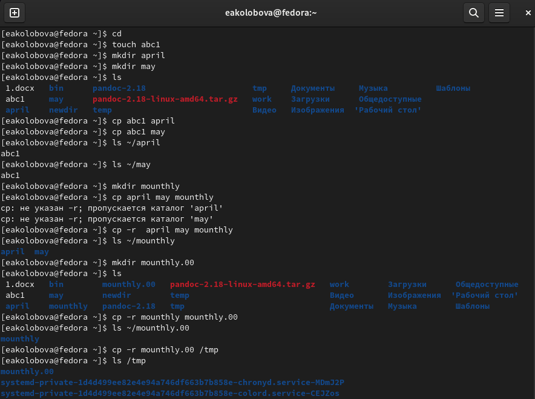
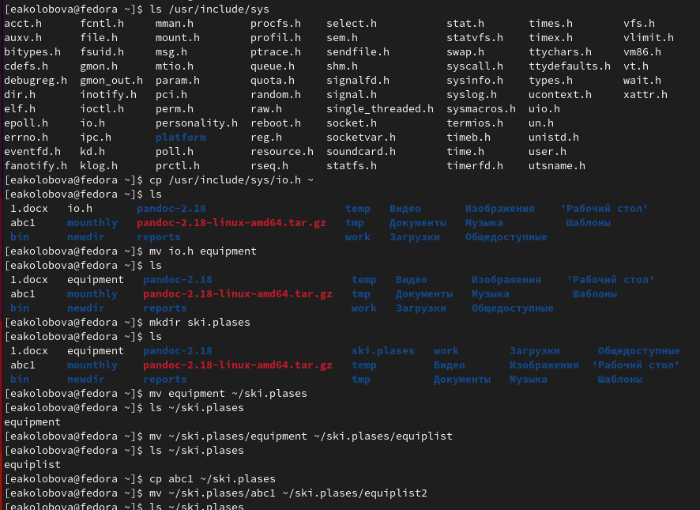
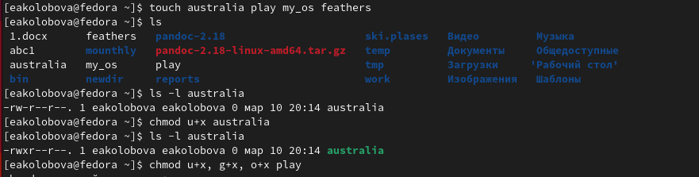
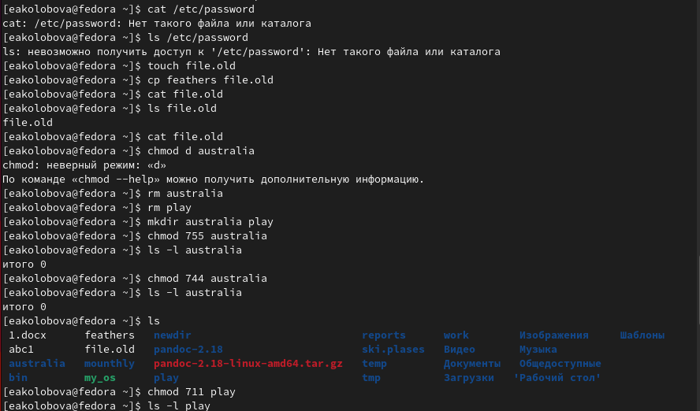
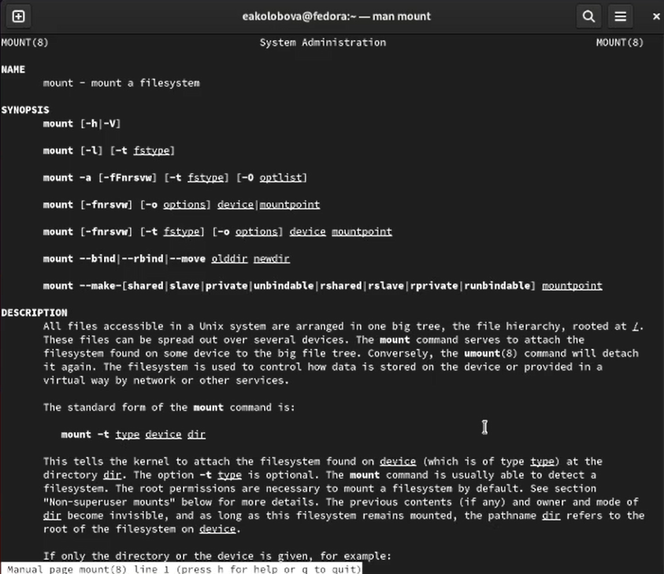

---
## Front matter
lang: ru-RU
title: Отчет по лабораторной работе № 5
subtitle: дисциплина Операционные системы
author:
  - Колобова Е. А., гр. НММбд-01-22
institute:
  - Российский университет дружбы народов, Москва, Россия
date: 11 марта 2023

## i18n babel
babel-lang: russian
babel-otherlangs: english

## Formatting pdf
toc: false
toc-title: Содержание
slide_level: 2
aspectratio: 169
section-titles: true
theme: metropolis
header-includes:
 - \metroset{progressbar=frametitle,sectionpage=progressbar,numbering=fraction}
 - '\makeatletter'
 - '\beamer@ignorenonframefalse'
 - '\makeatother'
---

# Информация

## Докладчик

:::::::::::::: {.columns align=center}
::: {.column width="70%"}

  * Колобова Елизавета
  * студент
  * Российский университет дружбы народов

:::
::::::::::::::

# Вводная часть

## Объект и предмет исследования

- файловая система Linux.

## Цели и задачи

- Ознакомление с файловой системой Linux, её структурой, именами и содержанием
каталогов. 
- Приобретение практических навыков по применению команд для работы
с файлами и каталогами, по управлению процессами (и работами), по проверке исполь-
зования диска и обслуживанию файловой системы.

## Материалы и методы

- терминал Linux.

# Выполнение работы

## Блок заданий 1

- Выполним все примеры, приведённые в первой части описания лабораторной работы.

{width=70%}

## Блок заданий 2
- Выполним указанные в описании работы действия, зафиксировав в отчёте по лабораторной работе
используемые при этом команды и результаты их выполнения

{width=70%}

## Блок заданий 3
- Определим опции команды chmod, необходимые для того, чтобы присвоить перечис-
ленным ниже файлам выделенные права доступа, считая, что в начале таких прав
нет:
3.1. drwxr--r-- ... australia
3.2. drwx--x--x ... play
3.3. -r-xr--r-- ... my_os
3.4. -rw-rw-r-- ... feathers

{width=70%}

## Блок заданий 4
- Проделаем приведённые в описании работы упражнения, записывая в отчёт используемые при этом команды

{width=70%}

## Блок заданий 5
- Прочитаем man по командам mount, fsck, mkfs, kill и кратко их охарактеризуем

{width=70%}

# Результаты
## Итоги

- Ознакомление с файловой системой Linux, её структурой, именами и содержанием
каталогов. 
- Приобретение практических навыков по применению команд для работы
с файлами и каталогами, по управлению процессами (и работами), по проверке исполь-
зования диска и обслуживанию файловой системы.

