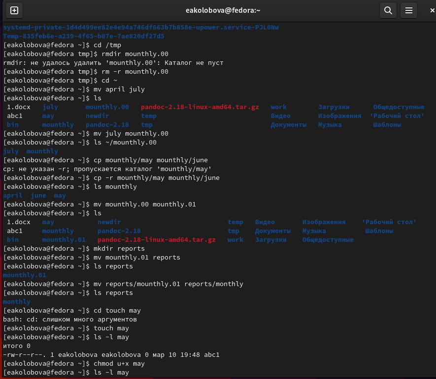

---
## Front matter
title: "Отчёт по лабораторной работе №5"
subtitle: "дисциплина Операционные системы"
author: "Колобова Елизавета, гр. НММбд-01-22"

## Generic otions
lang: ru-RU
toc-title: "Содержание"

## Bibliography
bibliography: bib/cite.bib
csl: pandoc/csl/gost-r-7-0-5-2008-numeric.csl

## Pdf output format
toc: true # Table of contents
toc-depth: 2
lof: true # List of figures
lot: true # List of tables
fontsize: 12pt
linestretch: 1.5
papersize: a4
documentclass: scrreprt
## I18n polyglossia
polyglossia-lang:
  name: russian
  options:
	- spelling=modern
	- babelshorthands=true
polyglossia-otherlangs:
  name: english
## I18n babel
babel-lang: russian
babel-otherlangs: english
## Fonts
mainfont: PT Serif
romanfont: PT Serif
sansfont: PT Sans
monofont: PT Mono
mainfontoptions: Ligatures=TeX
romanfontoptions: Ligatures=TeX
sansfontoptions: Ligatures=TeX,Scale=MatchLowercase
monofontoptions: Scale=MatchLowercase,Scale=0.9
## Biblatex
biblatex: true
biblio-style: "gost-numeric"
biblatexoptions:
  - parentracker=true
  - backend=biber
  - hyperref=auto
  - language=auto
  - autolang=other*
  - citestyle=gost-numeric
## Pandoc-crossref LaTeX customization
figureTitle: "Рис."
tableTitle: "Таблица"
listingTitle: "Листинг"
lofTitle: "Список иллюстраций"
lotTitle: "Список таблиц"
lolTitle: "Листинги"
## Misc options
indent: true
header-includes:
  - \usepackage{indentfirst}
  - \usepackage{float} # keep figures where there are in the text
  - \floatplacement{figure}{H} # keep figures where there are in the text
---

# Цель работы

Целью работы является ознакомление с файловой системой Linux, её структурой, именами и содержанием
каталогов. Приобретение практических навыков по применению команд для работы
с файлами и каталогами, по управлению процессами (и работами), по проверке использования диска и обслуживанию файловой системы


# Выполнение лабораторной работы

1. Выполним все примеры, приведённые в первой части описания лабораторной работы. (рис. [@fig:001], [@fig:002], [@fig:003], [@fig:004], [@fig:005])
 1. Скопировать файл ~/abc1 в файл april и в файл may:
```
 cd
 touch abc1
 cp abc1 april
 cp abc1 may
``` 
```
  2. Копирование нескольких файлов в каталог. Скопировать файлы april и may в каталог monthly:
```  
  mkdir monthly
  cp april may monthly
```  
```
  3. Копирование файлов в произвольном каталоге. Скопировать файл monthly/may в файл с именем june:
```
  cp monthly/may monthly/june
  ls monthly
```  
```
  3. Скопировать каталог monthly в каталог monthly.00:
```
  mkdir monthly.00
  cp -r monthly monthly.00
```  
```
  4. Копирование каталогов в произвольном каталоге. Скопировать каталог monthly.00
в каталог /tmp
```  
  cp -r monthly.00 /tmp
```  
```
  5. Изменить название файла april наjuly в домашнем каталоге:
```
  cd
  mv april july
```  
```
  6. Перемещение файлов в другой каталог. Переместить файл july в каталог monthly.00:
```
  mv july monthly.00
  ls monthly.00
```  
```
  7. Переименование каталогов в текущем каталоге. Переименовать каталог monthly.00в monthly.01
```  
  mv monthly.00 monthly.01
```  
```
  8. Перемещение каталога в другой каталог. Переместить каталог monthly.01в каталог reports:
```
  mkdir reports
  mv monthly.01 reports
```  
```
  9. Переименование каталога, не являющегося текущим. Переименовать каталог reports/monthly.01 в reports/monthly:
```
  mv reports/monthly.01 reports/monthly
```  
```
  10. Требуется создать файл ~/may с правом выполнения для владельца:
```  
  cd
  touch may
  ls -l may
  chmod u+x may
  ls -l may
```
  11. Требуется лишить владельца файла ~/may права на выполнение:
```
  chmod u-x may
  ls -l may
```
  12. Требуется создать каталог monthly с запретом на чтение для членов группы и всех остальных пользователей:
```
  cd
  mkdir monthly
  chmod g-r, o-r monthly
```
  13. Требуется создать файл ~/abc1 с правом записи для членов группы:
```
  cd
  touch abc1
  chmod g+w abc1
```
{#fig:001 width=70%}

{#fig:002 width=70%}

{#fig:003 width=70%}

{#fig:004 width=70%}

{#fig:005 width=70%}


2. Выполним следующие действия (рис. [@fig:006], [@fig:007]):
 1. Скопируем файл /usr/include/sys/io.h в домашний каталог и назовем его
equipment. 
```
 cp /usr/include/sys/io.h ~
 mv io.h equipment
```
 2. В домашнем каталоге создадим директорию ~/ski.plases.
```
mkdir ski.plases
```

 3. Переместим файл equipment в каталог ~/ski.plases.
```
mv equipment ski.plases
```

 4. Переименуем файл ~/ski.plases/equipment в ~/ski.plases/equiplist.
```
mv ~/ski.plases/equipment ~/ski.plases/equiplist
```

 5. Создадим в домашнем каталоге файл abc1 и скопируем его в каталог
~/ski.plases, назовем его equiplist2.
```
touch abc1
mv abc1 equiplist 2
mv equiplist 2 ski.plases
```
 6. Создадим каталог с именем equipment в каталоге ~/ski.plases.
```
mkdir ~/ski.plases/equipment
```

 7. Переместим файлы ~/ski.plases/equiplist и equiplist2 в каталог
~/ski.plases/equipment.
```
cd ski.plases
mv equiplist equiplist2 equipment
```
 8. Создадим и переместим каталог ~/newdir в каталог ~/ski.plases и назовем
его plans.
```
cd ~
mkdir newdir
mv newdir ski.plases
mv ~/ski.plases/newdir ~/ski.plases/plans
```

{#fig:006 width=70%}

{#fig:007 width=70%}

3. Определим опции команды chmod, необходимые для того, чтобы присвоить перечисленным ниже файлам выделенные права доступа, считая, что в начале таких прав нет (рис. [@fig:008], [@fig:009]):
 1. drwxr--r-- ... australia
```
chmod u+x australia
```
 2. drwx--x--x ... play
```
chmod u+x, g+x, o+x play
```
 3. -r-xr--r-- ... my_os
```
chmod 544 my_os
```
 4. -rw-rw-r-- ... feathers
```
chmod 664 feathers
```

{#fig:008 width=70%}

{#fig:009 width=70%}

4. Проделаем приведённые ниже упражнения (рис. [@fig:0010], [@fig:0011]):
 1. Просмотрим содержимое файла /etc/password.
```
ls (cat) /etc/password
``` 
```
 2. Скопируем файл ~/feathers в файл ~/file.old.
```
touch file.old
cp feathers file.old

```
 3. Переместим файл ~/file.old в каталог ~/play.
```
mv file.old play

```
 4. Скопируем каталог ~/play в каталог ~/fun.
```
cp play fun

```
 5. Переместим каталог ~/fun в каталог ~/play и назовем его games.
```
mv fun play
mv ~/play/fun ~/play/games

```
 6. Лишим владельца файла ~/feathers права на чтение.

chmod u-r feathers

 7. Что произойдёт, если попытаться просмотреть файл ~/feathers командой
cat? Сообщение об ошибке, т.к. нет прав на чтение

 8. Что произойдёт, если попытаться скопировать файл ~/feathers? Сообщение об ошибке
 
 9. Дадим владельцу файла ~/feathers право на чтение.

chmod u+r feathers

 10. Лишим владельца каталога ~/play права на выполнение.
 
chmod u-x play

 11. Перейдем в каталог ~/play. Что произошло? Сообщение об отказе в доступе
 12. Дадим владельцу каталога ~/play право на выполнение.

chmod u+x play

{#fig:0010 width=70%}

{#fig:0011 width=70%}


5. Прочитаем man по командам mount, fsck, mkfs, kill и кратко их охарактеризуем,
приведя примеры (рис. [@fig:0012], [@fig:0013], [@fig:0014], [@fig:0015], [@fig:0016]).
- mount служит для просмотра используемых в операционной системе файловых систем 
- fsck - утилита для проверки целостности файловой системы. С помощью команды fsck можно проверить (а в ряде случаев восстановить) целостность файловой системы
- mkfs используется для создания файловой системы Linux на некотором устройстве, обычно в разделе жёсткого диска. 
- kill посылает сигнал процессу. Обычно используется для «убийства» процесса (прерывание процесса).

{#fig:0012 width=70%}

{#fig:0013 width=70%}

{#fig:0014 width=70%}

{#fig:0015 width=70%}

{#fig:0016 width=70%}


# Контрольные вопросы

1. Дайте характеристику каждой файловой системе, существующей на жёстком диске
компьютера, на котором вы выполняли лабораторную работу.

Ext4 или Extended Filesystem - это стандартная файловая система для Linux. Она была разработана еще для Minix. Она самая стабильная из всех существующих, кодовая база изменяется очень редко и эта файловая система содержит больше всего функций. Версия ext2 была разработана уже именно для Linux и получила много улучшений. В 2001 году вышла ext3, которая добавила еще больше стабильности благодаря использованию журналирования. В 2006 была выпущена версия ext4, которая используется во всех дистрибутивах Linux до сегодняшнего дня. В ней было внесено много улучшений, в том числе увеличен максимальный размер раздела до одного экзабайта.
Btrfs или B-Tree File System - это совершенно новая файловая система, которая сосредоточена на отказоустойчивости, легкости администрирования и восстановления данных. Файловая система объединяет в себе очень много новых интересных возможностей, таких как размещение на нескольких разделах, поддержка подтомов, изменение размера не лету, создание мгновенных снимков, а также высокая производительность. Но многими пользователями файловая система Btrfs считается нестабильной. Тем не менее, она уже используется как файловая система по умолчанию в OpenSUSE и SUSE Linux.

2. Приведите общую структуру файловой системы и дайте характеристику каждой директории первого уровня этой структуры.

/ — root каталог. Содержит в себе всю иерархию системы;

/bin — здесь находятся двоичные исполняемые файлы. Основные общие команды, хранящиеся отдельно от других программ в системе (прим.: pwd, ls, cat, ps);

/boot — тут расположены файлы, используемые для загрузки системы (образ initrd, ядро vmlinuz);

/dev — в данной директории располагаются файлы устройств (драйверов). С помощью этих файлов можно взаимодействовать с устройствами. К примеру, если это жесткий диск, можно подключить его к файловой системе. В файл принтера же можно написать напрямую и отправить задание на печать;

/etc — в этой директории находятся файлы конфигураций программ. Эти файлы позволяют настраивать системы, сервисы, скрипты системных демонов;

/home — каталог, аналогичный каталогу Users в Windows. Содержит домашние каталоги учетных записей пользователей (кроме root). При создании нового пользователя здесь создается одноименный каталог с аналогичным именем и хранит личные файлы этого пользователя;

/lib — содержит системные библиотеки, с которыми работают программы и модули ядра;

/lost+found — содержит файлы, восстановленные после сбоя работы системы. Система проведет проверку после сбоя и найденные файлы можно будет посмотреть в данном каталоге;

/media — точка монтирования внешних носителей. Например, когда вы вставляете диск в дисковод, он будет автоматически смонтирован в директорию /media/cdrom;

/mnt — точка временного монтирования. Файловые системы подключаемых устройств обычно монтируются в этот каталог для временного использования;

/opt — тут расположены дополнительные (необязательные) приложения. Такие программы обычно не подчиняются принятой иерархии и хранят свои файлы в одном подкаталоге (бинарные, библиотеки, конфигурации);

/proc — содержит файлы, хранящие информацию о запущенных процессах и о состоянии ядра ОС;

/root — директория, которая содержит файлы и личные настройки суперпользователя;

/run — содержит файлы состояния приложений. Например, PID-файлы или UNIX-сокеты;

/sbin — аналогично /bin содержит бинарные файлы. Утилиты нужны для настройки и администрирования системы суперпользователем;

/srv — содержит файлы сервисов, предоставляемых сервером (прим. FTP или Apache HTTP);

/sys — содержит данные непосредственно о системе. Тут можно узнать информацию о ядре, драйверах и устройствах;

/tmp — содержит временные файлы. Данные файлы доступны всем пользователям на чтение и запись. Стоит отметить, что данный каталог очищается при перезагрузке;

/usr — содержит пользовательские приложения и утилиты второго уровня, используемые пользователями, а не системой. Содержимое доступно только для чтения (кроме root). Каталог имеет вторичную иерархию и похож на корневой;

/var — содержит переменные файлы. Имеет подкаталоги, отвечающие за отдельные переменные. Например, логи будут храниться в /var/log, кэш в /var/cache, очереди заданий в /var/spool/ и так далее.

3. Какая операция должна быть выполнена, чтобы содержимое некоторой файловой
системы было доступно операционной системе?

Монтирование тома.

4. Назовите основные причины нарушения целостности файловой системы. Как устра-
нить повреждения файловой системы?

Отсутствие синхронизации между образом файловой системы в памяти и ее данными на диске в случае аварийного останова может привести к появлению следующих ошибок:

1. Один блок адресуется несколькими mode (принадлежит нескольким файлам).

2. Блок помечен как свободный, но в то же время занят (на него ссылается onode).

3. Блок помечен как занятый, но в то же время свободен (ни один inode на него не ссылается).

4. Неправильное число ссылок в inode (недостаток или избыток ссылающихся записей в каталогах).

5. Несовпадение между размером файла и суммарным размером адресуемых inode блоков.

6. Недопустимые адресуемые блоки (например, расположенные за пределами файловой системы).

7. "Потерянные" файлы (правильные inode, на которые не ссылаются записи каталогов).

8. Недопустимые или неразмещенные номера inode в записях каталогов.

5. Как создаётся файловая система?

mkfs - позволяет создать файловую систему Linux.

6. Дайте характеристику командам для просмотра текстовых файлов.

Cat - выводит содержимое файла на стандартное устройство вывода

7. Приведите основные возможности команды cp в Linux.

копирование файлов и каталогов в другие каталоги

8. Приведите основные возможности команды mv в Linux.

перемещение файлов и каталогов и их переименование

9. Что такое права доступа? Как они могут быть изменены?

Права доступа к файлу или каталогу можно изменить, воспользовавшись командой chmod. Сделать это может владелец файла (или каталога) или пользователь с правами администратора.

# Выводы

Результатом проделанной работы является ознакомление с файловой системой Linux, её структурой, именами и содержанием
каталогов. Приобретение практических навыков по применению команд для работы
с файлами и каталогами, по управлению процессами (и работами), по проверке использования диска и обслуживанию файловой системы

# Список литературы{.unnumbered}

::: {#refs}
:::
