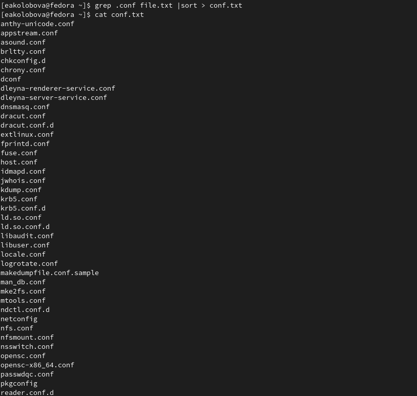
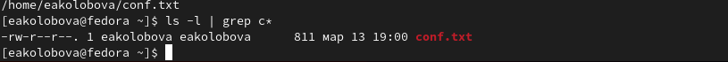
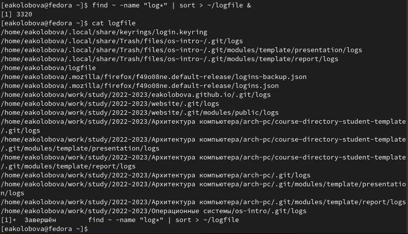
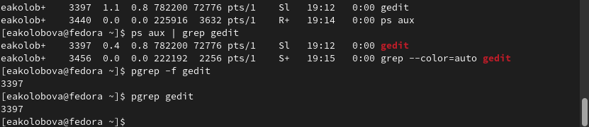
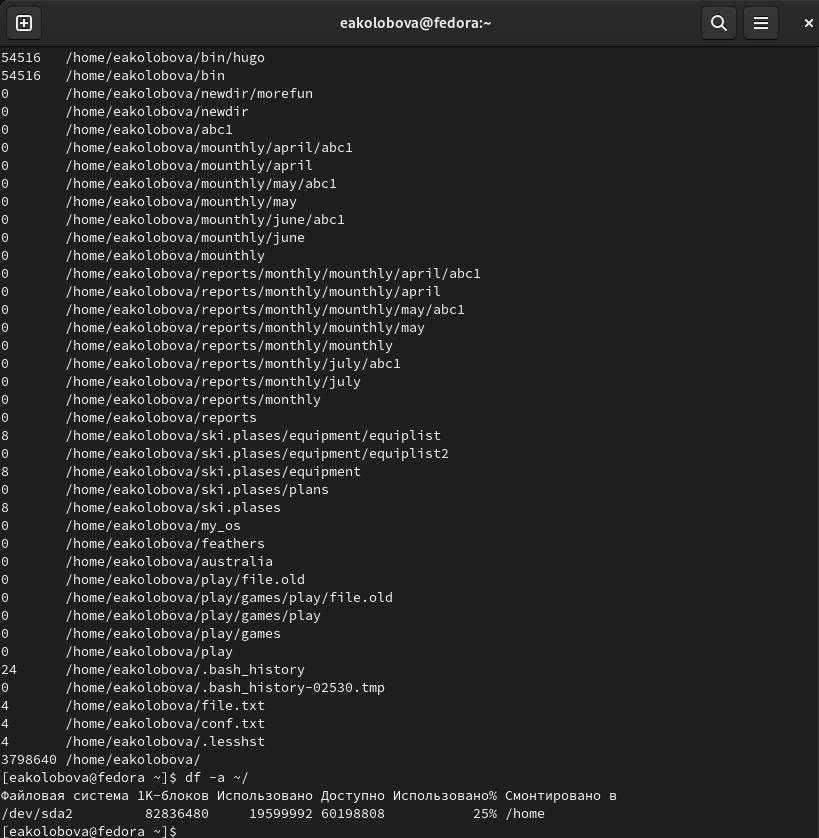

---
## Front matter
lang: ru-RU
title: Отчёт по лабораторной работе №6
subtitle: дисциплина Операционные системы
author:
  - Колобова Елизавета гр. НММбд-01-22
institute:
  - Российский университет дружбы народов, Москва, Россия
date: 13 марта 2023

## i18n babel
babel-lang: russian
babel-otherlangs: english

## Formatting pdf
toc: false
toc-title: Содержание
slide_level: 2
aspectratio: 169
section-titles: true
theme: metropolis
header-includes:
 - \metroset{progressbar=frametitle,sectionpage=progressbar,numbering=fraction}
 - '\makeatletter'
 - '\beamer@ignorenonframefalse'
 - '\makeatother'
---

# Информация

## Докладчик

:::::::::::::: {.columns align=center}
::: {.column width="70%"}

  * Колобова Елизавета Андреевна
  * студент
  * Российский университет дружбы народов

:::
::::::::::::::

# Вводная часть

## Объект и предмет исследования

- Файлы и текстовые данные
- Процессы юникс

## Цели и задачи

- Ознакомление с инструментами поиска файлов и фильтрации текстовых данных 
- Приобретение практических навыков: по управлению процессами (и заданиями), по
проверке использования диска и обслуживанию файловых систем

## Материалы и методы

- консоль Linux

# Создание презентации

## Выполнение лабораторной работы
- Осуществим вход в систему, используя соответствующее имя пользователя.
- Запишем в файл file.txt названия файлов, содержащихся в каталоге /etc. Допи-
шите в этот же файл названия файлов, содержащихся в домашнем каталоге. 
- Выведем имена всех файлов из file.txt, имеющих расширение .conf, после чего
запишем их в новый текстовой файл conf.txt.

{ width=70%}

## Выполнение лабораторной работы
- Определим, какие файлы в домашнем каталоге имеют имена, начинавшиеся
с символа c
- Выведем на экран (по странично) имена файлов из каталога /etc, начинающиеся
с символа h.

{ width=70%}

## Выполнение лабораторной работы
- Запустим в фоновом режиме процесс, который будет записывать в файл ~/logfile
файлы, имена которых начинаются с log.
- Удалим файл ~/logfile.

{ width=70%}

## Выполнение лабораторной работы
- Запустим из консоли в фоновом режиме редактор gedit.
- Определим идентификатор процесса gedit, используя команду ps, конвейер и фильтр
grep. 
- Прочтем справку (man) команды kill, после чего используем её для завершения
процесса gedit.

{width=70%}

## Выполнение лабораторной работы
- Выполним команды df и du, предварительно получив более подробную информацию
об этих командах, с помощью команды man.
- Воспользовавшись справкой команды find, выведем имена всех директорий, имею-
щихся в домашнем каталоге

{ width=70%}

## Результаты

- Результатом проделанной работы является ознакомление с инструментами поиска файлов и фильтрации текстовых данных и приобретение практических навыков: по управлению процессами (и заданиями), по проверке использования диска и обслуживанию файловых систем

