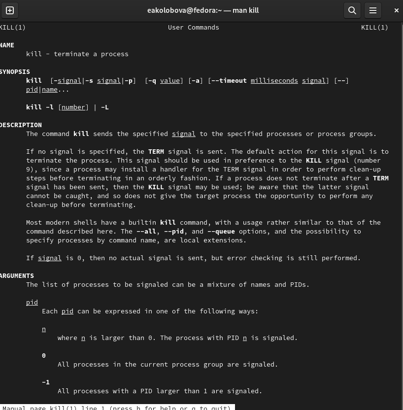

---
## Front matter
title: "Отчёт по лабораторной работе №6"
subtitle: "дисциплина Операционные системы"
author: "Колобова Елизавета гр. НММбд-01-22"

## Generic otions
lang: ru-RU
toc-title: "Содержание"

## Bibliography
bibliography: bib/cite.bib
csl: pandoc/csl/gost-r-7-0-5-2008-numeric.csl

## Pdf output format
toc: true # Table of contents
toc-depth: 2
lof: true # List of figures
lot: true # List of tables
fontsize: 12pt
linestretch: 1.5
papersize: a4
documentclass: scrreprt
## I18n polyglossia
polyglossia-lang:
  name: russian
  options:
	- spelling=modern
	- babelshorthands=true
polyglossia-otherlangs:
  name: english
## I18n babel
babel-lang: russian
babel-otherlangs: english
## Fonts
mainfont: PT Serif
romanfont: PT Serif
sansfont: PT Sans
monofont: PT Mono
mainfontoptions: Ligatures=TeX
romanfontoptions: Ligatures=TeX
sansfontoptions: Ligatures=TeX,Scale=MatchLowercase
monofontoptions: Scale=MatchLowercase,Scale=0.9
## Biblatex
biblatex: true
biblio-style: "gost-numeric"
biblatexoptions:
  - parentracker=true
  - backend=biber
  - hyperref=auto
  - language=auto
  - autolang=other*
  - citestyle=gost-numeric
## Pandoc-crossref LaTeX customization
figureTitle: "Рис."
tableTitle: "Таблица"
listingTitle: "Листинг"
lofTitle: "Список иллюстраций"
lotTitle: "Список таблиц"
lolTitle: "Листинги"
## Misc options
indent: true
header-includes:
  - \usepackage{indentfirst}
  - \usepackage{float} # keep figures where there are in the text
  - \floatplacement{figure}{H} # keep figures where there are in the text
---

# Цель работы

Целью работы является ознакомление с инструментами поиска файлов и фильтрации текстовых данных и приобретение практических навыков: по управлению процессами (и заданиями), по
проверке использования диска и обслуживанию файловых систем

# Выполнение лабораторной работы

1. Войдем в систему, используя соответствующее имя пользователя.
2. Запишем в файл file.txt названия файлов, содержащихся в каталоге /etc. Допи-
шем в этот же файл названия файлов, содержащихся в домашнем каталоге. (рис. [@fig:001], [@fig:002])
```
ls -a /etc |sort > file.txt
ls -R ~ |sort > file.txt
```

{#fig:001 width=70%}

{#fig:002 width=70%}

3. Выведем имена всех файлов из file.txt, имеющих расширение .conf, после чего
запишем их в новый текстовой файл conf.txt. (рис. [@fig:003])
```
grep .conf file.txt | sort > conf.txt
```

{#fig:003 width=70%}

4. Определим, какие файлы в вашем домашнем каталоге имеют имена, начинавшиеся
с символа c (рис. [@fig:004], [@fig:005])
```
find ~ -name "c*" -print
ls -a | grep c*
```

{#fig:004 width=70%}

{#fig:005 width=70%}

5. Выведем на экран имена файлов из каталога /etc, начинающиеся
с символа h. (рис. [@fig:006])
```
find /etc -name "h*" -print
```

{#fig:006 width=70%}

6. Запустим в фоновом режиме процесс, который будет записывать в файл ~/logfile
файлы, имена которых начинаются с log. (рис. [@fig:007])
```
find ~ -name "log*" | sort > ~/logfile &
```

{#fig:007 width=70%}

7. Удалим файл ~/logfile. (рис. [@fig:008])
```
rm logfile
```

{#fig:008 width=70%}

8. Запустим из консоли в фоновом режиме редактор gedit. (рис. [@fig:009], [@fig:0010])
```
gedit &
```

{#fig:009 width=70%}

{#fig:0010 width=70%}

9. Определим идентификатор процесса gedit, используя команду ps, конвейер и фильтр
grep. (рис. [@fig:0011]) Как ещё можно определить идентификатор процесса?
```
ps aux 
ps aux | grep gedit
pgrep gedit
Еще можно
pidof gedit
```

{#fig:0011 width=70%}

10. Прочтем справку (man) команды kill, после чего используем её для завершения
процесса gedit. (рис. [@fig:0012], [@fig:0013])
```
man kill
kill 3397 (id of gedit)
```

{#fig:0012 width=70%}

{#fig:0013 width=70%}

11. Выполним команды df и du, предварительно получив более подробную информацию
об этих командах, с помощью команды man. (рис. [@fig:0014], [@fig:0015], [@fig:0016])
```
man du
man df
du -a ~/
df -a ~/
```

{#fig:0014 width=70%}

{#fig:0015 width=70%}

{#fig:0016 width=70%}

12. Воспользовавшись справкой команды find, выведем имена всех директорий, имею-Структура научной презентации
щихся в домашнем каталоге (рис. [@fig:0017]).
```
find -L ~
```

{#fig:0017 width=70%}

# Контрольные вопросы
1. Какие потоки ввода вывода вы знаете?

Stdin и stdout, stderr

2. Объясните разницу между операцией > и >>.

Первый перенаправляет, а второй открывает в режиме добавления.

3. Что такое конвейер?

Конвейер (pipe) служит для объединения простых команд или утилит в цепочки, в которых результат работы предыдущей команды передаётся последующей.

4. Что такое процесс? Чем это понятие отличается от программы?

Компьютерная программа сама по себе — лишь пассивная последовательность инструкций. В то время как процесс — непосредственное выполнение этих инструкций. Также, процессом называют выполняющуюся программу и все её элементы: адресное пространство, глобальные переменные, регистры, стек, открытые файлы и так далее.

5. Что такое PID и GID?

PID – это айди процесса.

GID - Группы пользователей применяются для организации доступа нескольких пользователей к некоторым ресурсам.

6. 15.Что такое задачи и какая команда позволяет ими управлять?

Любую выполняющуюся в консоли команду или внешнюю программу можно запустить в фоновом режиме. Для этого следует в конце имени команды указать знак амперсанда &. Например: gedit &.

7. Найдите информацию об утилитах top и htop. Каковы их функции?

Top - отобразить запущенные процессы, используемые ими ресурсы и другую полезную информацию (с автоматическим обновлением данных)

Htop - показывает динамический список системных процессов, список обычно выравнивается по использованию ЦПУ. В отличие от top, htop показывает все процессы в системе. Также показывает время непрерывной работы, использование процессоров и памяти. Htop часто применяется в тех случаях, когда информации даваемой утилитой top недостаточно, например при поиске утечек памяти в процессах.

8. Назовите и дайте характеристику команде поиска файлов. Приведите примеры использования этой команды.

Команда find используется для поиска и отображения на экран имён файлов, соответствующих заданной строке символов. Формат команды: find путь [-опции]

9. Можно ли по контексту (содержанию) найти файл? Если да, то как?

Да, через команду grep. Например: grep Aug -R /var/log/* вывода строки, содержащие "Aug", во всех файлах, находящихся в директории /var/log и ниже

10. Как определить объем свободной памяти на жёстком диске?

Для определения объёма свободного пространства на файловой системе можно воспользоваться командой df, которая выведет на экран список всех файловых систем в соответствии с именами устройств, с указанием размера и точки монтирования.

11. Как определить объем вашего домашнего каталога?

Команда du показывает число килобайт, используемое каждым файлом или каталогом.

12. Как удалить зависший процесс?

Можно удалить через kill, написав айди процесса

# Выводы

Результатом проделанной работы является ознакомление с инструментами поиска файлов и фильтрации текстовых данных и приобретение практических навыков: по управлению процессами (и заданиями), по
проверке использования диска и обслуживанию файловых систем

# Список литературы{.unnumbered}

::: {#refs}
:::
