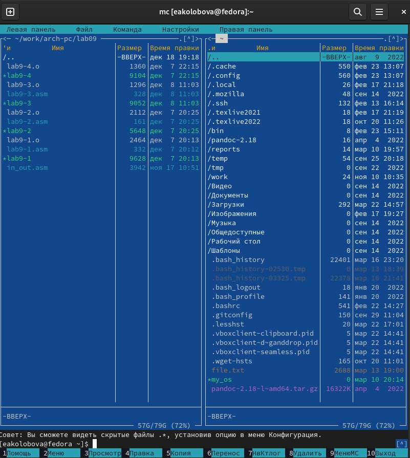
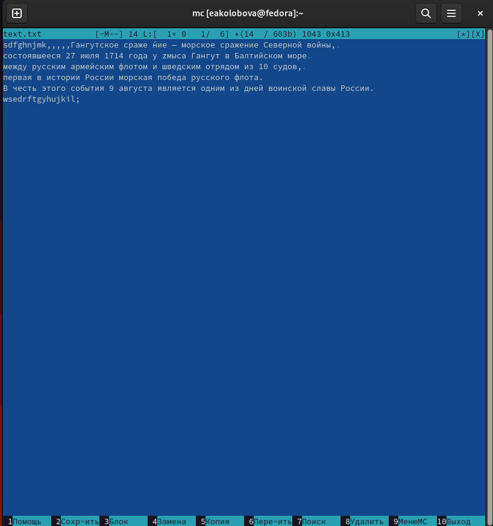

---
## Front matter
lang: ru-RU
title: Отчет по лабораторной работе №7
subtitle: дисциплина Операционные системы
author:
  - Колобова Елизавета, гр. НММбд-01-22
institute:
  - Российский университет дружбы народов, Москва, Россия
date: 22 марта 2023

## i18n babel
babel-lang: russian
babel-otherlangs: english

## Formatting pdf
toc: false
toc-title: Содержание
slide_level: 2
aspectratio: 169
section-titles: true
theme: metropolis
header-includes:
 - \metroset{progressbar=frametitle,sectionpage=progressbar,numbering=fraction}
 - '\makeatletter'
 - '\beamer@ignorenonframefalse'
 - '\makeatother'
---

# Информация

## Докладчик

:::::::::::::: {.columns align=center}
::: {.column width="70%"}

  * Колобова Елизавета 
  * студент
  * Российский университет дружбы народов

:::
::::::::::::::

# Вводная часть

## Объект и предмет исследования

- Командная оболочка Midnight Commander

## Цели и задачи

- Освоение основных возможностей командной оболочки Midnight Commander. 
- Приобретение навыков практической работы по просмотру каталогов и файлов; манипуляций с ними.

## Материалы и методы

- Процессор `pandoc` для входного формата Markdown
- Автоматизация процесса создания: `Makefile`

# Создание презентации

## Задание по mc
- Изучим информацию о mc, вызвав в командной строке man mc.
- Запустим из командной строки mc
- Выполним несколько операций в mc, используя управляющие клавиши
- Выполним основные команды меню правой панели
- Вызовем подменю Настройки . Освоим операции, определяющие структуру экрана mc

{width=70%}

## Задание по встроенному редактору mc
- Создадим текстовой файл text.txt.
-Откроем этот файл с помощью встроенного в mc редактора. Вставим в открытый файл небольшой фрагмент текста, скопированный из любого
другого файла или Интернета.
- Проделаем с текстомманипуляции, используя горячие клавиши

{width=70%}

## Задание по встроенному редактору mc
- Откроем файл с исходным текстом на некотором языке программирования (C++) 
- Используя меню редактора, выключим подсветку синтаксиса.

{width=70%}

# Результаты
- Освоение основных возможностей командной оболочки Midnight Commander. 
- Приобретение навыков практической работы по просмотру каталогов и файлов; манипуляций с ними.
