---
## Front matter
title: "Отчёт по лабораторной работе №7"
subtitle: "дисциплина Операционные системы"
author: "Колобова Елизавета, гр. НММбд-01-22"

## Generic otions
lang: ru-RU
toc-title: "Содержание"

## Bibliography
bibliography: bib/cite.bib
csl: pandoc/csl/gost-r-7-0-5-2008-numeric.csl

## Pdf output format
toc: true # Table of contents
toc-depth: 2
lof: true # List of figures
lot: true # List of tables
fontsize: 12pt
linestretch: 1.5
papersize: a4
documentclass: scrreprt
## I18n polyglossia
polyglossia-lang:
  name: russian
  options:
	- spelling=modern
	- babelshorthands=true
polyglossia-otherlangs:
  name: english
## I18n babel
babel-lang: russian
babel-otherlangs: english
## Fonts
mainfont: PT Serif
romanfont: PT Serif
sansfont: PT Sans
monofont: PT Mono
mainfontoptions: Ligatures=TeX
romanfontoptions: Ligatures=TeX
sansfontoptions: Ligatures=TeX,Scale=MatchLowercase
monofontoptions: Scale=MatchLowercase,Scale=0.9
## Biblatex
biblatex: true
biblio-style: "gost-numeric"
biblatexoptions:
  - parentracker=true
  - backend=biber
  - hyperref=auto
  - language=auto
  - autolang=other*
  - citestyle=gost-numeric
## Pandoc-crossref LaTeX customization
figureTitle: "Рис."
tableTitle: "Таблица"
listingTitle: "Листинг"
lofTitle: "Список иллюстраций"
lotTitle: "Список таблиц"
lolTitle: "Листинги"
## Misc options
indent: true
header-includes:
  - \usepackage{indentfirst}
  - \usepackage{float} # keep figures where there are in the text
  - \floatplacement{figure}{H} # keep figures where there are in the text
---

# Цель работы

Целью работы является освоение основных возможностей командной оболочки Midnight Commander и приобретение навыков практической работы по просмотру каталогов и файлов; манипуляций с ними.

# Выполнение лабораторной работы

# Задание по mc
1. Изучим информацию о mc, вызвав в командной строке man mc. (рис. [@fig:001])

{#fig:001 width=70%}

2. Запустим из командной строки mc (рис. [@fig:002])

{#fig:002 width=70%}

3. Выполним несколько операций в mc, используя управляющие клавиши (операции
с панелями; выделение/отмена выделения файлов, копирование/перемещение файлов, получение информации о размере и правах доступа на файлы и/или каталоги и т.п.) (рис. [@fig:003], [@fig:004], [@fig:005])

{#fig:003 width=70%}

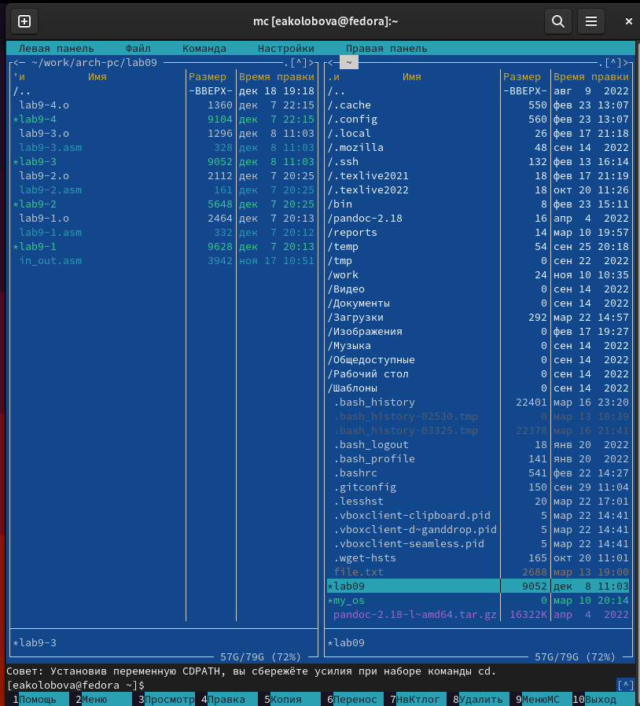{#fig:004 width=70%}

{#fig:005 width=70%}

4. Выполним основные команды меню правой панели. (рис. [@fig:006], [@fig:007], [@fig:008], [@fig:009])

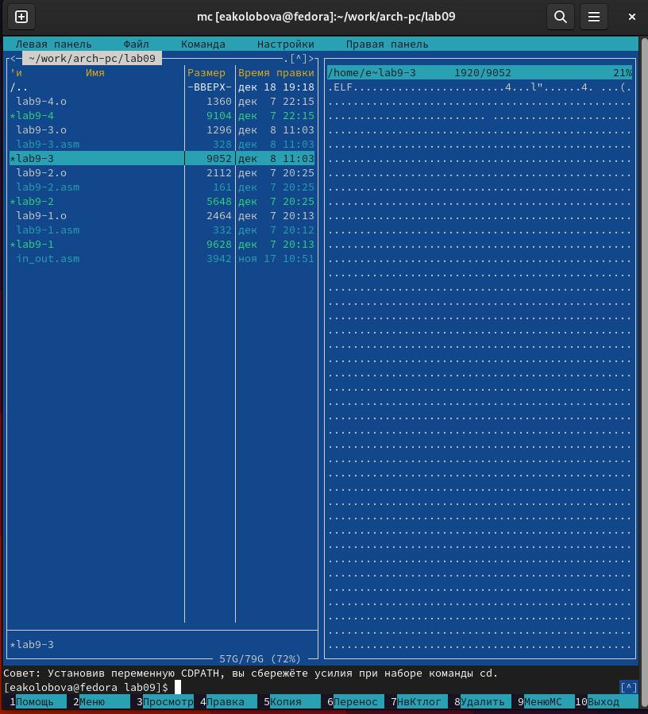{#fig:006 width=70%} 

{#fig:007 width=70%} 

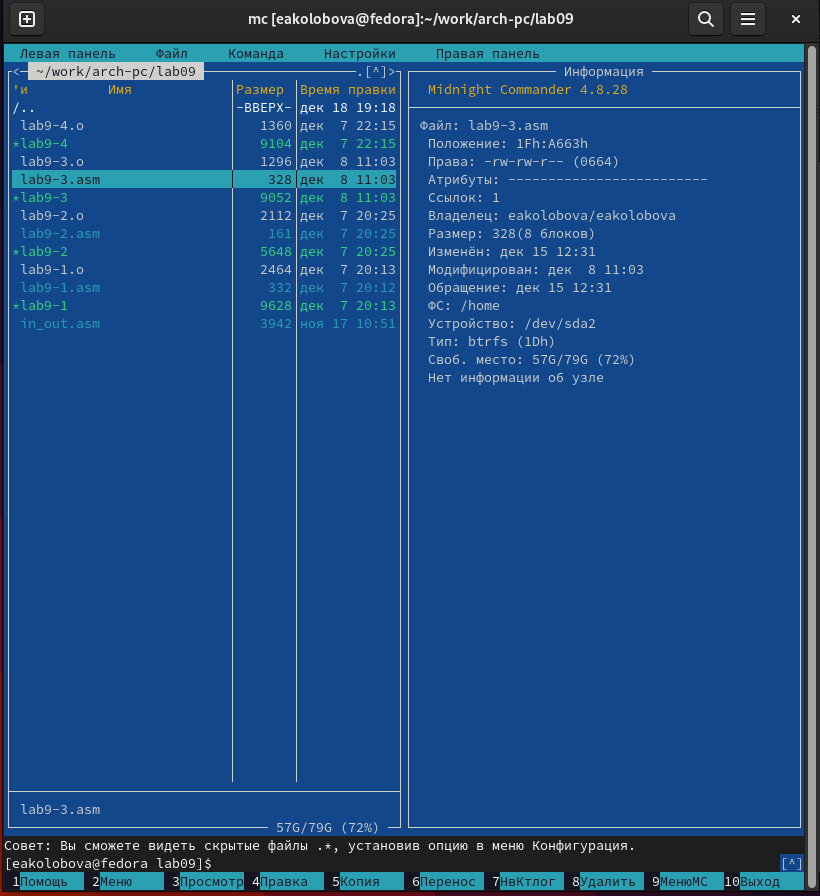{#fig:008 width=70%} 

{#fig:009 width=70%} 

5. Используя возможности подменю Файл , выполним:
– Просмотр содержимого текстового файла (рис. [@fig:0010])

{#fig:0010 width=70%} 

– Редактирование содержимого текстового файла (без сохранения результатов
редактирования) (рис. [@fig:0011])

{#fig:0011 width=70%} 

– Создание каталога (рис. [@fig:0012], [@fig:0013])

{#fig:0012 width=70%} 

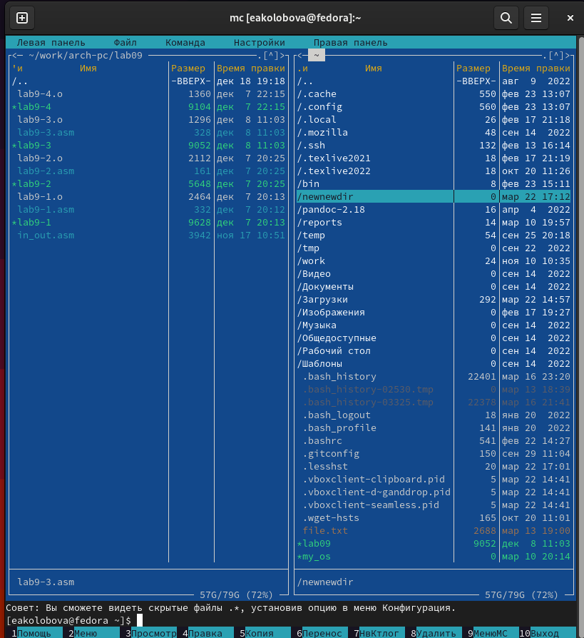{#fig:0013 width=70%}

– Копирование в файлов в созданный каталог (рис. [@fig:0014], [@fig:0015])

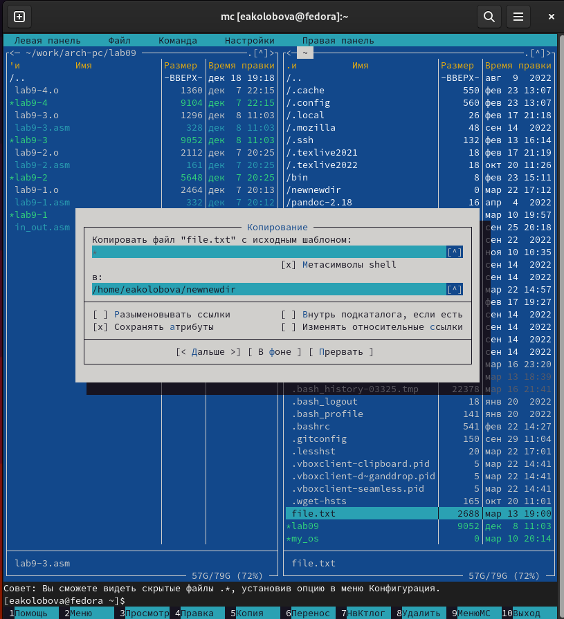{#fig:0014 width=70%} 

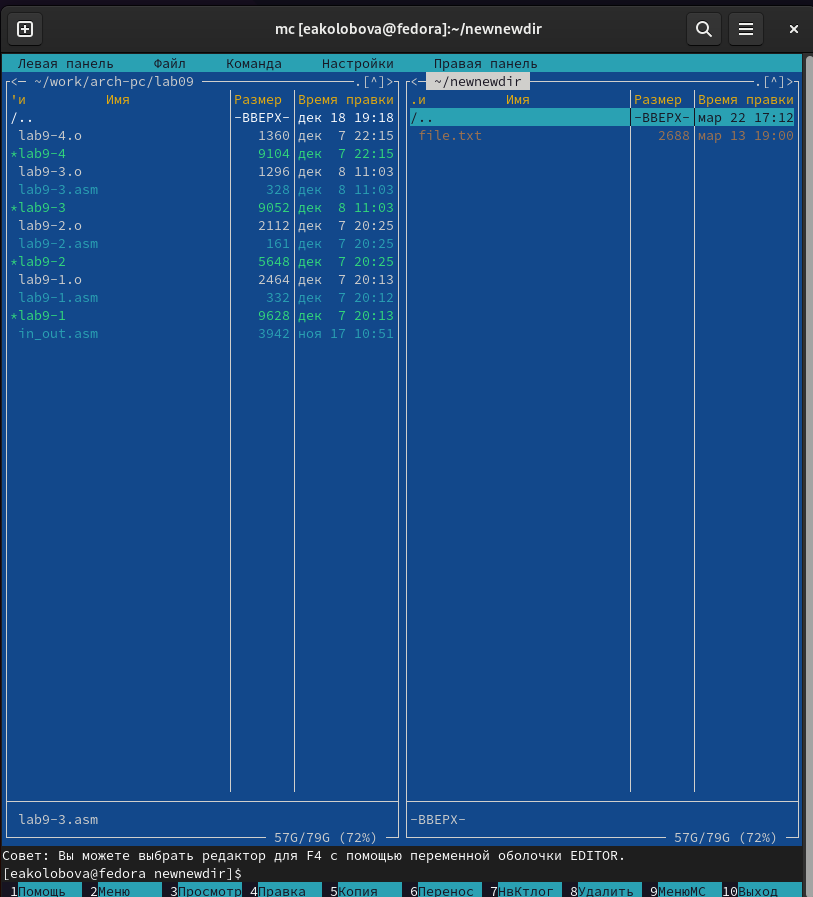{#fig:0015 width=70%} 

6. С помощью соответствующих средств подменю Команда осуществим:
– поиск в файловой системе файла с заданными условиями (файла с расширением .cpp) (рис. [@fig:0016])

{#fig:0016 width=70%} 

– выбор и повторение одной из предыдущих команд;
– переход в домашний каталог; (рис. [@fig:0017])

{#fig:0017 width=70%} 

– анализ файла меню и файла расширений. (рис. [@fig:0018], [@fig:0019])

{#fig:0018 width=70%} 

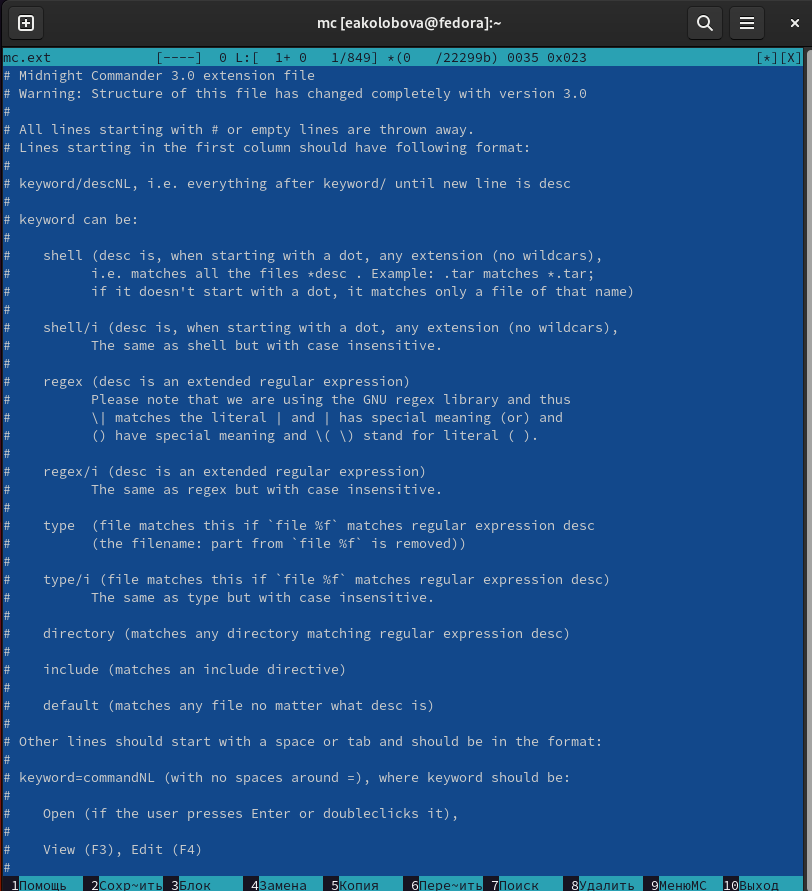{#fig:0019 width=70%} 

7. Вызовем подменю Настройки . Освоим операции, определяющие структуру экрана mc
(Full screen, Double Width, Show Hidden Files и т.д.)

# Задание по встроенному редактору mc
1. Создадим текстовой файл text.txt. (рис. [@fig:0021])

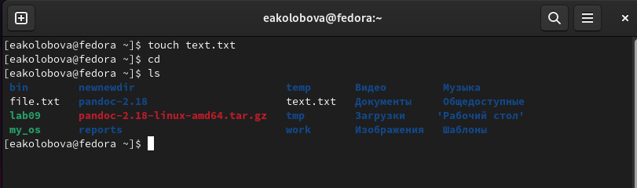{#fig:0021 width=70%} 

2. Откроем этот файл с помощью встроенного в mc редактора.
3. Вставим в открытый файл небольшой фрагмент текста, скопированный из любого
другого файла или Интернета. (рис. [@fig:0022])

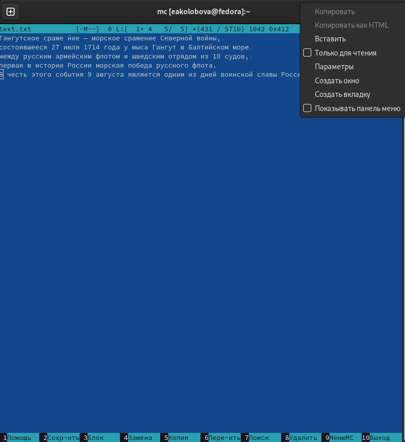{#fig:0022 width=70%} 

4. Проделаем с текстом следующие манипуляции, используя горячие клавиши:
- Удалим строку текста. (рис. [@fig:0023])

{#fig:0023 width=70%} 

- Выделим фрагмент текста и скопируем его на новую строку.
- Выделим фрагмент текста и перенесем его на новую строку. (рис. [@fig:0024])

{#fig:0024 width=70%} 

- Сохраним файл. (рис. [@fig:0025])

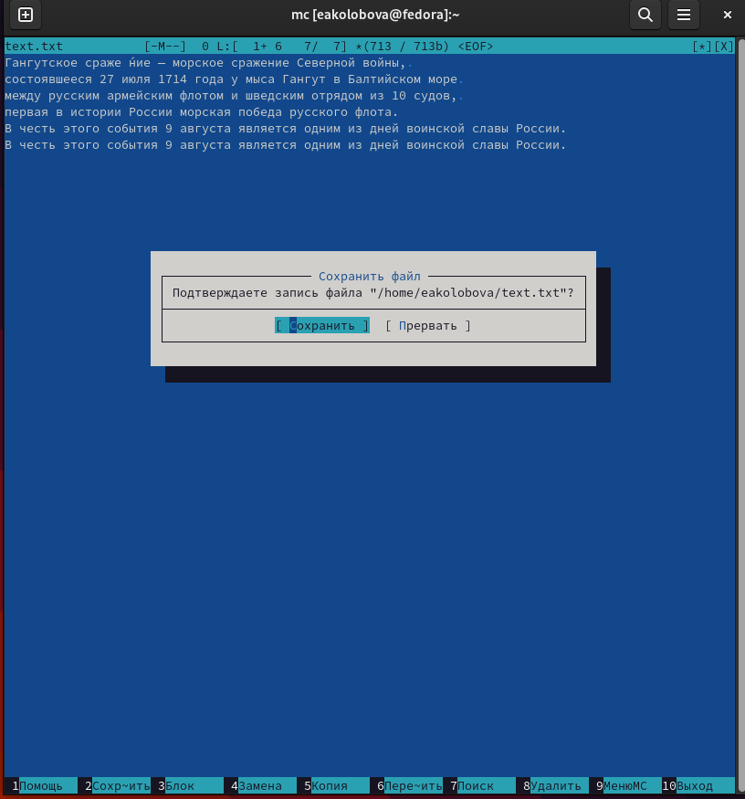{#fig:0025 width=70%} 

- Отменим последнее действие. (рис. [@fig:0026])

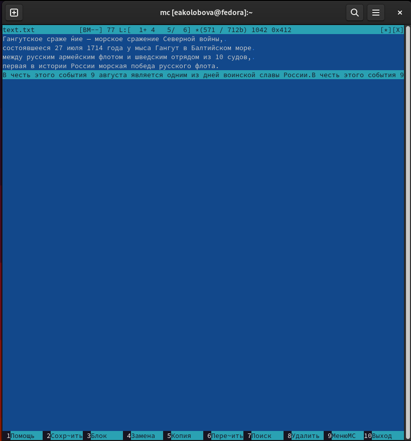{#fig:0026 width=70%} 

- Перейдем в конец файла (нажав комбинацию клавиш) и напишем некоторый
текст.
- Перейдем в начало файла (нажав комбинацию клавиш) и напишем некоторый
текст. (рис. [@fig:0027])

{#fig:0027 width=70%} 

- Сохраним и закроем файл.

5. Откроем файл с исходным текстом на некотором языке программирования (C++) (рис. [@fig:0028])

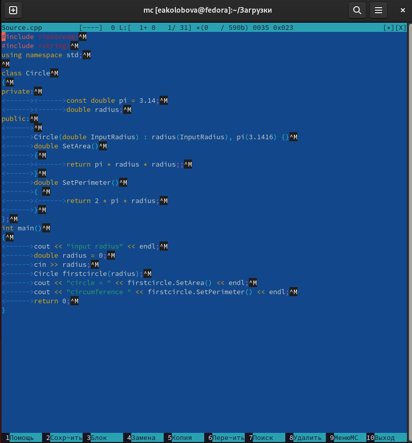{#fig:0028 width=70%} 

6. Используя меню редактора, выключим подсветку синтаксиса.(рис. [@fig:0029]).

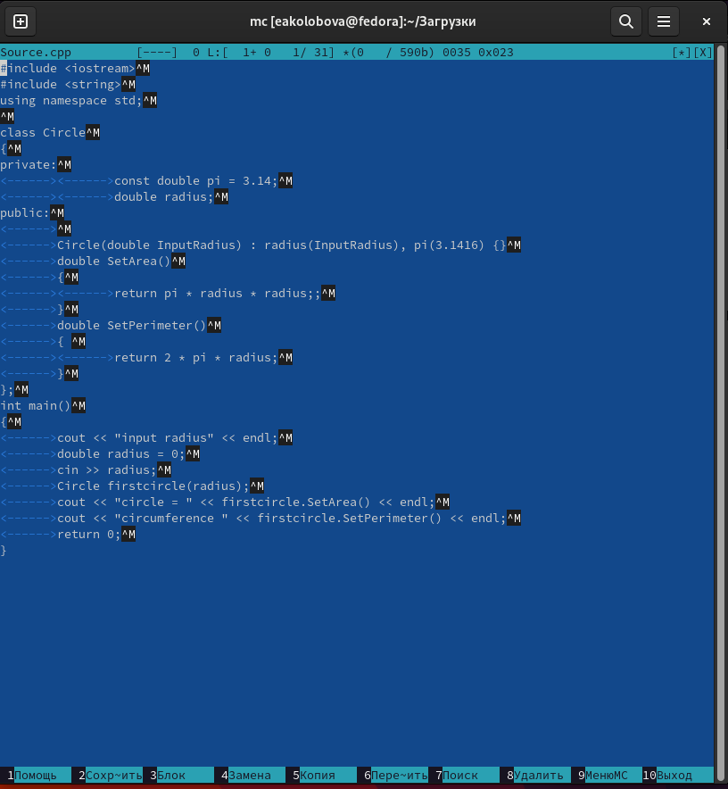{#fig:0029 width=70%} 

# Контрольные вопросы
1. Какие режимы работы есть в mc. Охарактеризуйте их.
Существует четыре  режима: Full, Brief, Long и User. В режиме Full отображается имя файла, размер файла и время последней модификации. В режиме Brief список файлов располагается в две колонки и состоит только из имён файлов (поэтому в этом режиме отображается наибольшее количество файлов, по сравнению с другими режимами). Режим Long идентичен результату выполнения команды ls -l. В этом режиме панель занимает весь экран. 

2. Какие операции с файлами можно выполнить как с помощью команд shell, так и с помощью меню (комбинаций клавиш) mc? Приведите несколько примеров.
3. Опишите структура меню левой (или правой) панели mc, дайте характеристику командам.
В меню каждой (левой или правой) панели можно выбрать Формат списка :
– стандартный — выводит список файлов и каталогов с указанием размера и времени
правки;
– ускоренный — позволяет задать число столбцов, на которые разбивается панель при
выводе списка имён файлов или каталогов без дополнительной информации;
– расширенный — помимо названия файла или каталога выводит сведения о правах
доступа, владельце, группе, размере, времени правки;
определённый пользователем — позволяет вывести те сведения о файле или каталоге,
которые задаст сам пользователь.
Подпункт меню Порядок сортировки позволяет задать критерии сортировки при выводе
списка файлов и каталогов: без сортировки, по имени, расширенный, время правки,
время доступа, время изменения атрибута, размер, узел
С помощью последовательного применения комбинации клавиш Ctrl-x d есть
возможность сравнения каталогов, отображённых на двух панелях. Панели могут допол-
нительно быть переведены в один из двух режимов: Информация или Дерево . В режиме
Информация на панель выводятся сведения о файле и текущей файловой системе,
расположенных на активной панели. В режиме Дерево на одной из панелей
выводится структура дерева каталогов.
4. Опишите структура меню Файл mc, дайте характеристику командам.
В меню Файл содержит перечень команд, которые могут быть применены к одному
или нескольким файлам или каталогам
Команды меню Файл :
– Просмотр ( F3 ) — позволяет посмотреть содержимое текущего (или выделенного)
файла без возможности редактирования.
– Просмотр вывода команды ( М + ! ) — функция запроса команды с параметрами
(аргумент к текущему выбранному файлу).
– Правка ( F4 ) — открывает текущий (или выделенный) файл для его редактирования.
– Копирование ( F5 ) — осуществляет копирование одного или нескольких файлов или
каталогов в указанное пользователем во всплывающем окне место.
– Права доступа ( Ctrl-x c ) — позволяет указать (изменить) права доступа к одному
или нескольким файлам или каталогам
Команды меню Файл :
– Просмотр ( F3 ) — позволяет посмотреть содержимое текущего (или выделенного)
файла без возможности редактирования.
– Просмотр вывода команды ( М + ! ) — функция запроса команды с параметрами
(аргумент к текущему выбранному файлу).
– Правка ( F4 ) — открывает текущий (или выделенный) файл для его редактирования.
– Копирование ( F5 ) — осуществляет копирование одного или нескольких файлов или
каталогов в указанное пользователем во всплывающем окне место.
– Права доступа ( Ctrl-x c ) — позволяет указать (изменить) права доступа к одному
или нескольким файлам или каталогам
5. Опишите структура меню Команда mc, дайте характеристику командам.
В меню Команда содержатся более общие команды для работы с mc.
Команды меню Команда :
– Дерево каталогов — отображает структуру каталогов системы.
– Поиск файла — выполняет поиск файлов по заданным параметрам.
Переставить панели — меняет местами левую и правую панели.
– Сравнить каталоги ( Ctrl-x d ) — сравнивает содержимое двух каталогов.
– Размеры каталогов — отображает размер и время изменения каталога (по умолчанию
в mc размер каталога корректно не отображается).
– История командной строки — выводит на экран список ранее выполненных в оболочке
команд.
– Каталоги быстрого доступа ( Ctrl-\ ) — пр вызове выполняется быстрая смена текущего
каталога на один из заданного списка.
– Восстановление файлов — позволяет восстановить файлы на файловых системах ext2
и ext3.
– Редактировать файл расширений — позволяет задать с помощью определённого син-
таксиса действия при запуске файлов с определённым расширением (например, какое
программного обеспечение запускать для открытия или редактирования файлов с рас-
ширением doc или docx).
– Редактировать файл меню — позволяет отредактировать контекстное меню пользова-
теля, вызываемое по клавише F2 .
– Редактировать файл расцветки имён — позволяет подобрать оптимальную для поль-
зователя расцветку имён файлов в зависимости от их типа.
6. Опишите структура меню Настройки mc, дайте характеристику командам.
Меню Настройки содержит ряд дополнительных опций по внешнему виду и функцио-
нальности mc.
Меню Настройки содержит:
– Конфигурация — позволяет скорректировать настройки работы с панелями
– Внешний вид и Настройки панелей — определяет элементы (строка меню, команд-
ная строка, подсказки и прочее), отображаемые при вызове mc, а также геометрию
расположения панелей и цветовыделение.
– Биты символов — задаёт формат обработки информации локальным терминалом.
– Подтверждение — позволяет установить или убрать вывод окна с запросом подтвер-
ждения действий при операциях удаления и перезаписи файлов, а также при выходе
из программы.
– Распознание клавиш — диалоговое окно используется для тестирования функцио-
нальных клавиш, клавиш управления курсором и прочее.
– Виртуальные ФС –– настройки виртуальной файловой системы: тайм-аут, пароль
и прочее.
7. Назовите и дайте характеристику встроенным командам mc.
8. Назовите и дайте характеристику командам встроенного редактора mc.
9. Дайте характеристику средствам mc, которые позволяют создавать меню, определяемые пользователем.
10. Дайте характеристику средствам mc, которые позволяют выполнять действия, определяемые пользователем, над текущим файлом.

# Выводы

Результатом проделанной работы является освоение основных возможностей командной оболочки Midnight Commander и приобретение навыков практической работы по просмотру каталогов и файлов; манипуляций с ними.

# Список литературы{.unnumbered}

::: {#refs}
:::
