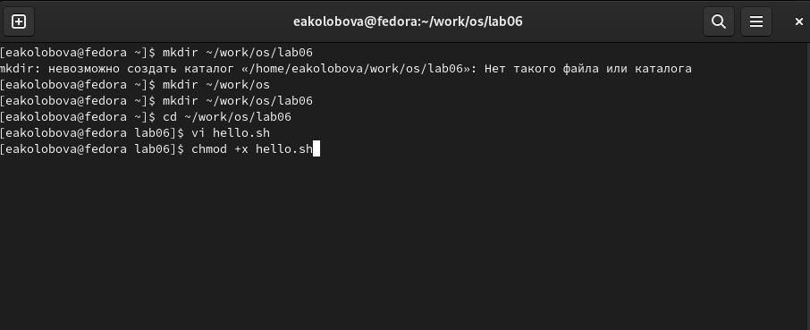
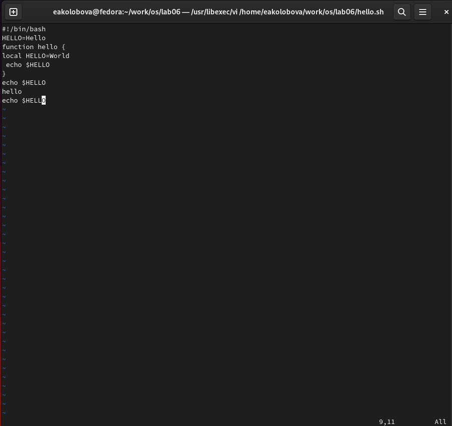

---
## Front matter
lang: ru-RU
title: Отчет по лабораторной работе №8
subtitle: дисциплина Операционные системы
author:
  - Колобова Елизавета, гр. НММбд-01-22
institute:
  - Российский университет дружбы народов, Москва, Россия
date: 22 марта 2023

## i18n babel
babel-lang: russian
babel-otherlangs: english

## Formatting pdf
toc: false
toc-title: Содержание
slide_level: 2
aspectratio: 169
section-titles: true
theme: metropolis
header-includes:
 - \metroset{progressbar=frametitle,sectionpage=progressbar,numbering=fraction}
 - '\makeatletter'
 - '\beamer@ignorenonframefalse'
 - '\makeatother'
---

# Информация

## Докладчик

:::::::::::::: {.columns align=center}
::: {.column width="70%"}

  * Колобова Елизавета 
  * студент
  * Российский университет дружбы народов

:::
::::::::::::::

# Вводная часть

## Объект и предмет исследования

- редактор vi

## Цели и задачи

- познакомиться с операционной системой Linux. Получить практические навыки работы с редактором vi

## Материалы и методы

- Процессор `pandoc` для входного формата Markdown
- Автоматизация процесса создания: `Makefile`

# Создание презентации

## Создание нового файла с использованием vi

1. Создадим каталог с именем ~/work/os/lab06 командой 
2. Перейдем в него командой 
3. Вызовем vi и создадим файл hello.sh
```
vi hello.sh
```
4. Нажмем клавишу i и введем следующий текст. 
```
1 #!/bin/bash
2 HELL=Hello
3 function hello {
4 LOCAL HELLO=World
5 echo $HELLO
6 }
7 echo $HELLO
8 hello
```
7. Нажмем w (записать) и q (выйти), а затем клавишу Enter для сохранения текста и завершения работы. 
8. Сделаем файл исполняемым 
```
chmod +x hello.sh
```
## Создание нового файла с использованием vi 7

{#width=70%}

## Редактирование существующего файла

1. Вызовем vi на редактирование файла
```
vi ~/work/os/lab06/hello.sh
```
2. Установим курсор в конец слова HELL второй строки клавишами 2G + $
3. Перейдем в режим вставки и заменим на Hello 
4. Установим курсор на четвертую строку и сотрем слово LOCAL - 4G + d0
5. Перейдем в режим вставки и наберем следующий текст: local
6. Установим курсор на последней строке файла. Вставим после неё строку, содержащую
следующий текст: echo $HELLO - 0
7. Нажмем Esc для перехода в командный режим.
8. Удалим последнюю строку - 0 + d0
9. Введем команду отмены изменений u для отмены последней команды - u
10. Введем символ ":" для перехода в режим последней строки. Запишем произведённые
изменения и выйдем - wq + enter 

## Редактирование существующего файла


{width=70%}


# Результаты
- знакомство с операционной системой Linux. Получить практические навыки работы с редактором vi
