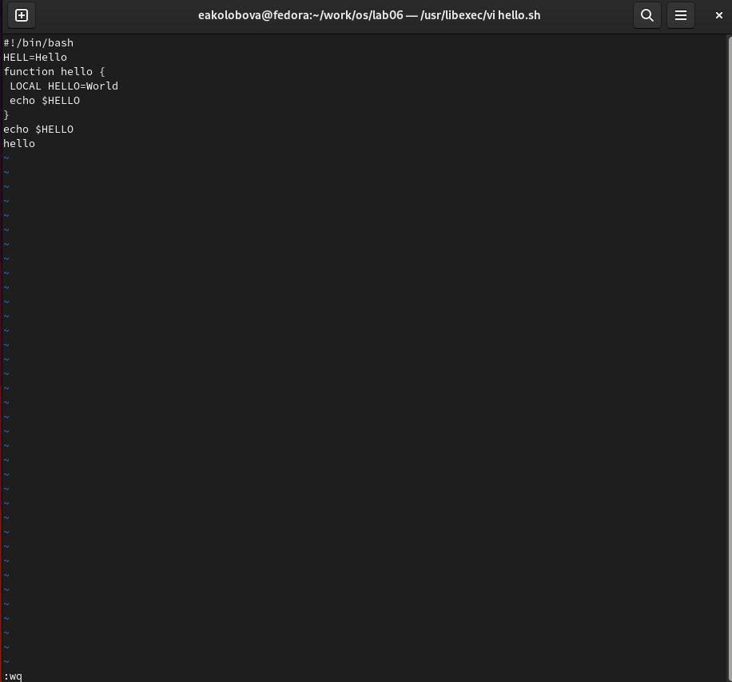

---
## Front matter
title: "Отчет по лабораторной работе №8"
subtitle: "Дисциплина Операционные системы"
author: "Колобова Елизавета, гр. НММбд-01-22"

## Generic otions
lang: ru-RU
toc-title: "Содержание"

## Bibliography
bibliography: bib/cite.bib
csl: pandoc/csl/gost-r-7-0-5-2008-numeric.csl

## Pdf output format
toc: true # Table of contents
toc-depth: 2
lof: true # List of figures
lot: true # List of tables
fontsize: 12pt
linestretch: 1.5
papersize: a4
documentclass: scrreprt
## I18n polyglossia
polyglossia-lang:
  name: russian
  options:
	- spelling=modern
	- babelshorthands=true
polyglossia-otherlangs:
  name: english
## I18n babel
babel-lang: russian
babel-otherlangs: english
## Fonts
mainfont: PT Serif
romanfont: PT Serif
sansfont: PT Sans
monofont: PT Mono
mainfontoptions: Ligatures=TeX
romanfontoptions: Ligatures=TeX
sansfontoptions: Ligatures=TeX,Scale=MatchLowercase
monofontoptions: Scale=MatchLowercase,Scale=0.9
## Biblatex
biblatex: true
biblio-style: "gost-numeric"
biblatexoptions:
  - parentracker=true
  - backend=biber
  - hyperref=auto
  - language=auto
  - autolang=other*
  - citestyle=gost-numeric
## Pandoc-crossref LaTeX customization
figureTitle: "Рис."
tableTitle: "Таблица"
listingTitle: "Листинг"
lofTitle: "Список иллюстраций"
lotTitle: "Список таблиц"
lolTitle: "Листинги"
## Misc options
indent: true
header-includes:
  - \usepackage{indentfirst}
  - \usepackage{float} # keep figures where there are in the text
  - \floatplacement{figure}{H} # keep figures where there are in the text
---

# Цель работы

Цель работы - познакомиться с операционной системой Linux. Получить практические навыки работы с редактором vi.

# Выполнение лабораторной работы

**Создание нового файла с использованием vi**

1. Создадим каталог с именем ~/work/os/lab06 командой (рис. [@fig:001])
2. Перейдем в него командой (рис. [@fig:001])
3. Вызовем vi и создадим файл hello.sh
```
vi hello.sh
```
(рис. [@fig:001])
4. Нажмем клавишу i и введем следующий текст. (рис. [@fig:002])
```
1 #!/bin/bash
2 HELL=Hello
3 function hello {
4 LOCAL HELLO=World
5 echo $HELLO
6 }
7 echo $HELLO
8 hello
```
5. Нажмем клавишу Esc для перехода в командный режим после завершения ввода
текста. (рис. [@fig:002])
6. Нажмем ":" для перехода в режим последней строки.(рис. [@fig:002])
7. Нажмем w (записать) и q (выйти), а затем клавишу Enter для сохранения текста и завершения работы. (рис. [@fig:002])
8. Сделаем файл исполняемым (рис. [@fig:001])
```
chmod +x hello.sh
```

{#fig:001 width=70%}

{#fig:002 width=70%}

**Редактирование существующего файла**

1. Вызовем vi на редактирование файла
```
vi ~/work/os/lab06/hello.sh
```
2. Установим курсор в конец слова HELL второй строки клавишами 2G + $
3. Перейдем в режим вставки и заменим на Hello 
4. Установим курсор на четвертую строку и сотрем слово LOCAL - 4G + d0
5. Перейдем в режим вставки и наберем следующий текст: local
6. Установим курсор на последней строке файла. Вставим после неё строку, содержащую
следующий текст: echo $HELLO - 0
7. Нажмем Esc для перехода в командный режим.
8. Удалим последнюю строку - 0 + d0
9. Введем команду отмены изменений u для отмены последней команды - u
10. Введем символ ":" для перехода в режим последней строки. Запишем произведённые
изменения и выйдем - wq + enter 
(рис. [@fig:003])

{#fig:003 width=70%}

# Контрольные вопросы
1. Дайте краткую характеристику режимам работы редактора vi.
Редактор vi имеет три режима работы:
– командный режим — предназначен для ввода команд редактирования и навигации по
редактируемому файлу;
– режим вставки — предназначен для ввода содержания редактируемого файла;
– режим последней (или командной) строки — используется для записи изменений в файл
и выхода из редактора.
2. Как выйти из редактора, не сохраняя произведённые изменения?
набрать символ q 
3. Назовите и дайте краткую характеристику командам позиционирования.
– 0 (ноль) — переход в начало строки;
– $ — переход в конец строки;
– G — переход в конец файла;
– 𝑛 G — переход на строку с номером n
4. Что для редактора vi является словом?
При использовании прописных W и B под разделителями понимаются только пробел, табуляция и возврат
каретки. При использовании строчных w и b под разделителями понимаются также любые знаки пунктуации.
5. Каким образом из любого места редактируемого файла перейти в начало (конец)
файла?
– Ctrl-f — перейти на страницу вперёд;
– Ctrl-b — перейти на страницу назад.
6. Назовите и дайте краткую характеристику основным группам команд редактирова-
ния.
Команды редактирования
 Вставка текста
– a — вставить текст после курсора;
– A — вставить текст в конец строки;
– i — вставить текст перед курсором;
– n i — вставить текст n раз;
– I — вставить текст в начало строки.
 Вставка строки
– о — вставить строку под курсором;
– О — вставить строку над курсором.
Удаление текста
– x — удалить один символ в буфер;
– d w — удалить одно слово в буфер;
– d $ — удалить в буфер текст от курсора до конца строки;
– d 0 — удалить в буфер текст от начала строки до позиции курсора;
– d d — удалить в буфер одну строку;
– n d d — удалить в буфер n строк
 Отмена и повтор произведённых изменений
– u — отменить последнее изменение;
– . — повторить последнее изменение.
 Копирование текста в буфер
– Y — скопировать строку в буфер;
– n Y — скопировать n строк в буфер;
– y w — скопировать слово в буфер.
 Вставка текста из буфера
– p — вставить текст из буфера после курсора;
– P — вставить текст из буфера перед курсором.
 Замена текста
– c w — заменить слово;
– n c w — заменить n слов;
– c $ — заменить текст от курсора до конца строки;
– r — заменить слово;
– R — заменить текст.
 Поиск текста
– / текст — произвести поиск вперёд по тексту указанной строки символов текст;
– ? текст — произвести поиск назад по тексту указанной строки символов текст.
7. Необходимо заполнить строку символами $. Каковы ваши действия?
скопировать знак в буфер обмена и  c $ — заменить текст от курсора до конца строки
8. Как отменить некорректное действие, связанное с процессом редактирования?
– u — отменить последнее изменение
9. Назовите и дайте характеристику основным группам команд режима последней стро-
ки.
Копирование и перемещение текста
– : n,m d — удалить строки с n по m;
– : i,j m k — переместить строки с i по j, начиная со строки k;
– : i,j t k — копировать строки с i по j в строку k;
– : i,j w имя-файла — записать строки с i по j в файл с именем имя-файла.
 Запись в файл и выход из редактора
– : w — записать изменённый текст в файл, не выходя из vi;
– : w имя-файла — записать изменённый текст в новый файл с именем имя-файла;
– : w ! имя-файла — записать изменённый текст в файл с именем имя-файла;
– : w q — записать изменения в файл и выйти из vi;
– : q — выйти из редактора vi;
– : q ! — выйти из редактора без записи;
– : e ! — вернуться в командный режим, отменив все изменения, произведённые
со времени последней запис
10. Как определить, не перемещая курсора, позицию, в которой заканчивается строка?
11. Выполните анализ опций редактора vi (сколько их, как узнать их назначение и т.д.).
Опции редактора vi позволяют настроить рабочую среду. Для задания опций использу-
ется команда set (в режиме последней строки):
– : set all — вывести полный список опций;
– : set nu — вывести номера строк;
– : set list — вывести невидимые символы;
– : set ic — не учитывать при поиске, является ли символ прописным или строчным.
12. Как определить режим работы редактора vi?
13. Постройте граф взаимосвязи режимов работы редактора vi.

# Выводы

Результатом проделанной работы является получение практические навыки работы с редактором vi.

# Список литературы{.unnumbered}

::: {#refs}
:::
