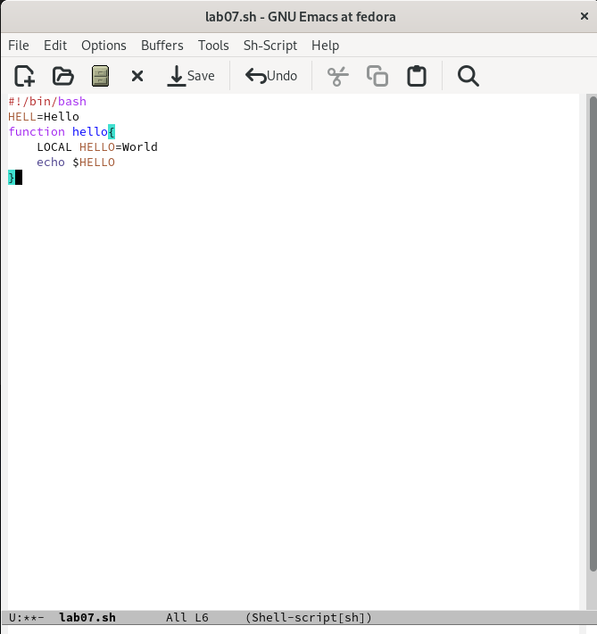
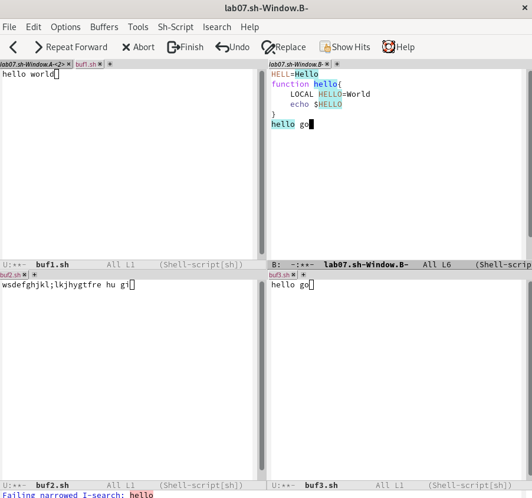

---
## Front matter
lang: ru-RU
title: Отчет по лабораторной работе №9
subtitle: дисциплина Операционные системы
author:
  - Колобова Елизавета, гр. НММбд-01-22
institute:
  - Российский университет дружбы народов, Москва, Россия
date: 22 марта 2023

## i18n babel
babel-lang: russian
babel-otherlangs: english

## Formatting pdf
toc: false
toc-title: Содержание
slide_level: 2
aspectratio: 169
section-titles: true
theme: metropolis
header-includes:
 - \metroset{progressbar=frametitle,sectionpage=progressbar,numbering=fraction}
 - '\makeatletter'
 - '\beamer@ignorenonframefalse'
 - '\makeatother'
---

# Информация

## Докладчик

:::::::::::::: {.columns align=center}
::: {.column width="70%"}

  * Колобова Елизавета 
  * студент
  * Российский университет дружбы народов

:::
::::::::::::::

# Вводная часть

## Объект и предмет исследования

- редактор emasc

## Цели и задачи

- познакомиться с редактором Emacs

## Материалы и методы

- Процессор `pandoc` для входного формата Markdown
- Автоматизация процесса создания: `Makefile`

# Создание презентации

## Создание нового файла 

1. Откроем emacs.
2. Создадим файл lab07.sh
3. Наберем текст:
```
1 #!/bin/bash
2 HELL=Hello
3 function hello {
4 LOCAL HELLO=World
5 echo $HELLO
6 }
```
{width=70%}

## Редактирование файла

4. Сохраним файл с помощью комбинации Ctrl-x Ctrl-s (C-x C-s).
5. Проделем с текстом стандартные процедуры редактирования:
 1. Вырежем одной командой целую строку (С-k).
 2. Вставим эту строку в конец файла (C-y).
 3. Выделим область текста (C-space).
 4. Скопируем область в буфер обмена (M-w).
 5. Вставим область в конец файла.
 6. Вновь выделим эту область и на этот раз вырежем её (C-w).
 7. Отменим последнее действие (C-/).

## Редактирование файла

{width=70%}

## Режим нескольких окон

1. Поделим фрейм на 4 части: разделим фрейм на два окна по вертикали (C-x 3),
а затем каждое из этих окон на две части по горизонтали (C-x 2) 
2. В каждом из четырёх созданных окон откроем новый буфер (файл) и введем
несколько строк текста. 
3. Переключимся в режим поиска (C-s) и найдем несколько слов, присутствующих
в тексте.
4. Переключимся между результатами поиска, нажимая C-s.
5. Выйдем из режима поиска, нажав C-g.
 
{width=70%}


# Результаты
- знакомство с операционной системой Linux. Получить практические навыки работы с редактором Emacs
