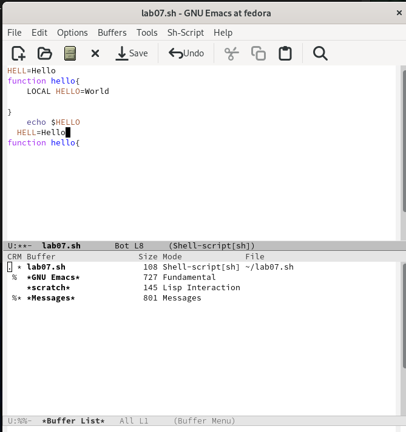
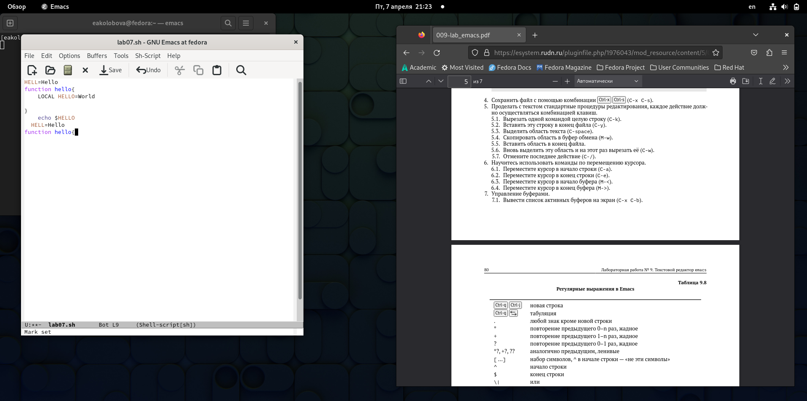
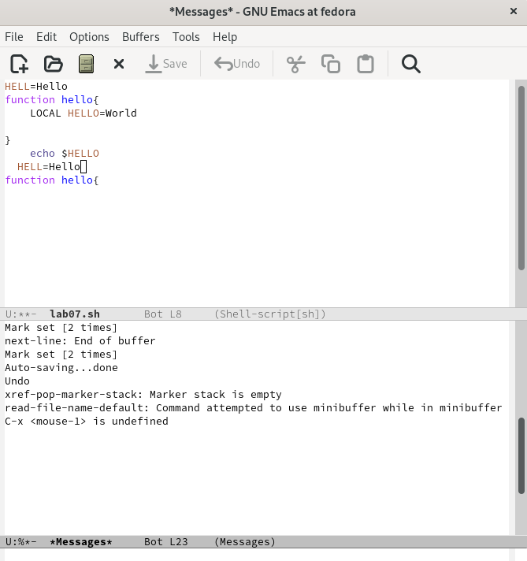

---
## Front matter
title: "Отчет по лабораторной работе №9"
subtitle: "Дисциплина Операционные системы"
author: "Колобова Елизавета, гр. НММбд-01-22"

## Generic otions
lang: ru-RU
toc-title: "Содержание"

## Bibliography
bibliography: bib/cite.bib
csl: pandoc/csl/gost-r-7-0-5-2008-numeric.csl

## Pdf output format
toc: true # Table of contents
toc-depth: 2
lof: true # List of figures
lot: true # List of tables
fontsize: 12pt
linestretch: 1.5
papersize: a4
documentclass: scrreprt
## I18n polyglossia
polyglossia-lang:
  name: russian
  options:
	- spelling=modern
	- babelshorthands=true
polyglossia-otherlangs:
  name: english
## I18n babel
babel-lang: russian
babel-otherlangs: english
## Fonts
mainfont: PT Serif
romanfont: PT Serif
sansfont: PT Sans
monofont: PT Mono
mainfontoptions: Ligatures=TeX
romanfontoptions: Ligatures=TeX
sansfontoptions: Ligatures=TeX,Scale=MatchLowercase
monofontoptions: Scale=MatchLowercase,Scale=0.9
## Biblatex
biblatex: true
biblio-style: "gost-numeric"
biblatexoptions:
  - parentracker=true
  - backend=biber
  - hyperref=auto
  - language=auto
  - autolang=other*
  - citestyle=gost-numeric
## Pandoc-crossref LaTeX customization
figureTitle: "Рис."
tableTitle: "Таблица"
listingTitle: "Листинг"
lofTitle: "Список иллюстраций"
lotTitle: "Список таблиц"
lolTitle: "Листинги"
## Misc options
indent: true
header-includes:
  - \usepackage{indentfirst}
  - \usepackage{float} # keep figures where there are in the text
  - \floatplacement{figure}{H} # keep figures where there are in the text
---

# Цель работы

Цель работы - познакомиться с редактором Emacs.

# Выполнение лабораторной работы

1. Откроем emacs.
2. Создадим файл lab07.sh с помощью комбинации Ctrl-x Ctrl-f . (рис. [@fig:001])

{#fig:001 width=70%}

3. Наберем текст:
```
1 #!/bin/bash
2 HELL=Hello
3 function hello {
4 LOCAL HELLO=World
5 echo $HELLO
6 }
```
(рис. [@fig:002])

{#fig:002 width=70%}

4. Сохраним файл с помощью комбинации Ctrl-x Ctrl-s (C-x C-s).
5. Проделем с текстом стандартные процедуры редактирования:
 1. Вырежем одной командой целую строку (С-k).
 2. Вставим эту строку в конец файла (C-y).
 3. Выделим область текста (C-space).
 4. Скопируем область в буфер обмена (M-w).
 5. Вставим область в конец файла.
 6. Вновь выделим эту область и на этот раз вырежем её (C-w).
 7. Отменим последнее действие (C-/). (рис. [@fig:003])
 
 {#fig:003 width=70%}
 
6. Научимся использовать команды по перемещению курсора.
 1. Переместим курсор в начало строки (C-a).
 2. Переместим курсор в конец строки (C-e).
 3. Переместим курсор в начало буфера (M-<).
 4. Переместим курсор в конец буфера (M->).
7. Управление буферами.
 1. Выведем список активных буферов на экран (C-x C-b). (рис. [@fig:004])
 
 {#fig:004 width=70%}
 
 2. Переместимся во вновь открытое окно (C-x) o со списком открытых буферов
и переключимся на другой буфер. (рис. [@fig:005])
 3. Закроем это окно (C-x 0).
 
 {#fig:005 width=70%}
 
 4. Теперь вновь переключимся между буферами, но уже без вывода их списка на
экран (C-x b).
8. Управление окнами.
 1. Поделим фрейм на 4 части: разделим фрейм на два окна по вертикали (C-x 3),
а затем каждое из этих окон на две части по горизонтали (C-x 2) 
 2. В каждом из четырёх созданных окон откроем новый буфер (файл) и введем
несколько строк текста. 

9. Режим поиска
 1. Переключимся в режим поиска (C-s) и найдем несколько слов, присутствующих
в тексте. (рис. [@fig:007])
 2. Переключимся между результатами поиска, нажимая C-s.
 3. Выйдем из режима поиска, нажав C-g.
 
 {#fig:007 width=70%}
 
 4. Перейдем в режим поиска и замены (M-%), введем текст, который следует найти
и заменить, нажмем Enter , затем введем текст для замены. После того как будут
подсвечены результаты поиска, нажмем ! для подтверждения замены.
 5. Испробуем другой режим поиска, нажав M-s o. Эта команда выполняет поиск регулярного выражения - это образец, который обозначает набор строк, возможно, и неограниченный набор. Команда поиска, использованная ранее искала точное совпадение в буфере. (рис. [@fig:008])
 
 {#fig:008 width=70%}

# Контрольные вопросы
1. Кратко охарактеризуйте редактор emacs.
Emacs представляет собой мощный экранный редактор текста, написанный на языке
высокого уровня Elisp.
2. Какие особенности данного редактора могут сделать его сложным для освоения но-
вичком?
3. Своими словами опишите, что такое буфер и окно в терминологии emacs’а.
Буфер — объект, представляющий какой-либо текст.
Буфер может содержать что угодно, например, результаты компиляции программы
или встроенные подсказки. 
Окно — прямоугольная область фрейма, отображающая один из буфе-
ров.
4. Можно ли открыть больше 10 буферов в одном окне?
Можно
5. Какие буферы создаются по умолчанию при запуске emacs?
Только что запущенный Emacs несет один буфер с именем scratch
6. Какие клавиши вы нажмёте, чтобы ввести следующую комбинацию C-c | и C-c C-|?
(ctrl + c + |) 
7. Как поделить текущее окно на две части?
Через меню файл, т.к. положенные клавиши не работают
Предполагается, что комбинациями клавиш (C-x 3) или (C-x 2) 
8. В каком файле хранятся настройки редактора emacs?
Для настройки Emacs используется специальный файл, который обычно находится в каталоге пользователя и называется .emacs
9. Какую функцию выполняет клавиша и можно ли её переназначить?
76 Лабораторная работа No 9. Текстовой редактор emacs
Многие рутинные операции в Emacs удобнее производить с помощью клавиатуры, а не
графического меню.
Переназначить клавиши можно. Например, хотим функцию undo включать по C-z. Смотрим чем занято C-z, нажимаем C-h k C-z:
C-z runs the command suspend-frame, which is an interactive compiled Назначаем этой функции другую комбинацию.
10. Какой редактор вам показался удобнее в работе vi или emacs? Поясните почему
vi, т.к. в нем все комбинации работают, как в руководстве написано
# Выводы

Результатом проделанной работы является получение практические навыки работы с редактором Emacs..

# Список литературы{.unnumbered}

::: {#refs}
:::
