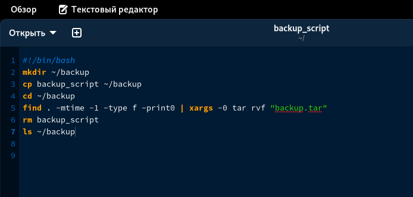

---
## Front matter
lang: ru-RU
title: Отчет по лабораторной работе №10
subtitle: дисциплина Операционные системы
author:
  - Колобова Елизавета, гр. НММбд-01-22
institute:
  - Российский университет дружбы народов, Москва, Россия
date: 22 марта 2023

## i18n babel
babel-lang: russian
babel-otherlangs: english

## Formatting pdf
toc: false
toc-title: Содержание
slide_level: 2
aspectratio: 169
section-titles: true
theme: metropolis
header-includes:
 - \metroset{progressbar=frametitle,sectionpage=progressbar,numbering=fraction}
 - '\makeatletter'
 - '\beamer@ignorenonframefalse'
 - '\makeatother'
---

# Информация

## Докладчик

:::::::::::::: {.columns align=center}
::: {.column width="70%"}

  * Колобова Елизавета 
  * студент
  * Российский университет дружбы народов

:::
::::::::::::::

# Вводная часть

## Объект и предмет исследования

- программирование в оболочке ОС UNIX/Linux.

## Цели и задачи

- изучить основы программирования в оболочке ОС UNIX/Linux. 
- Научиться писать небольшие командные файлы.

## Материалы и методы

- Процессор `pandoc` для входного формата Markdown
- Автоматизация процесса создания: `Makefile`

# Создание презентации

## Скрипт резервного копирования 

1. Напишем скрипт, который при запуске будет делать резервную копию самого себя (то
есть файла, в котором содержится его исходный код) в другую директорию backup
в домашнем каталоге. При этом файл должен архивироваться одним из ар-
хиваторов на выбор zip, bzip2 или tar. 

 { width=70%}

## Скрипт с неограниченным количеством аргументов  

2. Напишем пример командного файла, обрабатывающего любое произвольное число
аргументов командной строки, в том числе превышающее десять. Скрипт
может последовательно распечатывать значения всех переданных аргументов. 

 { width=70%}

## Скрипт информации о содержимом каталога

3. Напишем командный файл — аналог команды ls (без использования самой этой ко-
манды и команды dir). Требуется, чтобы он выдавал информацию о нужном каталоге
и выводил информацию о возможностях доступа к файлам этого каталога. 

 { width=70%}

## Скрипт подсчета количества файлов

4. Напишем командный файл, который получает в качестве аргумента командной строки
формат файла (.txt, .doc, .jpg, .pdf и т.д.) и вычисляет количество таких файлов
в указанной директории. Путь к директории также передаётся в виде аргумента ко-
мандной строки.
 
 { width=70%}
 

# Результаты
- Результатом проделанной работы является изучение основ программирования в оболочке ОС UNIX/Linux. 
