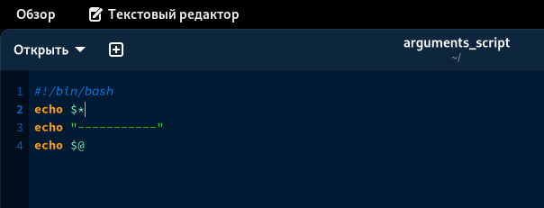
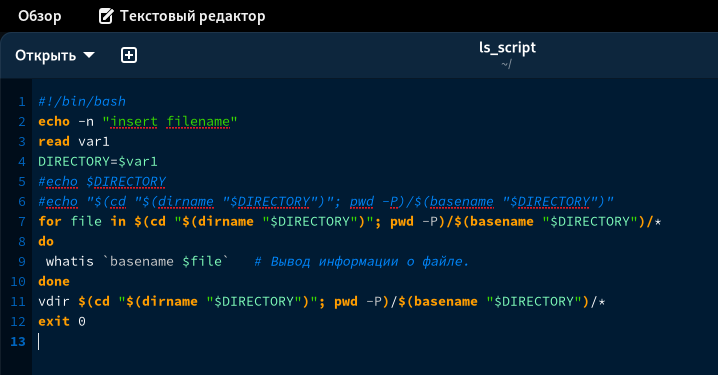
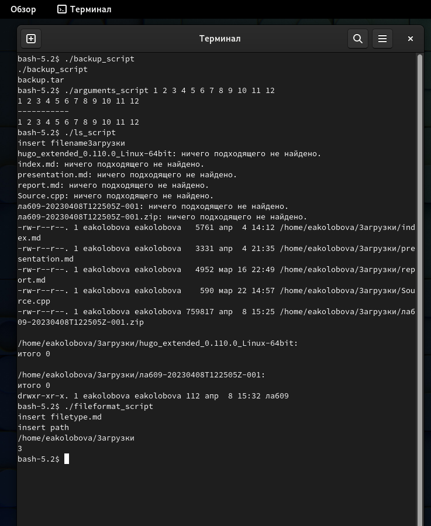

---
## Front matter
title: "Отчет по лабораторной работе №10"
subtitle: "Дисциплина Операционные системы"
author: "Колобова Елизавета, гр. НММбд-01-22"

## Generic otions
lang: ru-RU
toc-title: "Содержание"

## Bibliography
bibliography: bib/cite.bib
csl: pandoc/csl/gost-r-7-0-5-2008-numeric.csl

## Pdf output format
toc: true # Table of contents
toc-depth: 2
lof: true # List of figures
lot: true # List of tables
fontsize: 12pt
linestretch: 1.5
papersize: a4
documentclass: scrreprt
## I18n polyglossia
polyglossia-lang:
  name: russian
  options:
	- spelling=modern
	- babelshorthands=true
polyglossia-otherlangs:
  name: english
## I18n babel
babel-lang: russian
babel-otherlangs: english
## Fonts
mainfont: PT Serif
romanfont: PT Serif
sansfont: PT Sans
monofont: PT Mono
mainfontoptions: Ligatures=TeX
romanfontoptions: Ligatures=TeX
sansfontoptions: Ligatures=TeX,Scale=MatchLowercase
monofontoptions: Scale=MatchLowercase,Scale=0.9
## Biblatex
biblatex: true
biblio-style: "gost-numeric"
biblatexoptions:
  - parentracker=true
  - backend=biber
  - hyperref=auto
  - language=auto
  - autolang=other*
  - citestyle=gost-numeric
## Pandoc-crossref LaTeX customization
figureTitle: "Рис."
tableTitle: "Таблица"
listingTitle: "Листинг"
lofTitle: "Список иллюстраций"
lotTitle: "Список таблиц"
lolTitle: "Листинги"
## Misc options
indent: true
header-includes:
  - \usepackage{indentfirst}
  - \usepackage{float} # keep figures where there are in the text
  - \floatplacement{figure}{H} # keep figures where there are in the text
---

# Цель работы

Цель работы - изучить основы программирования в оболочке ОС UNIX/Linux. Научиться писать
небольшие командные файлы.

# Выполнение лабораторной работы

1. Напишем скрипт, который при запуске будет делать резервную копию самого себя (то
есть файла, в котором содержится его исходный код) в другую директорию backup
в домашнем каталоге. При этом файл должен архивироваться одним из ар-
хиваторов на выбор zip, bzip2 или tar. (рис. [@fig:001], [@fig:005])

 {#fig:001 width=70%}
 
2. Напишем пример командного файла, обрабатывающего любое произвольное число
аргументов командной строки, в том числе превышающее десять. Скрипт
может последовательно распечатывать значения всех переданных аргументов. (рис. [@fig:002], [@fig:005])

 {#fig:002 width=70%}
 
3. Напишем командный файл — аналог команды ls (без использования самой этой ко-
манды и команды dir). Требуется, чтобы он выдавал информацию о нужном каталоге
и выводил информацию о возможностях доступа к файлам этого каталога. (рис. [@fig:003], [@fig:005])

 {#fig:003 width=70%}
 
4. Напишем командный файл, который получает в качестве аргумента командной строки
формат файла (.txt, .doc, .jpg, .pdf и т.д.) и вычисляет количество таких файлов
в указанной директории. Путь к директории также передаётся в виде аргумента ко-
мандной строки.. (рис. [@fig:004], [@fig:005])
 
 {#fig:004 width=70%}
 
  {#fig:005 width=70%}

# Контрольные вопросы
1. Объясните понятие командной оболочки. Приведите примеры командных оболочек.
Чем они отличаются?
Командный процессор (командная оболочка, интерпретатор команд shell) — это про-
грамма, позволяющая пользователю взаимодействовать с операционной системой
компьютера. В операционных системах типа UNIX/Linux наиболее часто используются
следующие реализации командных оболочек:
– оболочка Борна (Bourne shell или sh) — стандартная командная оболочка UNIX/Linux,
содержащая базовый, но при этом полный набор функций;
– С-оболочка (или csh) — надстройка на оболочкой Борна, использующая С-подобный
синтаксис команд с возможностью сохранения истории выполнения команд;
– оболочка Корна (или ksh) — напоминает оболочку С, но операторы управления програм-
мой совместимы с операторами оболочки Борна;
– BASH — сокращение от Bourne Again Shell (опять оболочка Борна), в основе своей сов-
мещает свойства оболочек С и Корна (разработка компании Free Software Foundation)
2. Что такое POSIX?
OSIX (Portable Operating System Interface for Computer Environments) — набор стандартов
описания интерфейсов взаимодействия операционной системы и прикладных программ.
3. Как определяются переменные и массивы в языке программирования bash?
Командный процессор bash обеспечивает возможность использования переменных
типа строка символов. Имена переменных могут быть выбраны пользователем. Пользо-
ватель имеет возможность присвоить переменной значение некоторой строки символов.
Значение, присвоенное некоторой переменной, может быть впоследствии использо-
вано. Для этого в соответствующем месте командной строки должно быть употреблено
имя этой переменной, которому предшествует метасимвол $
Оболочка bash позволяет работать с массивами. Для создания массива используется
команда set с флагом -A. За флагом следует имя переменной, а затем список значений,
разделённых пробелами.
4. Каково назначение операторов let и read?
Команда let берет два операнда и присваивает их переменной. Положительным мо-
ментом команды let можно считать то, что для идентификации переменной ей не
нужен знак доллара; вы можете писать команды типа let sum=x+7, и let будет искать
переменную x и добавлять к ней 7.
Команда let также расширяет другие выражения let, если они заключены в двойные
круглые скобки. Таким способом вы можете создавать довольно сложные выражения.
Команда read позволяет читать значения переменных со стандартного ввода
5. Какие арифметические операции можно применять в языке программирования bash?
Целые числа можно записывать как последовательность цифр или в любом базовом
формате типа radix\#number, где radix (основание системы счисления) — любое чис-
ло не более 26. Для большинства команд используются следующие основания систем
исчисления: 2 (двоичная), 8 (восьмеричная) и 16 (шестнадцатеричная). Простейшими
математическими выражениями являются сложение (+), вычитание (-), умножение (*),
целочисленное деление (/) и целочисленный остаток от деления (%).
6. Что означает операция (( ))?
Для облегчения программирования можно записывать условия оболочки bash в двойные
скобки — `(( ))`
7. Какие стандартные имена переменных Вам известны?
Переменные PS1 и PS2 предназначены для отображения промптера командного про-
цессора. PS1 — это промптер командного процессора, по умолчанию его значение равно
символу $ или #. Если какая-то интерактивная программа, запущенная командным процессором, требует ввода, то используется промптер PS2. Он по умолчанию имеет
значение символа >.
Другие стандартные переменные:
– HOME — имя домашнего каталога пользователя. Если команда cd вводится без аргумен-
тов, то происходит переход в каталог, указанный в этой переменной.
– IFS — последовательность символов, являющихся разделителями в командной строке,
например, пробел, табуляция и перевод строки (new line).
– MAIL — командный процессор каждый раз перед выводом на экран промптера прове-
ряет содержимое файла, имя которого указано в этой переменной, и если содержимое
этого файла изменилось с момента последнего ввода из него, то перед тем как вывести
на терминал промптер, командный процессор выводит на терминал сообщение You
have mail (у Вас есть почта).
– TERM — тип используемого терминала.
– LOGNAME — содержит регистрационное имя пользователя, которое устанавливается
автоматически при входе в систему.
8. Что такое метасимволы?
Такие символы, как ' < > * ? | \ " &, являются метасимволами и имеют для ко-
мандного процессора специальный смысл.
9. Как экранировать метасимволы?
Снятие специального смысла с метасимвола
называется экранированием метасимвола. Экранирование может быть осуществлено с по-
мощью предшествующего метасимволу символа \, который, в свою очередь, является
метасимволом.
Для экранирования группы метасимволов нужно заключить её в одинарные кавыч-
ки. Строка, заключённая в двойные кавычки, экранирует все метасимволы, кроме
$, ' , \, "
10. Как создавать и запускать командные файлы?
Создать обычный пустой файл, записать в него текст программы.
Можно вызывать свой командный файл на выполнение, просто вводя его имя
с терминала так, как-будто он является выполняемой программой. 
11. Как определяются функции в языке программирования bash?
Группу команд можно объединить в функцию. Для этого существует ключевое слово
function, после которого следует имя функции и список команд, заключённых в фигур-
ные скобки. Удалить функцию можно с помощью команды unset c флагом -f.
12. Каким образом можно выяснить, является файл каталогом или обычным файлом?
С помощью проверки информации о файле с ключом -d и циклом, устанавливающим булев флаг
13. Каково назначение команд set, typeset и unset?
Команда typeset имеет четыре опции для работы с функциями:
– -f — перечисляет определённые на текущий момент функции;
– -ft — при последующем вызове функции инициирует её трассировку;
– -fx — экспортирует все перечисленные функции в любые дочерние программы обо-
лочек;
– -fu — обозначает указанные функции как автоматически загружаемые. Автоматиче-
ски загружаемые функции хранятся в командных файлах, а при их вызове оболочка
просматривает переменную FPATH, отыскивая файл с одноимёнными именами функ-
ций, загружает его и вызывает эти функции.
Значение всех переменных можно просмотреть с помощью команды set.
Изъять переменную из программы можно с помощью команды unset.
14. Как передаются параметры в командные файлы?
При вызове командного файла на выполнение параметры ему могут быть переданы
точно таким же образом, как и выполняемой программе. С точки зрения командного
файла эти параметры являются позиционными.
15. Назовите специальные переменные языка bash и их назначение.
– $* — отображается вся командная строка или параметры оболочки;
– $? — код завершения последней выполненной команды;
– $$ — уникальный идентификатор процесса, в рамках которого выполняется команд-
ный процессор;
– $! — номер процесса, в рамках которого выполняется последняя вызванная на выпол-
нение в командном режиме команда;
– $- — значение флагов командного процессора;
– ${#*} — возвращает целое число — количество слов, которые были результатом $*;
– ${#name} — возвращает целое значение длины строки в переменной name;
– ${name[n]} — обращение к n-му элементу массива;
– ${name[*]} — перечисляет все элементы массива, разделённые пробелом;
– ${name[@]} — то же самое, но позволяет учитывать символы пробелы в самих пере-
менных;
– ${name:-value} — если значение переменной name не определено, то оно будет заме-
нено на указанное value;
– ${name:value} — проверяется факт существования переменной;
– ${name=value} — если name не определено, то ему присваивается значение value;
– ${name?value} — останавливает выполнение, если имя переменной не определено,
и выводит value как сообщение об ошибке;
– ${name+value} — это выражение работает противоположно ${name-value}. Если пе-
ременная определена, то подставляется value;
– ${name#pattern} — представляет значение переменной name с удалённым самым
коротким левым образцом (pattern);
– ${#name[*]} и ${#name[@]} — эти выражения возвращают количество элементов
в массиве name.

# Выводы

Результатом проделанной работы является изучение основ программирования в оболочке ОС UNIX/Linux. 

# Список литературы{.unnumbered}

::: {#refs}
:::
