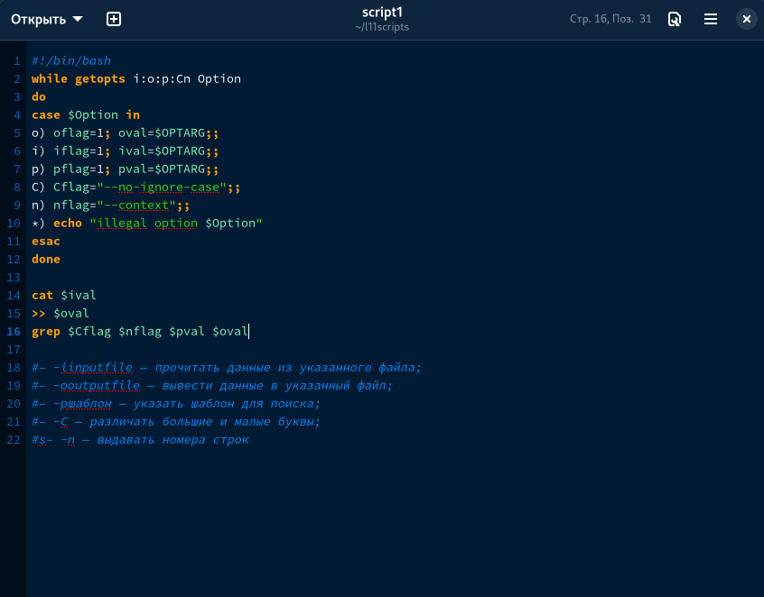
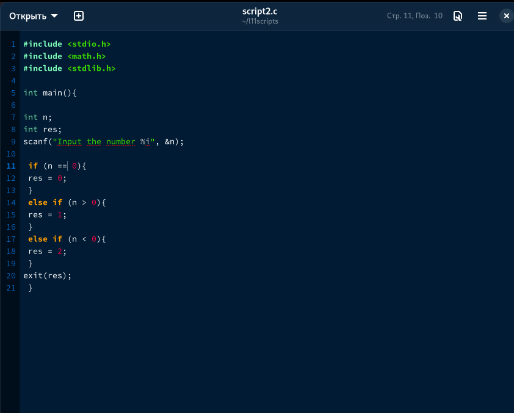
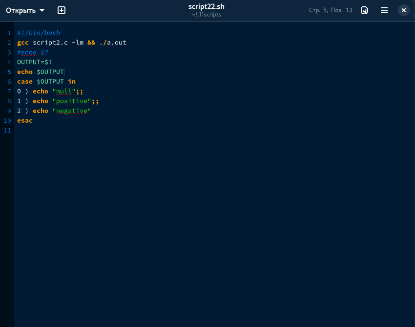
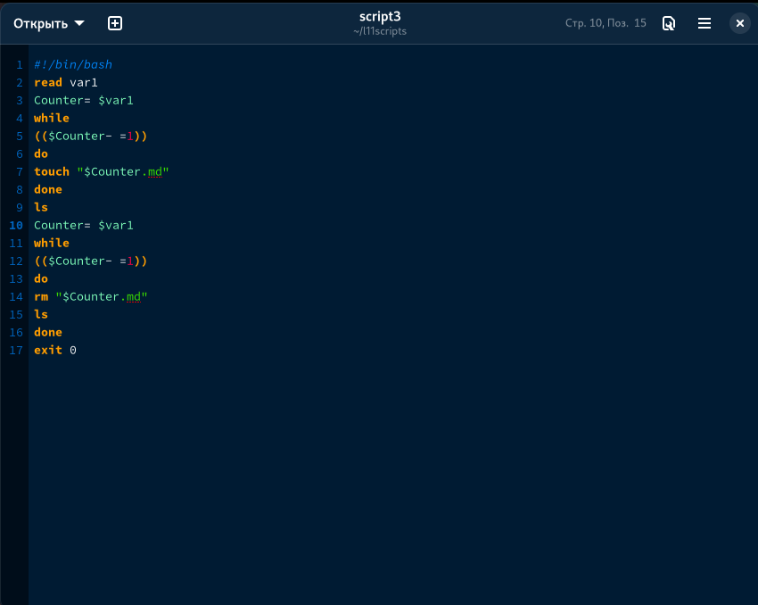
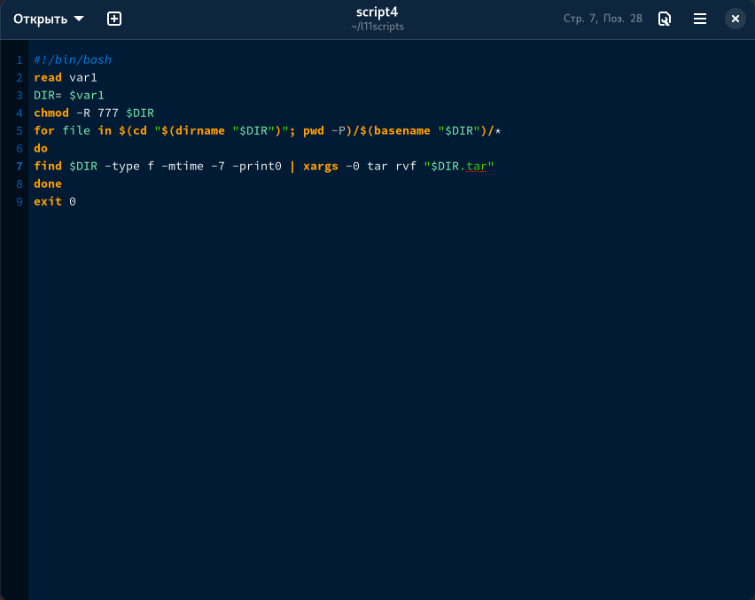

---
## Front matter
title: "Отчет по лабораторной работе №11"
subtitle: "Дисциплина Операционные системы"
author: "Колобова Елизавета, гр. НММбд-01-22"

## Generic otions
lang: ru-RU
toc-title: "Содержание"

## Bibliography
bibliography: bib/cite.bib
csl: pandoc/csl/gost-r-7-0-5-2008-numeric.csl

## Pdf output format
toc: true # Table of contents
toc-depth: 2
lof: true # List of figures
lot: true # List of tables
fontsize: 12pt
linestretch: 1.5
papersize: a4
documentclass: scrreprt
## I18n polyglossia
polyglossia-lang:
  name: russian
  options:
	- spelling=modern
	- babelshorthands=true
polyglossia-otherlangs:
  name: english
## I18n babel
babel-lang: russian
babel-otherlangs: english
## Fonts
mainfont: PT Serif
romanfont: PT Serif
sansfont: PT Sans
monofont: PT Mono
mainfontoptions: Ligatures=TeX
romanfontoptions: Ligatures=TeX
sansfontoptions: Ligatures=TeX,Scale=MatchLowercase
monofontoptions: Scale=MatchLowercase,Scale=0.9
## Biblatex
biblatex: true
biblio-style: "gost-numeric"
biblatexoptions:
  - parentracker=true
  - backend=biber
  - hyperref=auto
  - language=auto
  - autolang=other*
  - citestyle=gost-numeric
## Pandoc-crossref LaTeX customization
figureTitle: "Рис."
tableTitle: "Таблица"
listingTitle: "Листинг"
lofTitle: "Список иллюстраций"
lotTitle: "Список таблиц"
lolTitle: "Листинги"
## Misc options
indent: true
header-includes:
  - \usepackage{indentfirst}
  - \usepackage{float} # keep figures where there are in the text
  - \floatplacement{figure}{H} # keep figures where there are in the text
---

# Цель работы

Цель работы - изучить основы программирования в оболочке ОС UNIX/Linux. Научиться писать сложные командные файлы с использованием логических управляющих конструкций и циклов.
# Выполнение лабораторной работы

1. Используя команды getopts grep, напишем командный файл, который анализирует
командную строку с ключами:
– -iinputfile — прочитать данные из указанного файла;
– -ooutputfile — вывести данные в указанный файл;
– -pшаблон — указать шаблон для поиска;
– -C — различать большие и малые буквы;
– -n — выдавать номера строк.
а затем ищет в указанном файле нужные строки, определяемые ключом -p. (рис. [@fig:001])

 {#fig:001 width=70%}
 
2. Напишем на языке Си программу, которая вводит число и определяет, является ли оно
больше нуля, меньше нуля или равно нулю. Затем программа завершается с помощью
функции exit(n), передавая информацию в о коде завершения в оболочку. Команд-
ный файл вызывает эту программу и, проанализировав с помощью команды
$?, выдать сообщение о том, какое число было введено. (положительное, отрицательное или нуль) (рис. [@fig:002], [@fig:003])

 {#fig:002 width=70%}
 
  {#fig:003 width=70%}
 
3. Напишем командный файл, создающий указанное число файлов, пронумерованных
последовательно от 1 до N ( 1.tmp, 2.tmp, 3.tmp,4.tmp и т.д.). Число файлов,
которые необходимо создать, передаётся в аргументы командной строки. Этот же ко-
мандный файл удаляет все созданные им файлы (если они существуют). (рис. [@fig:004]])

 {#fig:004 width=70%}
 
4. Напишем командный файл, который с помощью команды tar запаковывает в архив
все файлы в указанной директории. Он модифицирован так, чтобы запаковывались
только те файлы, которые были изменены менее недели тому назад . (рис. [@fig:005])
 
 {#fig:005 width=70%}

# Контрольные вопросы
1. Каково предназначение команды getopts?
осуществляет синтаксический анализ командной строки, выделяя флаги, и используется
для объявления переменных.
2. Какое отношение метасимволы имеют к генерации имён файлов?
 После всех подстановок в каждом слове команды ищутся символы *,?, и т.д. Если находится хотя бы один из них, то это слово рассматривается как шаблон имен файлов и заменяется именами файлов, удовлетворяющих данному шаблону (в алфавитном порядке). Если ни одно имя файла не удовлетворяет шаблону, то он остается неизменным. Значения указанных символов: * любая строка, включая и пустую ? один любой символ [...] любой из указанных между ними символов. Пара символов, разделенных знаком -, означает любой символ, который находится между ними, включая и их самих. Если первым символом после "[" идет "!", то указанные символы не должны входить в имя файла
3. Какие операторы управления действиями вы знаете?
Точка с запятой (;), Амперсанд (&), Символ доллара со знаком вопроса ($?), Двойной амперсанд (&&), Двойная вертикальная черта (||), Знак фунта (#), Экранирование специальных символов (\)
4. Какие операторы используются для прерывания цикла?
Команда break завершает выполнение цикла, а команда continue завершает данную итерацию блока операторов.
5. Для чего нужны команды false и true?
команда true всегда возвращает код завершения, равный нулю (т.е. истина), команда false всегда возвращает код завершения, не равный нулю (т. е. ложь).
6. Что означает строка if test -f man$s/$i.$s, встреченная в командном файле?
7. Объясните различия между конструкциями while и until.
При замене в операторе цикла while служебного слова while на until условие, при
выполнении которого осуществляется выход из цикла, меняется на противоположное.
В остальном оператор цикла while и оператор цикла until идентичны.
# Выводы

Результатом проделанной работы является изучение основ программирования в оболочке ОС UNIX/Linux. 

# Список литературы{.unnumbered}

::: {#refs}
:::
