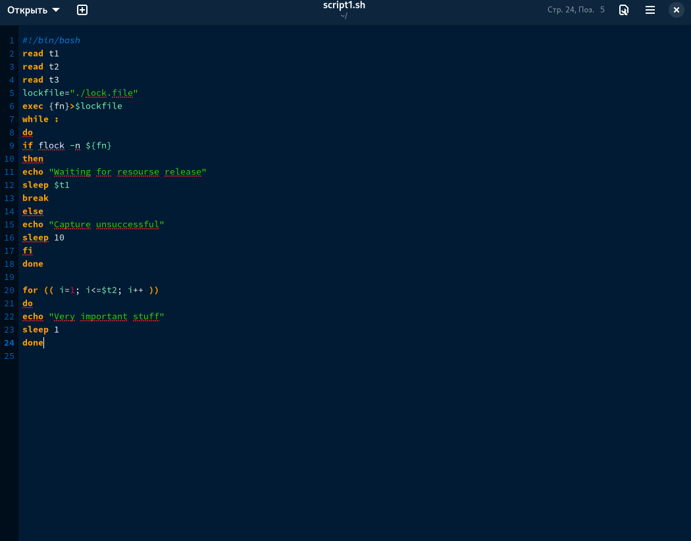
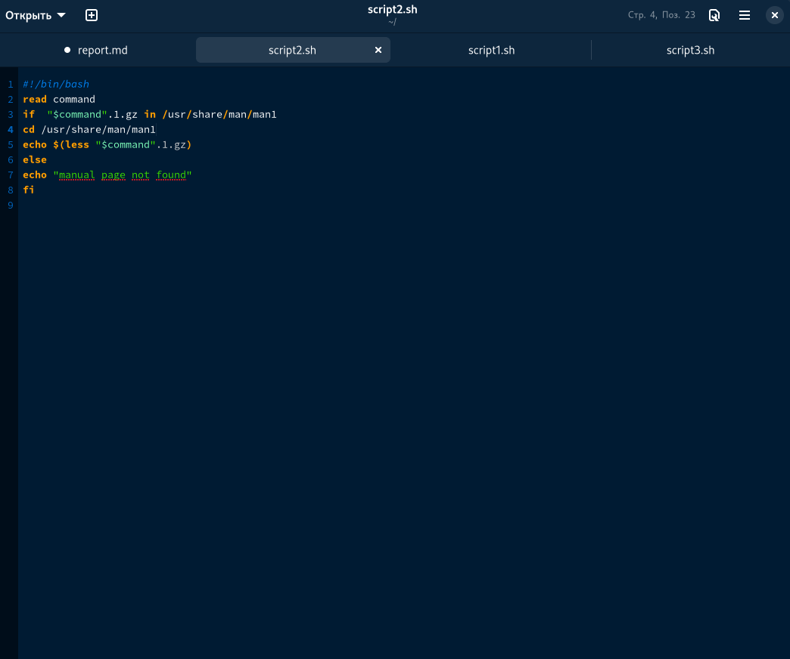

---
## Front matter
lang: ru-RU
title: Отчет по лабораторной работе №12
subtitle: дисциплина Операционные системы
author:
  - Колобова Елизавета, гр. НММбд-01-22
institute:
  - Российский университет дружбы народов, Москва, Россия
date: 22 марта 2023

## i18n babel
babel-lang: russian
babel-otherlangs: english

## Formatting pdf
toc: false
toc-title: Содержание
slide_level: 2
aspectratio: 169
section-titles: true
theme: metropolis
header-includes:
 - \metroset{progressbar=frametitle,sectionpage=progressbar,numbering=fraction}
 - '\makeatletter'
 - '\beamer@ignorenonframefalse'
 - '\makeatother'
---

# Информация

## Докладчик

:::::::::::::: {.columns align=center}
::: {.column width="70%"}

  * Колобова Елизавета 
  * студент
  * Российский университет дружбы народов

:::
::::::::::::::

# Вводная часть

## Объект и предмет исследования

- программирование в оболочке ОС UNIX/Linux.

## Цели и задачи

- изучить основы программирования в оболочке ОС UNIX/Linux. 
- Научиться писать сложные командные файлы с использованием логических управляющих конструкций и циклов.

## Материалы и методы

- Процессор `pandoc` для входного формата Markdown
- Автоматизация процесса создания: `Makefile`

# Создание презентации

##  Скрипт упрощенного механизма семафоров

1. Напишем командный файл, реализующий упрощённый механизм семафоров. Ко-
мандный файл в течение некоторого времени t1 дожидается освобождения
ресурса, выдавая об этом сообщение, а дождавшись его освобождения, использует
его в течение некоторого времени t2<>t1, также выдавая информацию о том, что
ресурс используется соответствующим командным файлом (процессом). Запустим
командный файл в одном виртуальном терминале в фоновом режиме, перенаправив
его вывод в другой (> /dev/tty# или > /dev/psa/#, # - номер терминала). 

## Скрипт упрощенного механизма семафоров

 { width=70%}
 
## Реализация команды man

2. Реализуем команду man с помощью командного файла. Изучим содержимое ката-
лога /usr/share/man/man1. В нем находятся архивы текстовых файлов, содержащих
справку по большинству установленных в системе программ и команд. Каждый архив
можно открыть командой less сразу же просмотрев содержимое справки. Командный
файл получает в виде аргумента командной строки название команды и в виде
результата выдает справку об этой команде или сообщение об отсутствии справки,
если соответствующего файла нет в каталоге man1.) 

 
## Реализация команды man

{ width=70%}
 
  
## Скрипт создания буквенной последовательности

3. Используя встроенную переменную $RANDOM, напишем командный файл, генерирующий случайную последовательность букв латинского алфавита. 

 {width=70%}

# Результаты
- Результатом проделанной работы является изучение основ программирования в оболочке ОС UNIX/Linux. 
