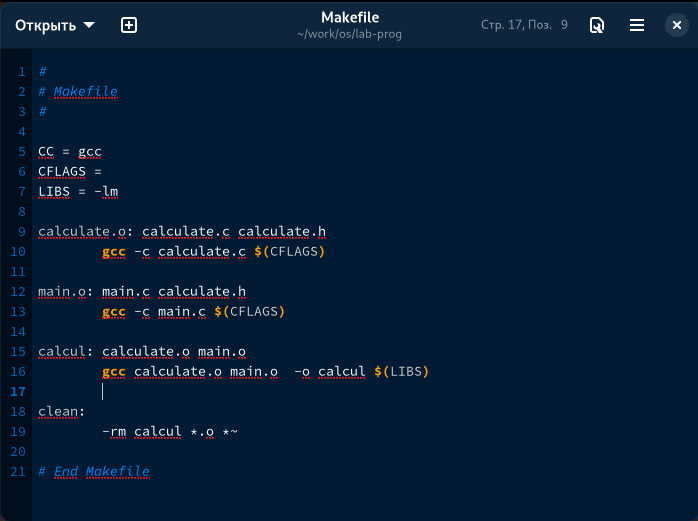
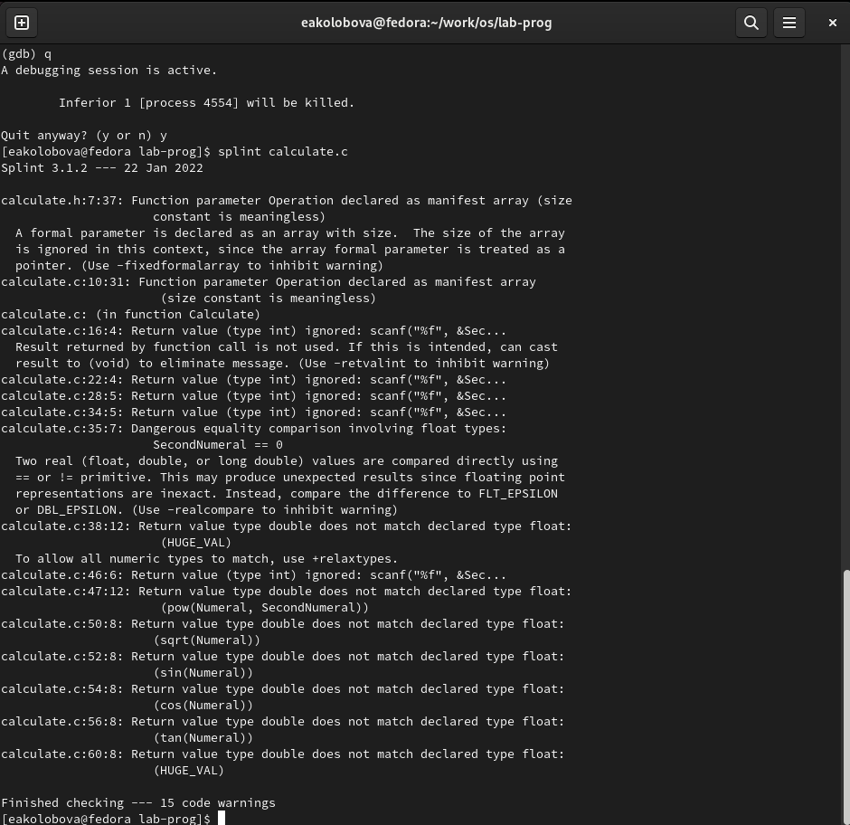

---
## Front matter
lang: ru-RU
title: Отчет по лабораторной работе №13
subtitle: дисциплина Операционные системы
author:
  - Колобова Елизавета, гр. НММбд-01-22
institute:
  - Российский университет дружбы народов, Москва, Россия
date: 22 марта 2023

## i18n babel
babel-lang: russian
babel-otherlangs: english

## Formatting pdf
toc: false
toc-title: Содержание
slide_level: 2
aspectratio: 169
section-titles: true
theme: metropolis
header-includes:
 - \metroset{progressbar=frametitle,sectionpage=progressbar,numbering=fraction}
 - '\makeatletter'
 - '\beamer@ignorenonframefalse'
 - '\makeatother'
---

# Информация

## Докладчик

:::::::::::::: {.columns align=center}
::: {.column width="70%"}

  * Колобова Елизавета 
  * студент
  * Российский университет дружбы народов

:::
::::::::::::::

# Вводная часть

## Объект и предмет исследования

- программирование в оболочке ОС UNIX/Linux.

## Цели и задачи

- Цель работы - приобрести простейшие навыки разработки, анализа, тестирования и отладки приложений в ОС типа UNIX/Linux на примере создания на языке программирования С калькулятора с простейшими функциями.

## Материалы и методы

- Процессор `pandoc` для входного формата Markdown
- Автоматизация процесса создания: `Makefile`

# Создание презентации

##  Создание файлов

1. В домашнем каталоге создадим подкаталог ~/work/os/lab_prog 
 
2. Создадим в нём файлы: calculate.h, calculate.c, main.c.
 
3. Заполним созданные файлы согласно материалам лабораторной работы. Реализация функций калькулятора представлена в файле calculate.c, основной файл main.c реализует интерфейс пользователя к калькулятору. Синтаксические ошибки утилитой ыздште не выявляются, так что их там, скорее всего, нет

## Создание Makefile

Создадим Makefile с содержанием, указанным в материалах лабораторной работы. Основное в содержании файла - это указанный в нем порядок компиляции исполняемых файлов. Сразу отредактируем файл, переместив блок с компиляцией программы calcul ниже всех остальных, сразу перед блоком clean, т.к. для компиляции итоговой программы требуются файлы, которые создаются в блоках выше. 

 { width=70%}
 
## Компиляция и отладка

Выполним компиляцию программы посредством gcc, как указано в лабораторной работе, с добавлением ключа -g, чтобы далее программу можно было загрузить в отладчик без ошибок. 
С помощью gdb выполним отладку программы calcul и выполним указанные в материалах к лаб. работе действия

  { width=70%} 
  
## Исследование с помощью утилиты splint 

С помощью утилиты splint попробуем проанализировать коды файлов calculate.c
и main.c. В основном выводятся предупреждения о несоответствии типов переменных и возвращаемых значений, игнорировании определенных функций, использовании параметров в кач-ве указателей и прочих сомнительных, но не влияющих на работу программы вещах 

 { width=70%}
 
# Результаты
Результатом проделанной работы является Приобретение простейших навыков разработки, анализа, тестирования и отладки приложений в ОС типа UNIX/Linux на примере создания на языке программирования
С калькулятора с простейшими функциями. 
