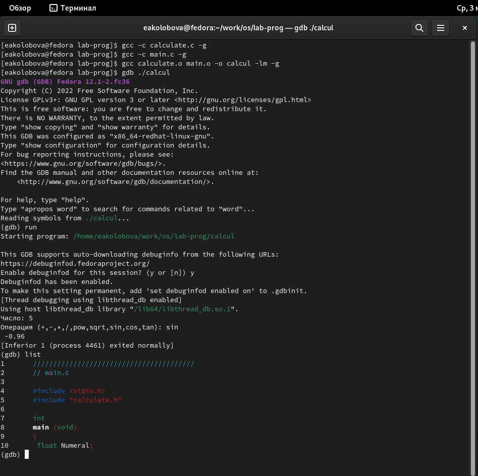
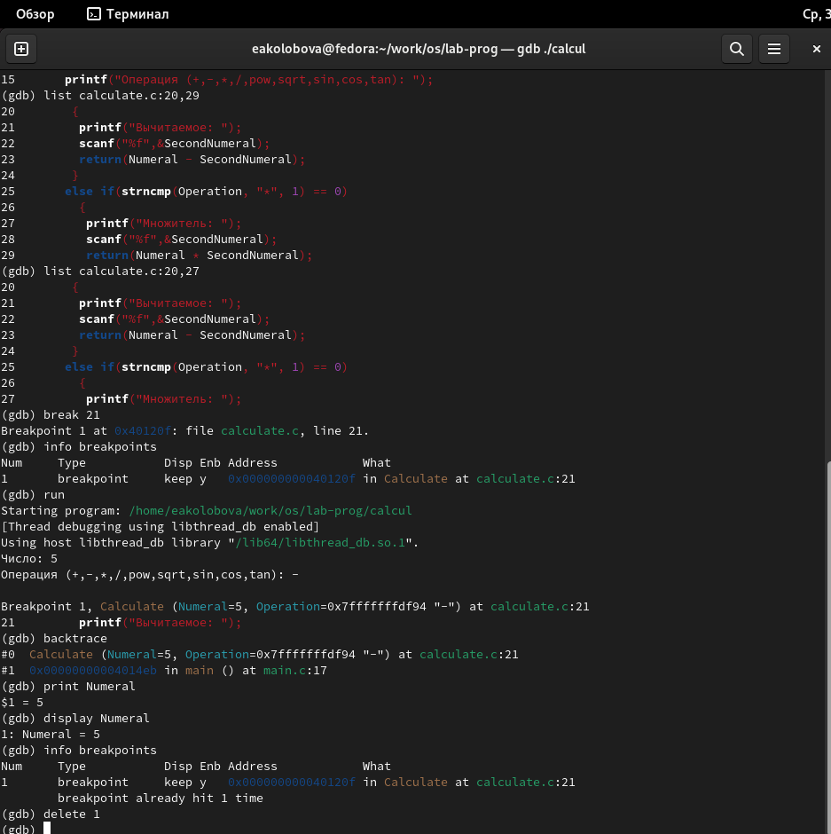
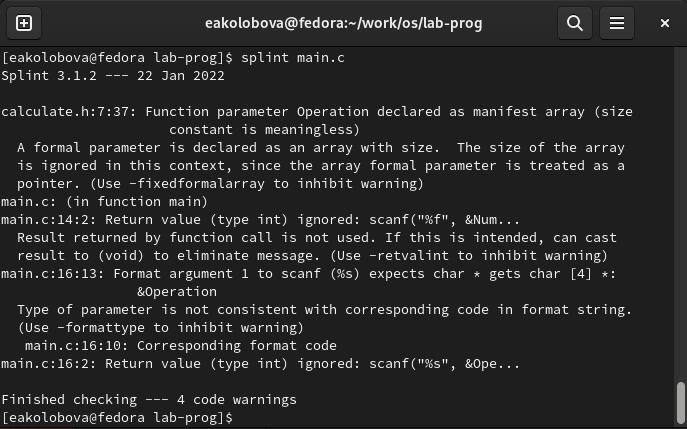

---
## Front matter
title: "Отчет по лабораторной работе №13"
subtitle: "Дисциплина Операционные системы"
author: "Колобова Елизавета, гр. НММбд-01-22"

## Generic otions
lang: ru-RU
toc-title: "Содержание"

## Bibliography
bibliography: bib/cite.bib
csl: pandoc/csl/gost-r-7-0-5-2008-numeric.csl

## Pdf output format
toc: true # Table of contents
toc-depth: 2
lof: true # List of figures
lot: true # List of tables
fontsize: 12pt
linestretch: 1.5
papersize: a4
documentclass: scrreprt
## I18n polyglossia
polyglossia-lang:
  name: russian
  options:
	- spelling=modern
	- babelshorthands=true
polyglossia-otherlangs:
  name: english
## I18n babel
babel-lang: russian
babel-otherlangs: english
## Fonts
mainfont: PT Serif
romanfont: PT Serif
sansfont: PT Sans
monofont: PT Mono
mainfontoptions: Ligatures=TeX
romanfontoptions: Ligatures=TeX
sansfontoptions: Ligatures=TeX,Scale=MatchLowercase
monofontoptions: Scale=MatchLowercase,Scale=0.9
## Biblatex
biblatex: true
biblio-style: "gost-numeric"
biblatexoptions:
  - parentracker=true
  - backend=biber
  - hyperref=auto
  - language=auto
  - autolang=other*
  - citestyle=gost-numeric
## Pandoc-crossref LaTeX customization
figureTitle: "Рис."
tableTitle: "Таблица"
listingTitle: "Листинг"
lofTitle: "Список иллюстраций"
lotTitle: "Список таблиц"
lolTitle: "Листинги"
## Misc options
indent: true
header-includes:
  - \usepackage{indentfirst}
  - \usepackage{float} # keep figures where there are in the text
  - \floatplacement{figure}{H} # keep figures where there are in the text
---

# Цель работы

Цель работы - приобрести простейшие навыки разработки, анализа, тестирования и отладки приложений в ОС типа UNIX/Linux на примере создания на языке программирования С калькулятора с простейшими функциями.

# Выполнение лабораторной работы

1. В домашнем каталоге создадим подкаталог ~/work/os/lab_prog 
 
2. Создадим в нём файлы: calculate.h, calculate.c, main.c.
 
3. Заполним созданные файлы согласно материалам лабораторной работы. Реализация функций калькулятора представлена в файле calculate.c, основной файл main.c реализует интерфейс пользователя к калькулятору. Синтаксические ошибки утилитой ыздште не выявляются, так что их там, скорее всего, нет
 
4. Создадим Makefile с содержанием, указанным в материалах лабораторной работы. Основное в содержании файла - это указанный в нем порядок компиляции исполняемых файлов. Сразу отредактируем файл, переместив блок с компиляцией программы calcul ниже всех остальных, сразу перед блоком clean, т.к. для компиляции итоговой программы требуются файлы, которые создаются в блоках выше. (рис. [@fig:006]])

 {#fig:006 width=70%}

5. Выполним компиляцию программы посредством gcc, как указано в лабораторной работе, с добавлением ключа -g, чтобы далее программу можно было загрузить в отладчик без ошибок. (рис. [@fig:001]])

6. С помощью gdb выполним отладку программы calcul и выполним следующие действия: (рис. [@fig:001], [@fig:002], [@fig:003])
– Запустим отладчик GDB, загрузив в него программу для отладки
– Для запуска программы внутри отладчика введем команду run
– Для постраничного (по 9 строк) просмотра исходного код используем команду
list
– Для просмотра строк с 12 по 15 основного файла используем list с параметрами
– Для просмотра определённых строк не основного файла используем list с па-
раметрами: calculate.c:20,29
– Установим точку останова в файле calculate.c на строке номер 21
– Выведем информацию об имеющихся в проекте точках останова
– Запустим программу внутри отладчика и убедимся, что программа остановится
в момент прохождения точки останова
– Отладчик выдаст следующую информацию:
```
1 #0 Calculate (Numeral=5, Operation=0x7fffffffd280 "-")
2 at calculate.c:21
3 #1 0x0000000000400b2b in main () at main.c:17
```
а команда backtrace покажет весь стек вызываемых функций от начала програм-
мы до текущего места.
– Посмотрим, чему равно на этом этапе значение переменной Numeral
На экран должно быть выведено число 5, оно и выводится
– Сравним с результатом вывода на экран после использования команды
1 display Numeral
Результат один  и тот же
– Уберем точки останова

 {#fig:001 width=70%} 
 
 {#fig:002 width=70%} 
 
 {#fig:003 width=70%} 
 
7. С помощью утилиты splint попробуем проанализировать коды файлов calculate.c
и main.c. В основном выводятся предупреждения о несоответствии типов переменных и возвращаемых значений, игнорировании определенных функций, использовании параметров в кач-ве указателей и прочих сомнительных, но не влияющих на работу программы вещах ([@fig:004], [@fig:005])

 {#fig:004 width=70%}
 
 {#fig:005 width=70%}

# Контрольные вопросы
1. Как получить информацию о возможностях программ gcc, make, gdb и др.?
запустив их с ключом --help или -h или просмотрев мануал
2. Назовите и дайте краткую характеристику основным этапам разработки приложений
в UNIX.
– планирование, включающее сбор и анализ требований к функционалу и другим ха-
рактеристикам разрабатываемого приложения;
– проектирование, включающее в себя разработку базовых алгоритмов и спецификаций,
определение языка программирования;
– непосредственная разработка приложения:
– кодирование — по сути создание исходного текста программы (возможно
в нескольких вариантах);
– анализ разработанного кода;
– сборка, компиляция и разработка исполняемого модуля;
– тестирование и отладка, сохранение произведённых изменений;
– документирование.
3. Что такое суффикс в контексте языка программирования? Приведите примеры ис-
пользования.
Это расширение, указывающее, на каком языке написан файл. Файлы с расширением (суффиксом) .c воспринимаются gcc как программы на языке
С, файлы с расширением .cc или .C — как файлы на языке C++, а файлы c расширением
.o считаются объектными.
4. Каково основное назначение компилятора языка С в UNIX?
gcc по расширению (суффиксу) .c распознает тип файла для компиля-
ции и формирует объектный модуль — файл с расширением .o.
5. Для чего предназначена утилита make?
Она позволяет автоматизировать процесс преобразования
файлов программы из одной формы в другую, отслеживает взаимосвязи между файлами.
6. Приведите пример структуры Makefile. Дайте характеристику основным элементам
этого файла.
Общий синтаксис Makefile имеет вид:
```1 target1 [target2...]:[:] [dependment1...]
2 [(tab)commands] [#commentary]
3 [(tab)commands] [#commentary]
```
Здесь знак # определяет начало комментария (содержимое от знака # и до конца строки
не будет обрабатываться. Одинарное двоеточие указывает на то, что последовательность
команд должна содержаться в одной строке. Для переноса можно в длинной строке
команд можно использовать обратный слэш (\). Двойное двоеточие указывает на то, что
последовательность команд может содержаться в нескольких последовательных строках.
Пример более сложного синтаксиса Makefile:
```
1 #
2 # Makefile for abcd.c
3 #
4
5 CC = gcc
6 CFLAGS =
7
8 # Compile abcd.c normaly
9 abcd: abcd.c
10 $(CC) -o abcd $(CFLAGS) abcd.c
11
12 clean:
13 -rm abcd *.o *~
14
15 # End Makefile for abcd.c
```
В этом примере в начале файла заданы три переменные: CC и CFLAGS. Затем указаны
цели, их зависимости и соответствующие команды. В командах происходит обращение
к значениям переменных. Цель с именем clean производит очистку каталога от фай-
лов, полученных в результате компиляции. Для её описания использованы регулярные
выражения.
7. Назовите основное свойство, присущее всем программам отладки. Что необходимо
сделать, чтобы его можно было использовать?
8. Назовите и дайте основную характеристику основным командам отладчика gdb.
backtrace вывод на экран пути к текущей точке останова (по сути вывод
названий всех функций)
break установить точку останова (в качестве параметра может быть
указан номер строки или название функции)
clear удалить все точки останова в функции
continue продолжить выполнение программы
delete удалить точку останова
display добавить выражение в список выражений, значения которых
отображаются при достижении точки останова программы
finish выполнить программу до момента выхода из функции
info breakpoints вывести на экран список используемых точек останова
info watchpoints вывести на экран список используемых контрольных выраже-
ний
list вывести на экран исходный код (в качестве параметра может
быть указано название файла и через двоеточие номера на-
чальной и конечной строк)
next выполнить программу пошагово, но без выполнения вызывае-
мых в программе функций
print вывести значение указываемого в качестве параметра выра-
жения
run запуск программы на выполнение
set установить новое значение переменной
step пошаговое выполнение программы
watch установить контрольное выражение, при изменении значения
которого программа будет остановлена
9. Опишите по шагам схему отладки программы, которую Вы использовали при выпол-
нении лабораторной работы.
– Запустим отладчик GDB, загрузив в него программу для отладки
– Для запуска программы внутри отладчика введем команду run
– Для постраничного (по 9 строк) просмотра исходного код используем команду
list
– Для просмотра строк с 12 по 15 основного файла используем list с параметрами
– Для просмотра определённых строк не основного файла используем list с па-
раметрами: calculate.c:20,29
– Установим точку останова в файле calculate.c на строке номер 21
– Выведем информацию об имеющихся в проекте точках останова
– Запустим программу внутри отладчика и убедимся, что программа остановится
в момент прохождения точки останова
– Отладчик выдаст следующую информацию:
```
1 #0 Calculate (Numeral=5, Operation=0x7fffffffd280 "-")
2 at calculate.c:21
3 #1 0x0000000000400b2b in main () at main.c:17
```
а команда backtrace покажет весь стек вызываемых функций от начала програм-
мы до текущего места.
– Посмотрим, чему равно на этом этапе значение переменной Numeral
На экран должно быть выведено число 5, оно и выводится
– Сравним с результатом вывода на экран после использования команды
1 display Numeral
Результат один  и тот же
– Уберем точки останова

10. Прокомментируйте реакцию компилятора на синтаксические ошибки в программе
при его первом запуске.
из-за синтаксических ошибок программа не компелится, т.к. компилятор не может распознать содержащие ошибки части кода
11. Назовите основные средства, повышающие понимание исходного кода программы.
Для облегчения понимания исходного кода используются комментарии
12. Каковы основные задачи, решаемые программой splint 
Эта утилита анализирует программный код, проверяет коррект-
ность задания аргументов использованных в программе функций и типов возвращаемых
значений, обнаруживает синтаксические и семантические ошибки.
# Выводы

Результатом проделанной работы является Приобретение простейших навыков разработки, анализа, тестирования и отладки приложений в ОС типа UNIX/Linux на примере создания на языке программирования
С калькулятора с простейшими функциями. 

# Список литературы{.unnumbered}

::: {#refs}
:::
