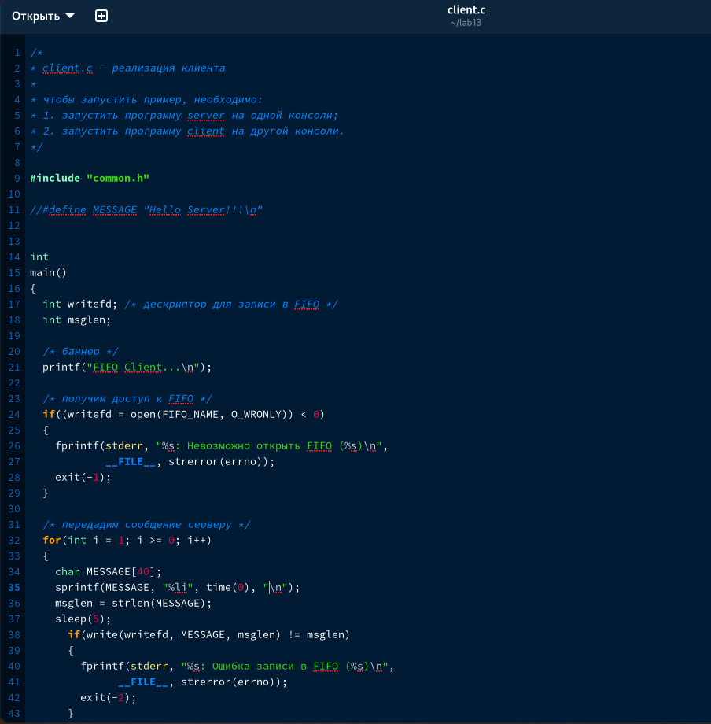

---
## Front matter
lang: ru-RU
title: Отчет по лабораторной работе №14
subtitle: дисциплина Операционные системы
author:
  - Колобова Елизавета, гр. НММбд-01-22
institute:
  - Российский университет дружбы народов, Москва, Россия
date: 22 марта 2023

## i18n babel
babel-lang: russian
babel-otherlangs: english

## Formatting pdf
toc: false
toc-title: Содержание
slide_level: 2
aspectratio: 169
section-titles: true
theme: metropolis
header-includes:
 - \metroset{progressbar=frametitle,sectionpage=progressbar,numbering=fraction}
 - '\makeatletter'
 - '\beamer@ignorenonframefalse'
 - '\makeatother'
---

# Информация

## Докладчик

:::::::::::::: {.columns align=center}
::: {.column width="70%"}

  * Колобова Елизавета 
  * студент
  * Российский университет дружбы народов

:::
::::::::::::::

# Вводная часть

## Объект и предмет исследования

- программирование в оболочке ОС UNIX/Linux.

## Цели и задачи

- Цель работы - приобретение практических навыков работы с именованными каналами.

## Материалы и методы

- Процессор `pandoc` для входного формата Markdown
- Автоматизация процесса создания: `Makefile`

# Создание презентации

## Описание изменений

Изучив приведённые в тексте лабораторной работы программы server.c и client.c, напишем аналогичные программы, внеся следующие изменения:

1. Работает не 1 клиент, а несколько (например, два).
    Для этого (как объясняли на семинарских занятиях) достаточно просто запустить клиентскую программу в двух разных консолях
    
2. Клиенты передают текущее время с некоторой периодичностью (например, раз в пять
секунд). Используйте функцию sleep() для приостановки работы клиента.
    Для этого в переменную, содержащую сообщение передаем переведенное в строку время, после чего приостанавливаем работу клиента на 5 секунд с помощью sleep, а в заголовочный файл подключаем time.h (
3. Сервер работает не бесконечно, а прекращает работу через некоторое время (напри-
мер, 30 сек). Используйте функцию clock() для определения времени работы сервера.
    Указанной в задании функцией получаем время работы сервера, и с помощью цикла завершаем работу сервера, если оно превысит 30 секунд (иначе оставляем все как было).
Что будет в случае, если сервер завершит работу, не закрыв канал? - Канал продолжит существовать

 
## Компиляция и отладка

{width=70%}

 {width=70%}
  
## Исследование с помощью утилиты splint 

 {width=70%}

 {width=70%}
 
# Результаты
Результатом проделанной работы является приобретение практических навыков работы с именованными каналами.
