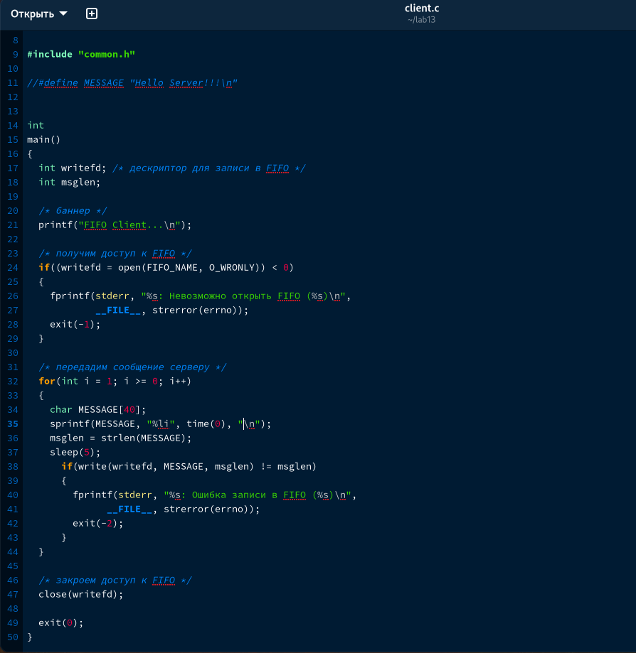
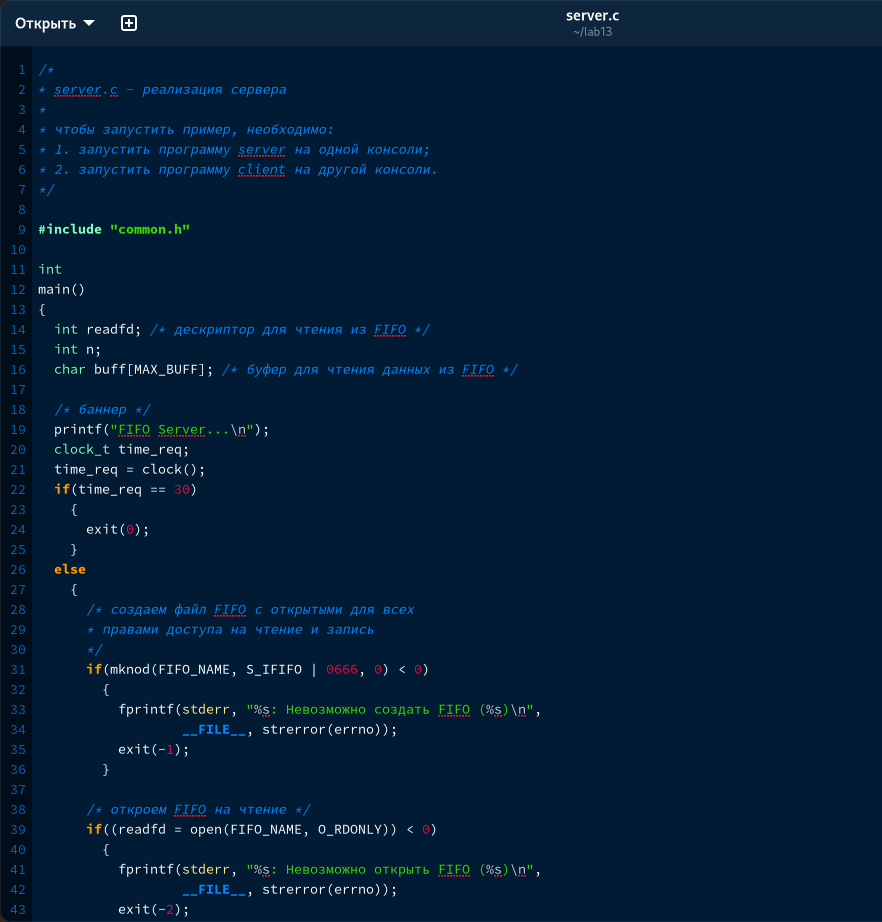
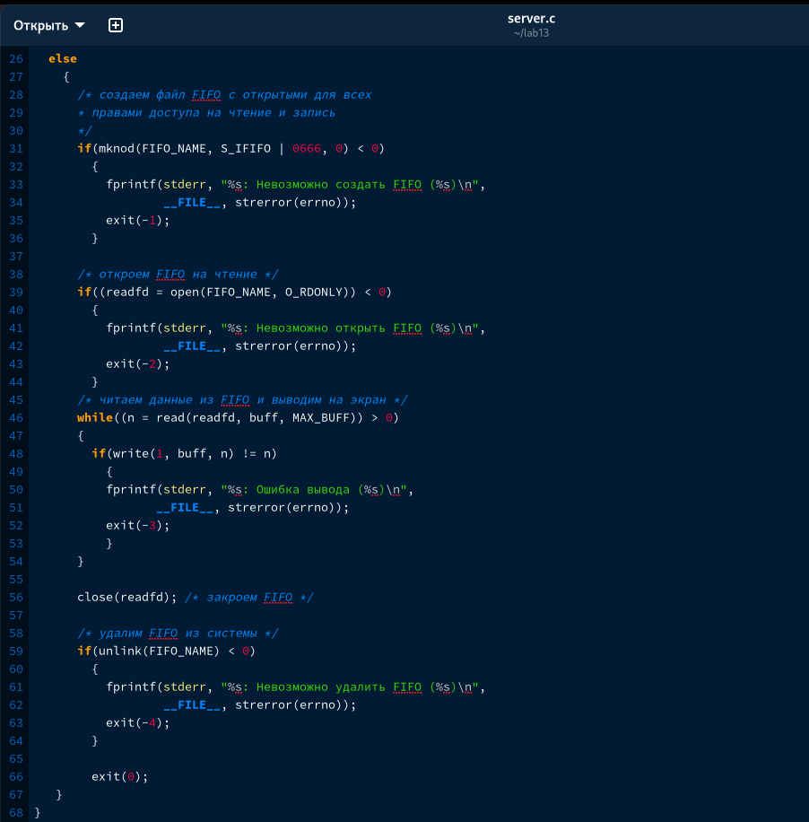

---
## Front matter
title: "Отчет по лабораторной работе №14"
subtitle: "Дисциплина Операционные системы"
author: "Колобова Елизавета, гр. НММбд-01-22"

## Generic otions
lang: ru-RU
toc-title: "Содержание"

## Bibliography
bibliography: bib/cite.bib
csl: pandoc/csl/gost-r-7-0-5-2008-numeric.csl

## Pdf output format
toc: true # Table of contents
toc-depth: 2
lof: true # List of figures
lot: true # List of tables
fontsize: 12pt
linestretch: 1.5
papersize: a4
documentclass: scrreprt
## I18n polyglossia
polyglossia-lang:
  name: russian
  options:
	- spelling=modern
	- babelshorthands=true
polyglossia-otherlangs:
  name: english
## I18n babel
babel-lang: russian
babel-otherlangs: english
## Fonts
mainfont: PT Serif
romanfont: PT Serif
sansfont: PT Sans
monofont: PT Mono
mainfontoptions: Ligatures=TeX
romanfontoptions: Ligatures=TeX
sansfontoptions: Ligatures=TeX,Scale=MatchLowercase
monofontoptions: Scale=MatchLowercase,Scale=0.9
## Biblatex
biblatex: true
biblio-style: "gost-numeric"
biblatexoptions:
  - parentracker=true
  - backend=biber
  - hyperref=auto
  - language=auto
  - autolang=other*
  - citestyle=gost-numeric
## Pandoc-crossref LaTeX customization
figureTitle: "Рис."
tableTitle: "Таблица"
listingTitle: "Листинг"
lofTitle: "Список иллюстраций"
lotTitle: "Список таблиц"
lolTitle: "Листинги"
## Misc options
indent: true
header-includes:
  - \usepackage{indentfirst}
  - \usepackage{float} # keep figures where there are in the text
  - \floatplacement{figure}{H} # keep figures where there are in the text
---

# Цель работы

Цель работы - приобретение практических навыков работы с именованными каналами.

# Выполнение лабораторной работы

Изучив приведённые в тексте лабораторной работы программы server.c и client.c, напишем аналогичные программы, внеся следующие изменения:

1. Работает не 1 клиент, а несколько (например, два).
    Для этого (как объясняли на семинарских занятиях) достаточно просто запустить клиентскую программу в двух разных консолях
    
2. Клиенты передают текущее время с некоторой периодичностью (например, раз в пять
секунд). Используйте функцию sleep() для приостановки работы клиента.
    Для этого в переменную, содержащую сообщение передаем переведенное в строку время, после чего приостанавливаем работу клиента на 5 секунд с помощью sleep, а в заголовочный файл подключаем time.h (рис. [@fig:001], [@fig:002], [@fig:003])
3. Сервер работает не бесконечно, а прекращает работу через некоторое время (напри-
мер, 30 сек). Используйте функцию clock() для определения времени работы сервера.
    Указанной в задании функцией получаем время работы сервера, и с помощью цикла завершаем работу сервера, если оно превысит 30 секунд (иначе оставляем все как было).
Что будет в случае, если сервер завершит работу, не закрыв канал? - Канал продолжит существовать (рис. [@fig:004], [@fig:005])

 {#fig:003 width=70%}
 
 {#fig:001 width=70%}

 {#fig:002 width=70%}
 
 {#fig:004 width=70%}

 {#fig:005 width=70%}
 
 { width=70%}

# Контрольные вопросы
1. В чем ключевое отличие именованных каналов от неименованных?
Именованные каналы отличаются от неименованных наличием
идентификатора канала, который представлен как специальный файл (соответственно
имя именованного канала — это имя файла).
2. Возможно ли создание неименованного канала из командной строки?
Неименованные каналы подобны именованным, но они в файловой системе не существуют. Они не имеют путевых имен, ассоциированных с ними, и все они и их следы исчезают после того, как последний файловый дескриптор, ссылающийся на них, закрывается. Т.е. создать их из командной строки нельзя
3. Возможно ли создание именованного канала из командной строки?
FIFO может быть создан и из командной строки shell:
```
$ mknod name p
```
4. Опишите функцию языка С, создающую неименованный канал.
Создание неименованного канала выполняется по двум файловым дескрипторам, один из которых доступен только для чтения, а второй — только для записи.
```
#include <unistd.h>

int pipe(int fds[2]);
```
Единственный параметр-массив включает два файловых дескриптора — fd[0] для чтения и fd[1] для записи.
5. Опишите функцию языка С, создающую именованный канал.
Файлы именованных каналов создаются функцией mkfifo(3).
```
1 #include <sys/types.h>
2 #include <sys/stat.h>
3
4 int mkfifo(const char *pathname, mode_t mode)
```
6. Что будет в случае прочтения из fifo меньшего числа байтов, чем находится в канале?
Большего числа байтов?
При чтении числа байт, меньшего чем находится в канале, возвращается требуемое число байтов, остаток сохраняется для последующих чтений. При чтении числа байт, большего чем находится в канале, возвращается доступное число байт.
7. Аналогично, что будет в случае записи в fifo меньшего числа байтов, чем позволяет
буфер? Большего числа байтов?
Запись числа байтов, меньшего емкости канала или FIFO, гарантированно атомарно. Это означает, что в случае, когда несколько процессов одновременно записывают в канал, порции данных от этих процессов не перемешиваются.

При записи большего числа байтов, чем это позволяет канал или FIFO, вызов write(2) блокируется до освобождения требуемого места. При этом атомарность операции не гарантируется. Если процесс пытается записать данные в канал, не открытый ни одним процессом на чтение, процессу генерируется сигнал SIGPIPE, а вызов write(2) возвращает 0 с установкой ошибки (errno=ERRPIPE) (если процесс не установил обработки сигнала SIGPIPE, производится обработка по умолчанию — процесс завершается).
8. Могут ли два и более процессов читать или записывать в канал?
С точки зрения процессов, канал выглядит как пара открытых файловых дескрипторов – один на чтение и один на запись (можно больше, но неудобно). Мы можем писать в канал до тех пор пока есть место в буфере, если место в буфере кончится – процесс будет заблокирован на записи.
9. Опишите функцию write (тип возвращаемого значения, аргументы и логику работы).
Функция write() является частью UNIX-подобной системы ввода/вывода и не определена стандартом ANSI С. Функция write() переписывает count байт из буфера, на который указывает bufy в файл, соответствующий дескриптору файла handle. Указателю положения в файле дается приращение на количество записанных байт.
10. Опишите функцию strerror
Строковая функция strerror - функция языков C/C++, транслирующая код ошибки, который обычно хранится в глобальной переменной errno, в сообщение об ошибке, понятном человеку.
# Выводы

Результатом проделанной работы является приобретение практических навыков работы с именованными каналами.

# Список литературы{.unnumbered}

::: {#refs}
:::
