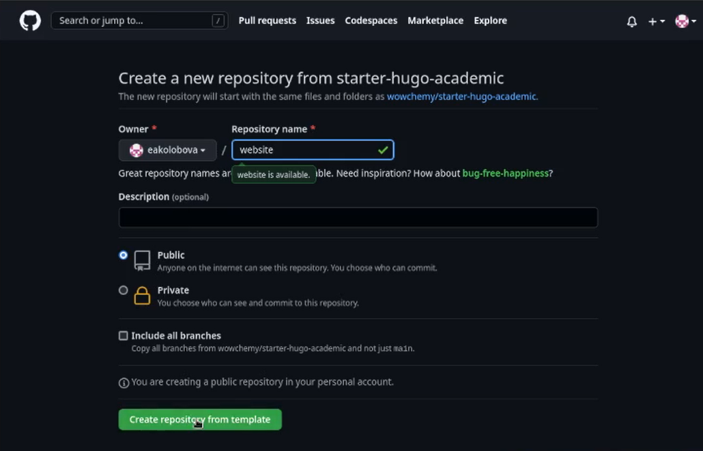
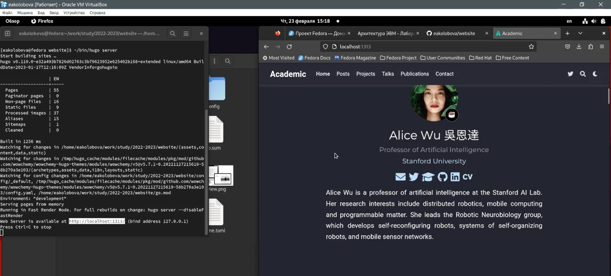
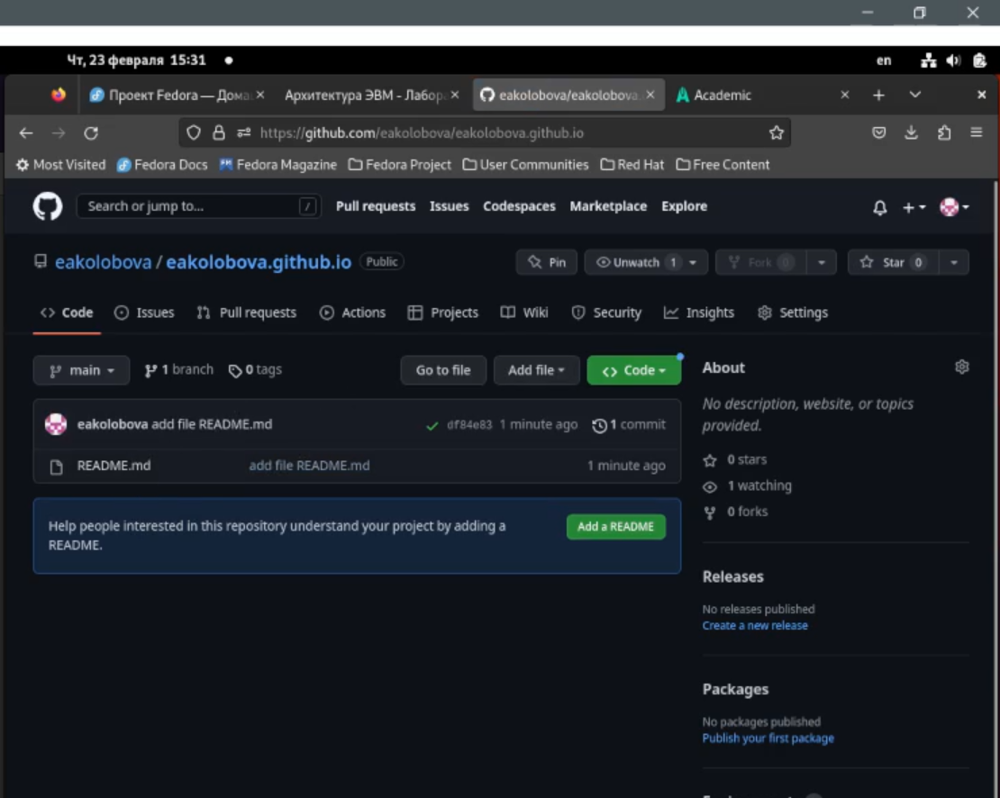
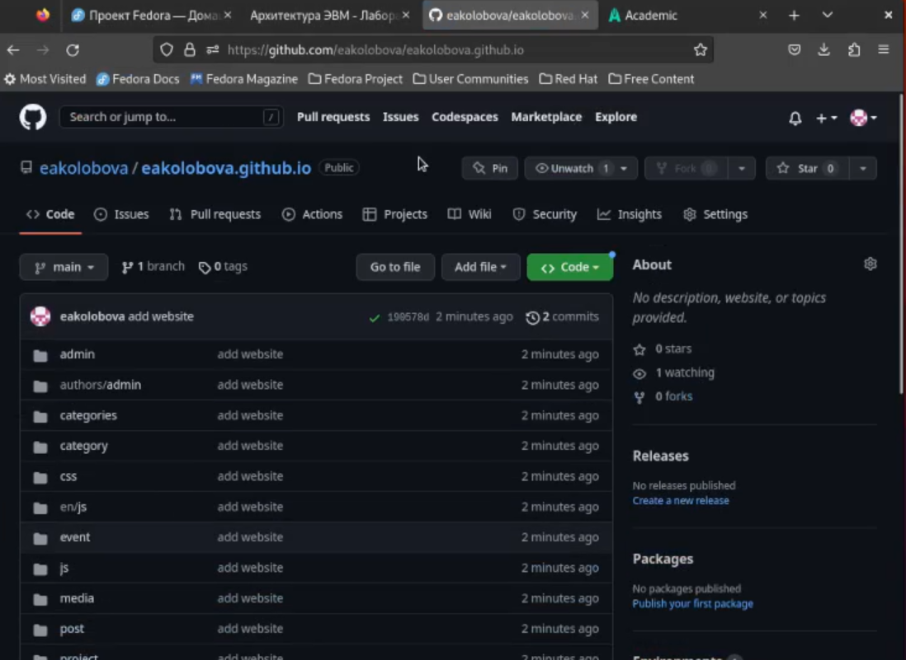

---
## Front matter
lang: ru-RU
title: Презентация по индивидуальному проекту, этап 1
subtitle: дисциплина Операционные системы
author:
  - Колобова Е. А.
institute:
  - Российский университет дружбы народов, Москва, Россия
  - группа НММбд-01-22
date: 24 февраля 2023

## i18n babel
babel-lang: russian
babel-otherlangs: english

## Formatting pdf
toc: false
toc-title: Содержание
slide_level: 2
aspectratio: 169
section-titles: true
theme: metropolis
header-includes:
 - \metroset{progressbar=frametitle,sectionpage=progressbar,numbering=fraction}
 - '\makeatletter'
 - '\beamer@ignorenonframefalse'
 - '\makeatother'
---

# Информация

## Докладчик

:::::::::::::: {.columns align=center}
::: {.column width="70%"}

  * Колобова Елизавета Андреевна
  * студент
  * Российский университет дружбы народов

:::
::::::::::::::

# Вводная часть

## Объект и предмет исследования

- Персональный сайт научного работника

## Цели и задачи

- Создать заготовки для сайта и разместить их на Github pages

## Материалы и методы

- Сервер Github 
- ПО для создания сайтов Hugo

# Создание презентации

## Создание рабочего репозитория

- С сайта Github скачаем по приложенной ссылке архив с последней версией HUGO и переносим исполняемый файл в папку bin в домашней папке
- На сайте Github создадим новый репозиторий, назовем его website. Клонируем репозиторий в каталог 2022-2023

{width=70%}

## Создание сервера для сайта

- Перейдем в созданный каталог website и выполним в нем файл hugo. После этого удалим появившийся каталог public и выполним команду hugo server
- В результате мы получим ссылку на сайт, доступную пока только на локальном компьютере

{width=70%}

## Создание репозитория для сайта

- Чтобы сайт был доступен с любой машины, разместим его в репозитории Github.
Создадим новый пустой репозиторий с именем username.github.io и клонируем репозиторий в тот же каталог, что и предыдущий. Создадим в этом репозитории новую ветку
- Чтобы активировать наш репозиторий, создадим в нем пустой файл README.md и отправим на сервер

{width=70%}

## Размещение сайта в репозитории
- Выполним команду git submodul add -b main "ссылка на репозиторий" public и отредактируем файл .gitignor, чтобы исправить игнорирование пути public
- Отправляем фаайлы сайта на сервер github

{width=70%}

## Итоговый вид сайта в браузере

{width=70%}

## Результаты
- Результатом проделанной работы является создание заготовок для сайта и размещение их на Github pages
