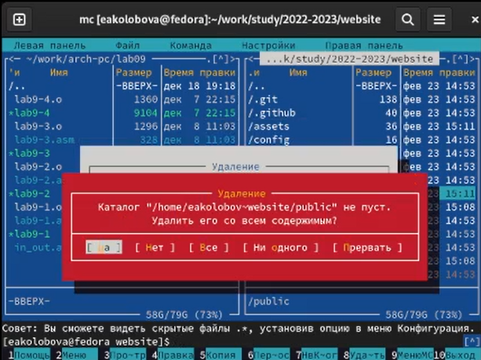

---
## Front matter
title: "Отчет по индивидуальному проекту, этап 1"
subtitle: "дисциплина: Операционные системы"
author: "Колобова Елизавета Андреевна, гр. НММ-01"

## Generic otions
lang: ru-RU
toc-title: "Содержание"

## Bibliography
bibliography: bib/cite.bib
csl: pandoc/csl/gost-r-7-0-5-2008-numeric.csl

## Pdf output format
toc: true # Table of contents
toc-depth: 2
lof: true # List of figures
lot: true # List of tables
fontsize: 12pt
linestretch: 1.5
papersize: a4
documentclass: scrreprt
## I18n polyglossia
polyglossia-lang:
  name: russian
  options:
	- spelling=modern
	- babelshorthands=true
polyglossia-otherlangs:
  name: english
## I18n babel
babel-lang: russian
babel-otherlangs: english
## Fonts
mainfont: PT Serif
romanfont: PT Serif
sansfont: PT Sans
monofont: PT Mono
mainfontoptions: Ligatures=TeX
romanfontoptions: Ligatures=TeX
sansfontoptions: Ligatures=TeX,Scale=MatchLowercase
monofontoptions: Scale=MatchLowercase,Scale=0.9
## Biblatex
biblatex: true
biblio-style: "gost-numeric"
biblatexoptions:
  - parentracker=true
  - backend=biber
  - hyperref=auto
  - language=auto
  - autolang=other*
  - citestyle=gost-numeric
## Pandoc-crossref LaTeX customization
figureTitle: "Рис."
tableTitle: "Таблица"
listingTitle: "Листинг"
lofTitle: "Список иллюстраций"
lolTitle: "Листинги"
## Misc options
indent: true
header-includes:
  - \usepackage{indentfirst}
  - \usepackage{float} # keep figures where there are in the text
  - \floatplacement{figure}{H} # keep figures where there are in the text
---

# Цель работы

Целью работы является создание персонального сайта научного работника.

# Задание

Создать и разместить на Github pages заготовки для персонального сайта. 


# Выполнение лабораторной работы

1. С сайта Github скачаем по приложенной ссылке архив с последней версией HUGO
   В домашней папке создадим папку bin и переместим в нее исполняемый файл HUGO из распакованного архива.(рис. [@fig:001]).

{#fig:001 width=70%}

2. Для работы с сайтом создадим на сайте Github новый репозиторий, назовем его website (рис. [@fig:002]).

Клонируем репозиторий в каталог 2022-2023 (рис. [@fig:003]):

```
git clone --recursive 'ссылка на репозиторий'
```

{#fig:002 width=70%}

{#fig:003 width=70%}

3. Перейдем в созданный каталог website и выполним в нем файл hugo (рис. [@fig:004]):

```
~/bin/hugo
```
после этого удалим появившийся каталог public (рис. [@fig:005])
и выполним команду 
```
~/bin/hugo server
```
(рис. [@fig:004],  [@fig:006]).

В результате выполнения этой команды мы получим ссылку на наш сайт, доступный пока только на локальном компьютере (рис. [@fig:007]).

{#fig:004 width=70%}

{#fig:005 width=70%}

{#fig:006 width=70%}

{#fig:007 width=70%}

4. Чтобы сайт был доступен с любой машины, разместим его в репозитории Github.
Создадим новый пустой репозиторий с именем username.github.io. Остальные настройки оставляем нетронутыми. (рис. [@fig:008])
Клонируем репозиторий в тот же каталог, что и предыдущий (рис. [@fig:009]):

```
git clone --recursive 'ссылка на репозиторий'
```
Перейдем в каталог нового репозитория. Создадим новую ветку main и переключимся на нее

```
git checkout -b main
```
Чтобы активировать наш репозиторий, создадим в нем пустой файл README.md и отправим на сервер (рис. [@fig:0011], [@fig:0012]):

```
touch README.md
git add . 
git commit -am ""
git push
```
{#fig:008 width=70%}

{#fig:009 width=70%}

{#fig:0011 width=70%}

{#fig:0012 width=70%}

5. Выполним следующую команду (рис. [@fig:0013]):
```
git submodul add -b main "ссылка на репозиторий" public
```

В ходе операции игнорируется путь public. Исправим это, отредактировав соответствующий файл .gitignore (рис. [@fig:0014]). Теперь в каталоге public появились файлы для сайта
Отправляем файлы сайта на сервер (рис. [@fig:0015]):

```
git add . 
git commit -am ""
git push
```
{#fig:0013 width=70%}

{#fig:0014 width=70%}

{#fig:0015 width=70%}

6. Теперь наш сайт хранится в удаленном репозитории на Github и доступен с любого компьютера по ссылке username.github.io. В дальнейшем он будет модифицироваться (рис. [@fig:0016]):

{#fig:0016 width=70%}

# Выводы

Итогом проделанной работы является заготовка для персонального сайта, размещенная на Github pages

# Список литературы{.unnumbered}

::: {#refs}
:::
