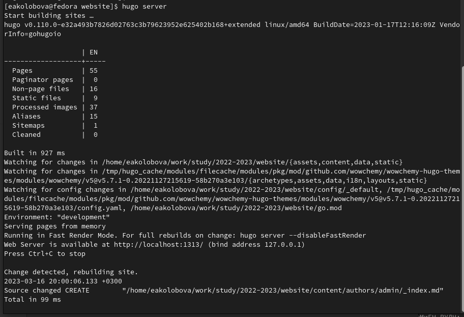
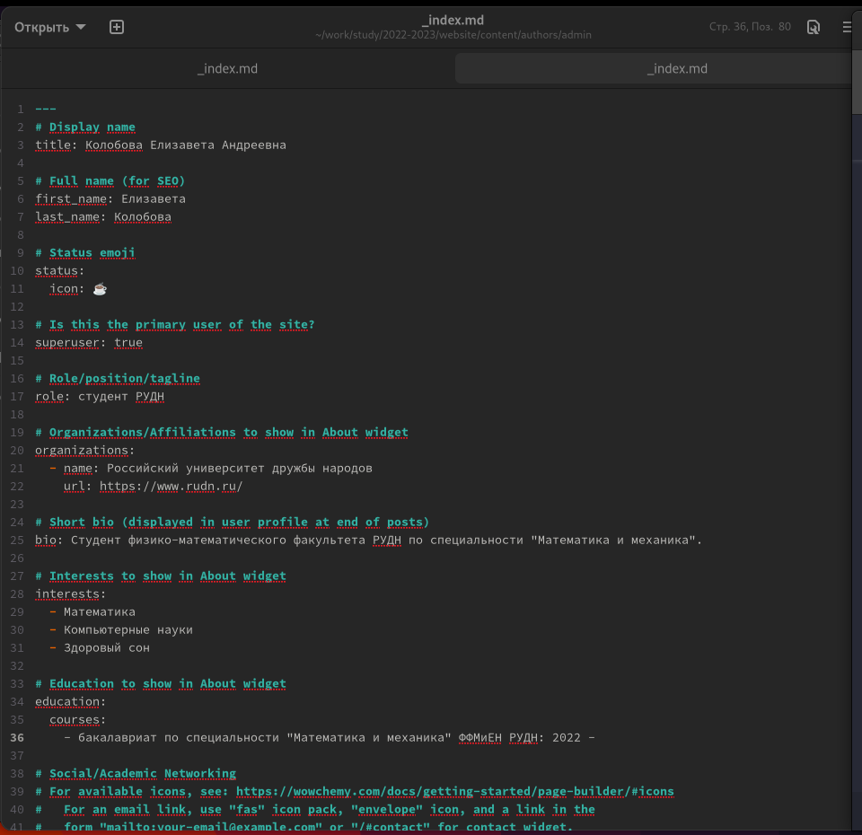
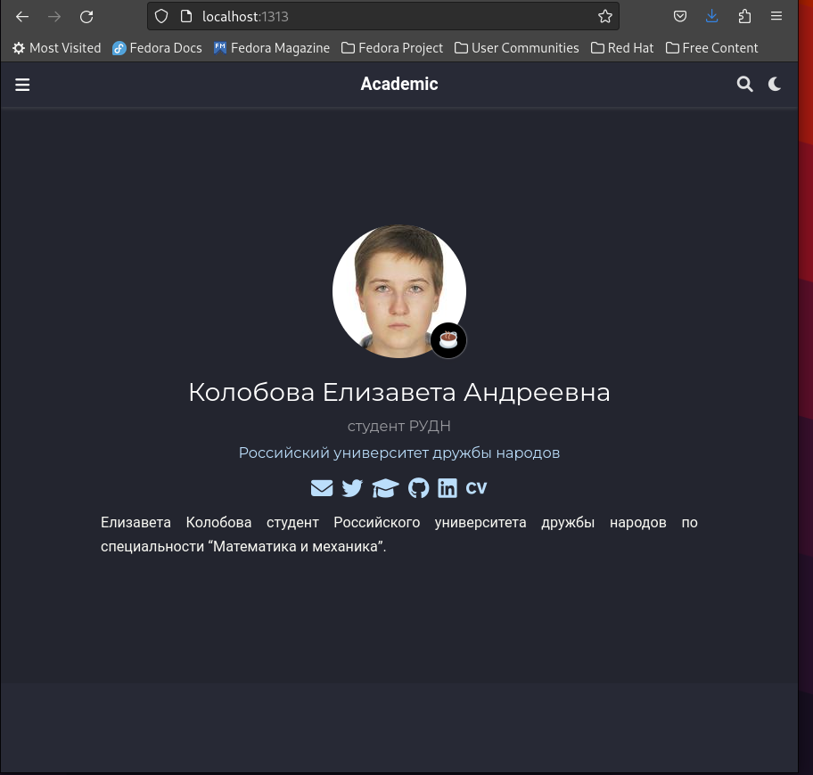
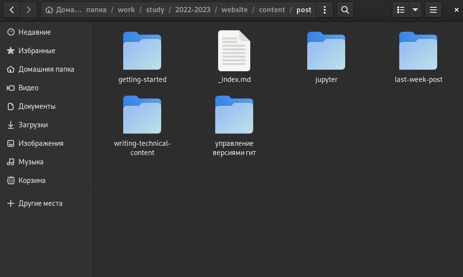
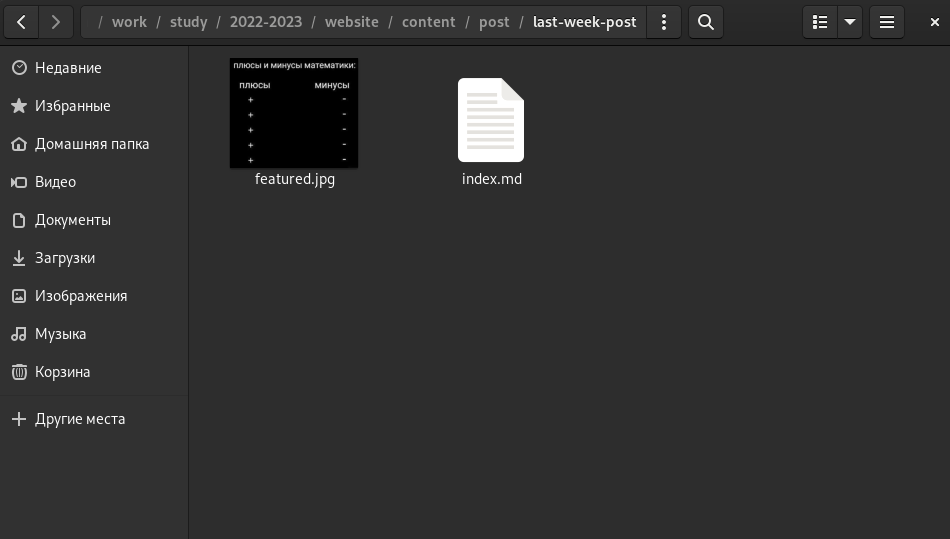
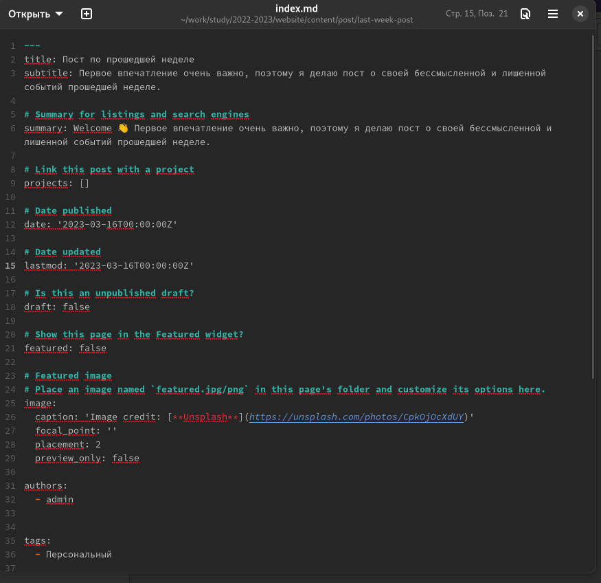
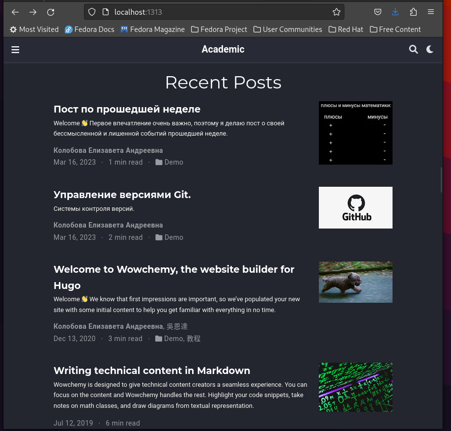

---
## Front matter
title: "Отчет по индивидуальному проекту, этап 2"
subtitle: "дисциплина Операционные системы"
author: "Колобова Елизавета"

## Generic otions
lang: ru-RU
toc-title: "Содержание"

## Bibliography
bibliography: bib/cite.bib
csl: pandoc/csl/gost-r-7-0-5-2008-numeric.csl

## Pdf output format
toc: true # Table of contents
toc-depth: 2
lof: true # List of figures
lot: true # List of tables
fontsize: 12pt
linestretch: 1.5
papersize: a4
documentclass: scrreprt
## I18n polyglossia
polyglossia-lang:
  name: russian
  options:
	- spelling=modern
	- babelshorthands=true
polyglossia-otherlangs:
  name: english
## I18n babel
babel-lang: russian
babel-otherlangs: english
## Fonts
mainfont: PT Serif
romanfont: PT Serif
sansfont: PT Sans
monofont: PT Mono
mainfontoptions: Ligatures=TeX
romanfontoptions: Ligatures=TeX
sansfontoptions: Ligatures=TeX,Scale=MatchLowercase
monofontoptions: Scale=MatchLowercase,Scale=0.9
## Biblatex
biblatex: true
biblio-style: "gost-numeric"
biblatexoptions:
  - parentracker=true
  - backend=biber
  - hyperref=auto
  - language=auto
  - autolang=other*
  - citestyle=gost-numeric
## Pandoc-crossref LaTeX customization
figureTitle: "Рис."
tableTitle: "Таблица"
listingTitle: "Листинг"
lofTitle: "Список иллюстраций"
lotTitle: "Список таблиц"
lolTitle: "Листинги"
## Misc options
indent: true
header-includes:
  - \usepackage{indentfirst}
  - \usepackage{float} # keep figures where there are in the text
  - \floatplacement{figure}{H} # keep figures where there are in the text
---

# Цель работы

Загрузка на сайт научного работника персональной информации.

# Задание

Добавить на сайт данные о себе.

# Выполнение лабораторной работы
1. В каталоге website, в котором находится рабочий репозиторий сайта, выполняем команду hugo server (рис. [@fig:001])

{#fig:001 width=70%}

2. Размещаем фотографию владельца сайта. Для этого добавляем нужную фотографию в папку content/autors/admin и переименовываем ее в avatar.png (рис. [@fig:003])
3. Размещаем краткое описание владельца сайта (Biography). Файл с этими данными index.md находится в content/autors/admin. Редактируем нужную информацию. (рис. [@fig:002])

{#fig:002 width=70%}

{#fig:003 width=70%}

4. Добавляем информацию об интересах (Interests). Эта информация содержится в файле content/index.md. Редактируем нужное
5. Добавляем информацию от образовании (Education). Все аналогично предыдущему пункту, файл тот же.
6. Сделаем пост по прошедшей неделе. Для этого в папке content/posts создадим новую папку с названием поста, добавим в нее картинку с названием featured.png и файл index.md, аналогичные тем, что содержатся в папках с примерами постов. В файле редактируем заголовок и текст поста. (рис. [@fig:004], [@fig:005], [@fig:006])

{#fig:004 width=70%}

{#fig:005 width=70%}

{#fig:006 width=70%}

7. Добавить пост на тему по выбору:
   Управление версиями. Git. 
   Порядок действий аналогичен предыдущему пункту (рис. [@fig:007])
  
 {#fig:007 width=70%}
 
8. Выполняем в каталоге website команду hugo и в этом же каталоге отправляем файлы на сервер github (git add ., git commit, git push), далее переходим в каталог public и еще раз отправляем файлы на сервер github.

# Выводы

Мы загрузили на сайт персональную информацию и сделали посты.
# Список литературы{.unnumbered}

::: {#refs}
:::
