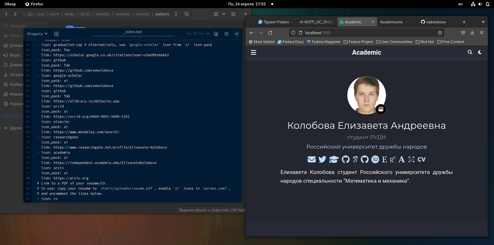
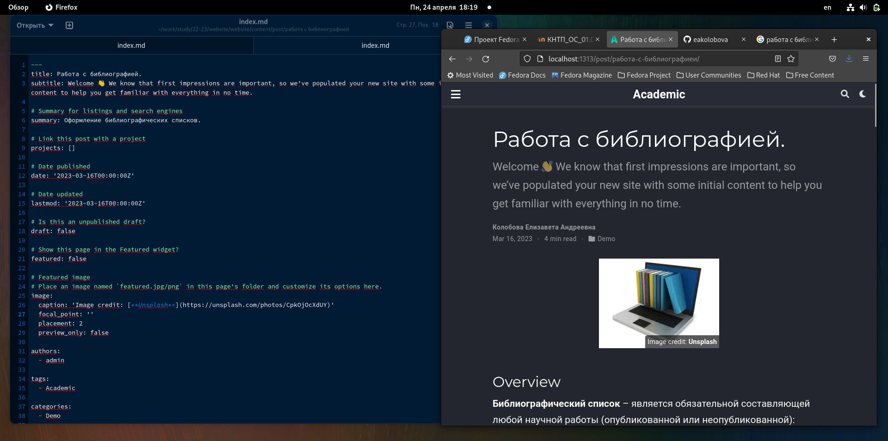

---
## Front matter
lang: ru-RU
title: Отчет по индивидуальному проекту, этап 4
subtitle: дисциплина Операционные системы
author:
  - Колобова Елизавета, гр. НММбд-01-22
institute:
  - Российский университет дружбы народов, Москва, Россия
date: 04 апреля 2023

## i18n babel
babel-lang: russian
babel-otherlangs: english

## Formatting pdf
toc: false
toc-title: Содержание
slide_level: 2
aspectratio: 169
section-titles: true
theme: metropolis
header-includes:
 - \metroset{progressbar=frametitle,sectionpage=progressbar,numbering=fraction}
 - '\makeatletter'
 - '\beamer@ignorenonframefalse'
 - '\makeatother'
---

# Информация

## Докладчик

:::::::::::::: {.columns align=center}
::: {.column width="70%"}

  * Колобова Елизавета Андреевна
  * студент
  * Российский университет дружбы народов
 
:::
::::::::::::::

# Вводная часть

## Объект и предмет исследования

- персональный сайт научного работника

## Цели и задачи
- Добавить на сайт ссылки на научные ресурсы
- Сделать тематические посты

## Материалы и методы

- Процессор `pandoc` для входного формата Markdown
- Результирующие форматы
	- `pdf`
	- `html`
- Автоматизация процесса создания: `Makefile`
- Система контроля версий Git

# Создание презентации

## Добавление информации
- В каталоге website, в котором находится рабочий репозиторий сайта, выполняем команду hugo server
- Зарегистрируемся на следующих ресурсах и разместим ссылки на них на сайте:

   - eLibrary;
   - Google Scholar;
   - ORCID;
   - Mendeley;
   - ResearchGate;
   - Academia.edu;
   - arXiv;
   - github.
   
## Добавление информации 
{width=70%}

## Создание постов
- Сделаем пост по прошедшей неделе. Для этого в папке content/posts создадим новую папку с названием поста, добавим в нее картинку с названием featured.png и файл index.md, аналогичные тем, что содержатся в папках с примерами постов. В файле редактируем заголовок и текст поста.
- Добавим пост на тему по выбору: работа с библиографией. Все аналогично предыдущему пункту.

{width=70%}

# Результаты

Мы загрузили на сайт персональную информацию и сделали посты.

:::

