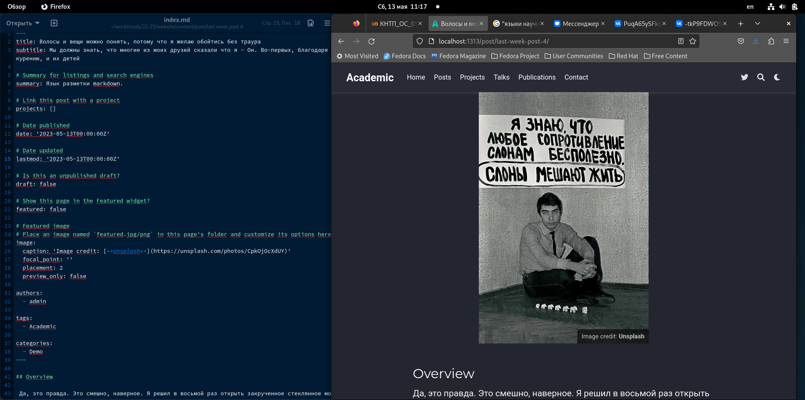

---
## Front matter
lang: ru-RU
title: Отчет по индивидуальному проекту, этап 5
subtitle: дисциплина Операционные системы
author:
  - Колобова Елизавета, гр. НММбд-01-22
institute:
  - Российский университет дружбы народов, Москва, Россия
date: 04 апреля 2023

## i18n babel
babel-lang: russian
babel-otherlangs: english

## Formatting pdf
toc: false
toc-title: Содержание
slide_level: 2
aspectratio: 169
section-titles: true
theme: metropolis
header-includes:
 - \metroset{progressbar=frametitle,sectionpage=progressbar,numbering=fraction}
 - '\makeatletter'
 - '\beamer@ignorenonframefalse'
 - '\makeatother'
---

# Информация

## Докладчик

:::::::::::::: {.columns align=center}
::: {.column width="70%"}

  * Колобова Елизавета Андреевна
  * студент
  * Российский университет дружбы народов
 
:::
::::::::::::::

# Вводная часть

## Объект и предмет исследования

- персональный сайт научного работника

## Цели и задачи
- Добавить на сайт информацию о проектах
- Сделать тематические посты

## Материалы и методы

- Процессор `pandoc` для входного формата Markdown
- Результирующие форматы
	- `pdf`
	- `html`
- Автоматизация процесса создания: `Makefile`
- Система контроля версий Git

# Создание презентации

## Добавление информации
- В каталоге website, в котором находится рабочий репозиторий сайта, выполняем команду hugo server
- Добавляем проект и два поста : на выбранную тему и по прошедшей неделе.
Механизм везде один: в соответствующем каталоге делаем копии папок с контентом, переименовываем, вставляем картинку (с таким же именем и типом, как в примере), редактируем текстовый файл, как нам нужно. После все этого загружаем изменения на гитхаб
   
## Добавление информации 
{#fig:001 width=70%}

## Добавление информации 
{#fig:003 width=70%}

# Результаты

Мы загрузили на сайт информацию о проектах и сделали посты.

:::

