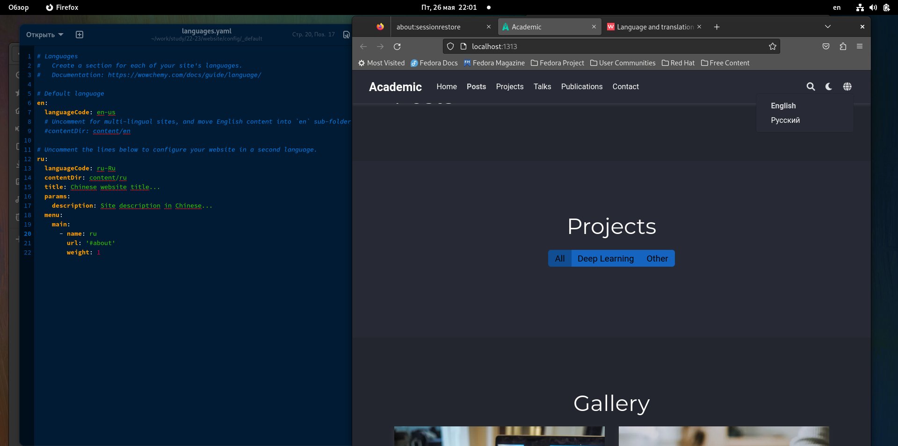
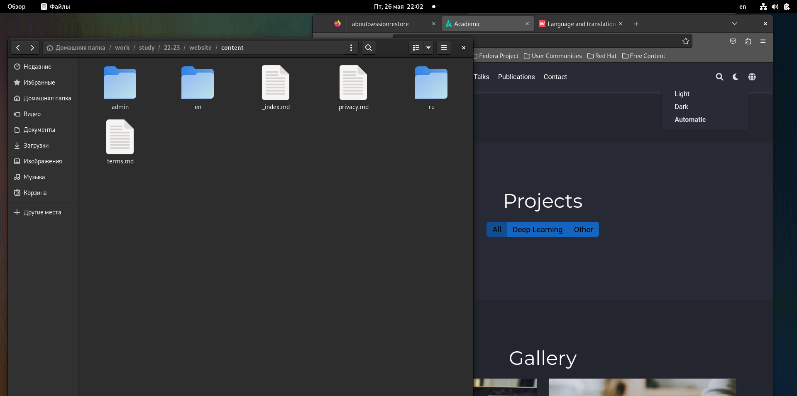
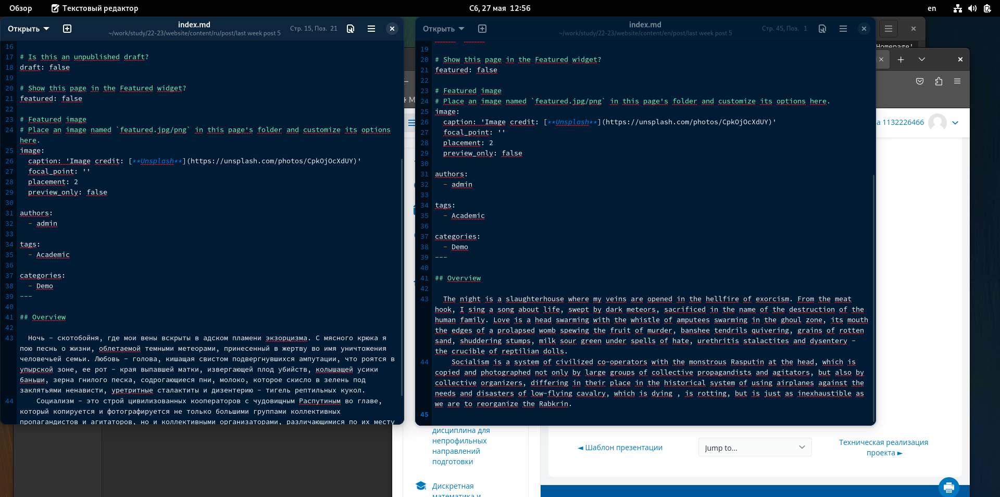

---
## Front matter
lang: ru-RU
title: Отчет по индивидуальному проекту, этап 6
subtitle: дисциплина Операционные системы
author:
  - Колобова Елизавета, гр. НММбд-01-22
institute:
  - Российский университет дружбы народов, Москва, Россия
date: 27.05.2023

## i18n babel
babel-lang: russian
babel-otherlangs: english

## Formatting pdf
toc: false
toc-title: Содержание
slide_level: 2
aspectratio: 169
section-titles: true
theme: metropolis
header-includes:
 - \metroset{progressbar=frametitle,sectionpage=progressbar,numbering=fraction}
 - '\makeatletter'
 - '\beamer@ignorenonframefalse'
 - '\makeatother'
---

# Информация

## Докладчик

:::::::::::::: {.columns align=center}
::: {.column width="70%"}

  * Колобова Елизавета Андреевна
  * студент
  * Российский университет дружбы народов
 
:::
::::::::::::::

# Вводная часть

## Объект и предмет исследования

- персональный сайт научного работника

## Цели и задачи
- Добавить на сайт поддержку двух языков
- Сделать тематические посты

## Материалы и методы

- Процессор `pandoc` для входного формата Markdown
- Результирующие форматы
	- `pdf`
	- `html`
- Автоматизация процесса создания: `Makefile`
- Система контроля версий Git

# Создание презентации

## Добавление информации
- В папке config/_default редактируем файл languages: раскомментируем нужные строки. Также создаем в папке content подпапки en и ru, весь контент на английском языке перемещаем в первую подпапку, на русском - во вторую. Папку admin и файл _index.md нужно оставить в content, чтобы сайт продолжал работать. В подпапках переводим посты и проекты на нужный язык.
   
## Добавление информации 
{width=70%}

## Добавление информации 
{width=70%}

## Создание постов
- Добавляем пост по прошедшей неделе на двух языках: в соответствующих каталогах делаем копии папок с контентом, переименовываем, вставляем картинку (с таким же именем и типом, как в примере), редактируем текстовый файл, как нам нужно. После все этого загружаем изменения на гитхаб

## Создание постов
{width=70%}

# Результаты

ИТогом проделанной работы является добавление на сайт поддержки двух языков

:::

